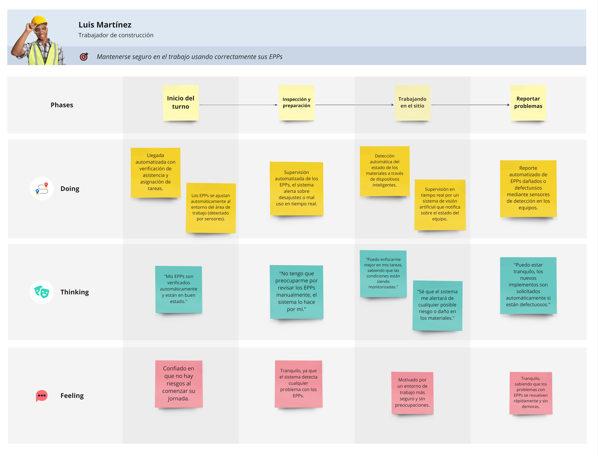

**Universidad Peruana de Ciencias Aplicadas**  
**Ingeniería de Software**  
**Ciclo 2024-2**  

<h4>Arquitecturas de Software Emergentes</h4>

**Sección:** SW82
**Profesor:** Royer Edelwer Rojas Malasquez

<h3>INFORME DEL TRABAJO FINAL</h3>

**Startup:** SocialTech

**Producto:**

**Integrantes:**

Achamizo Huamani, Jean Carlos  
Aliaga Trevejo, Lucía Guadalupe  
Raymundo Guevara, Rodrigo Alejandro  
Siancas Reategui, Luis Alberto  
Trujillo Lopez, Luis Alberto  

**Setiembre, 2024**

---

# Registro de Versiones del Informe

| Versión | Fecha | Autor | Descripción de la modificación |
| ------- | ----- | ----- | ------------------------------ |
|   1.0     |      |     |         |

---

# Project Report Collaboration Insights

---

# Contenido

## Tabla de contenidos

---

# Student Outcome

| Criterio específico | Acciones realizadas | Conclusiones |
| --- | --- | --- |
|     |     |     |
|     |     |     |

---

# Capítulo I: Introducción

## 1.1. Startup Profile

### 1.1.1. Descripción de la Startup

SocialTech es un startup creado por estudiantes de la UPC, dedicada al desarrollo de soluciones innovadoras en el campo de la visión artificial. Nuestro equipo utiliza Python y otras tecnologías avanzadas para crear herramientas que transforman la manera en que se analizan y procesan las imágenes. En SocialTech, estamos comprometidos con la innovación y la accesibilidad, aplicando nuestros conocimientos y habilidades para ofrecer soluciones efectivas y escalables que aborden desafíos visuales complejos.

### 1.1.2. Perfiles de integrantes del equipo

<table>
    <tr>
        <td>Perfil</td>
        <td>Foto</td>
    </tr>
    <tr>
        <td><b>Nombre:</b> Achamizo Huamani, Jean Carlos 
            <b>Carrera:</b> Ingenieria de Software  
        <b>Descripcion:</b> Descripción 
        <td></td>
    </tr>
    <tr>
        <td><b>Nombre:</b> Aliaga Trevejo, Lucía Guadalupe  
            <b>Carrera:</b> Ingenieria de Software  
        <b>Descripcion:</b> Descripción 
        <td></td>
    </tr>
    <tr>
        <td><b>Nombre:</b> Raymundo Guevara, Rodrigo Alejandro  
            <b>Carrera:</b> Ingenieria de Software  
        <b>Descripcion:</b> Soy estudiante de la carrera de Ingeniería de Software y un apasionado de la tecnología. Me gusta descubrir nuevas formas de solucionar problemas con diversos frameworks y algoritmos. Me considero una persona responsable y empática. Me gusta mucho trabajar en equipo y ayudar a mis compañeros 
        <td></td>
    </tr>
    <tr>
        <td><b>Nombre:</b> Siancas Reategui, Luis Alberto 
            <b>Carrera:</b> Ingenieria de Software  
        <b>Descripcion:</b> Descripción 
        <td></td>
    </tr>
    <tr>
        <td><b>Nombre:</b> Trujillo Lopez, Luis Alberto 
            <b>Carrera:</b> Ingenieria de Software  
        <b>Descripcion:</b> Descripción 
        <td></td>
    </tr>
   <table>

## 1.2. Solution Profile

### 1.2.1 Antecedentes y problemática

La ausencia de Equipos de Protección Personal (EPP) adecuados incrementa significativamente la probabilidad de accidentes en el lugar de trabajo, lo que puede llevar a lesiones graves e incluso a la muerte. Los trabajadores que no utilizan cascos, guantes o botas de seguridad están más expuestos a caídas, cortes, quemaduras y otros peligros asociados con el trabajo en construcción. En muchas obras de construcción en Perú, especialmente en las pequeñas o informales, no existe una cultura sólida de seguridad. Los trabajadores a menudo no reciben capacitación adecuada sobre el uso de EPPs, y las empresas no siempre implementan sistemas efectivos para garantizar que se utilicen correctamente.

What (Qué)
Actualmente existen algunas normativas y regulaciones que exigen el uso de EPPs, pero en la práctica no siempre se cumplen. Existen soluciones tradicionales para la gestión de la seguridad laboral, como auditorías manuales y capacitaciones, pero no están siendo suficientemente efectivas para garantizar el uso correcto y constante de los EPPs en los lugares de trabajo. Nuestra propuesta aborda este problema mediante el uso de tecnología de visión artificial para detectar en tiempo real si los trabajadores están utilizando correctamente los EPPs.

When (Cuándo)
La problemática surge principalmente en el día a día de las actividades laborales en los sitios de construcción, cuando los trabajadores omiten o usan incorrectamente los EPPs. En muchos casos, los supervisores no pueden monitorear continuamente a todos los trabajadores debido a la carga de trabajo o a la cantidad de empleados. Esto pone en riesgo la seguridad de los trabajadores y expone a las empresas a sanciones legales y multas.

Where (Dónde)
Nuestra solución se implementará inicialmente en sitios de construcción de Lima, Perú, tanto en proyectos de gran envergadura como en pequeñas obras, donde la falta de control y capacitación en el uso de EPPs es más evidente. Posteriormente, planeamos expandir nuestra solución a nivel nacional y, a largo plazo, a nivel internacional en regiones con problemáticas similares.

Who (Quién)
Nuestra plataforma está dirigida a empresas del sector de la construcción y otros sectores industriales que necesiten asegurar el cumplimiento de las normativas de seguridad laboral. Los usuarios principales incluyen supervisores de obra, encargados de seguridad y salud ocupacional, así como trabajadores que deseen mejorar la seguridad en su entorno laboral.

Why (Por qué)
Planteamos esta solución porque queremos reducir el número de accidentes laborales relacionados con la falta de uso de EPPs y mejorar la cultura de seguridad en las empresas. El uso adecuado de los EPPs no solo protege la vida de los trabajadores, sino que también mejora la productividad y reduce los costos asociados a accidentes y sanciones por incumplimiento de normativas de seguridad.

How (Cómo)
Utilizaremos tecnología de visión artificial integrada a cámaras de vigilancia ya instaladas en los sitios de construcción, o cámaras especializadas si es necesario, para detectar en tiempo real si los trabajadores están usando correctamente los EPPs. Los responsables de seguridad recibirán alertas automáticas cuando se detecten infracciones, permitiendo una acción inmediata. Además, se generarán informes detallados para facilitar la gestión y cumplimiento de las normativas.

How much (Cuánto)
En el Perú, aunque existen algunas soluciones para la gestión de la seguridad laboral, ninguna ofrece la capacidad de detección en tiempo real del uso de EPPs mediante visión artificial. Nuestra solución busca cerrar esta brecha tecnológica, contribuyendo a una mejora significativa en la seguridad laboral y posicionando a Perú a la vanguardia de la innovación en seguridad industrial.

### 1.2.2 Lean UX Process

#### 1.2.2.1. Lean UX Problem Statements

**PS1:** Los trabajadores en los diversos entornos industriales o de fabricación enfrentan el riesgo constante de accidentes debido al uso inadecuado o la falta de control sobre sus Equipos de Protección Personal (EPP). Necesitan un sistema que ayude a gestionar el uso correcto de los EPP para evitar posibles accidentes. ¿Cómo podemos desarrollar un sistema de monitoreo que garantice el uso adecuado de los EPP en tiempo real, para prevenir riesgos y asegurar el cumplimiento de las normativas de seguridad?

**PS2:** Los supervisores de seguridad carecen de herramientas efectivas para controlar si los trabajadores están utilizando correctamente sus EPP durante las operaciones. Es por ello que necesitan una herramienta que les permita monitorear de forma automática el cumplimiento de las EPP en entornos laborales. ¿Cómo podemos crear una solución que permita monitorear el estado y uso de los EPP de manera eficiente, reduciendo así los riesgos de accidentes laborales?

**PS3:** Existe una necesidad por un sistema que integre la supervisión del uso de EPP y genere alertas en caso de incumplimientos, lo que mejora la prevención de accidentes laborales. Es gracias a ello que se requiere una solución capaz de satisfacer las necesidades de los supervisores para evitar el accidente de los trabajadores. ¿Cómo podemos ofrecerles una herramienta que simplifique este proceso y asegure una mayor seguridad en el lugar de trabajo?

#### 1.2.2.2. Lean UX Assumptions

**Business outcomes**

- Incrementar el cumplimiento de las normativas de seguridad en un 20% en las empresas que implementen el sistema.
- Reducir los incidentes relacionados con el uso incorrecto de EPP en un 15% dentro de los primeros 6 meses de implementación.
- Mejorar la retención de clientes gracias a la integración de nuevas funcionalidades como la generación de reportes automáticos sobre el uso de EPP.

**User**

- Los usuarios son supervisores de seguridad que desean una solución que les permita controlar el uso de EPP en tiempo real de manera automática, sin depender de verificaciones manuales constantes.
- Los trabajadores aceptarán más fácilmente el monitoreo de EPP si el sistema es fácil de usar y no interfiere con sus actividades laborales en cualquier periodo regular.

**User & Customers**

¿Quién es el usuario?
- Los usuarios son los trabajadores que utilizan Equipos de Protección Personal (EPP) en entornos laborales con un grado de riesgo, como fábricas, manufacturas, plantas de construcción, minería, y otros sectores industriales.
- Los usuarios pueden incluir supervisores de seguridad de cualquier entorno laboral con un grado de riesgo como las mencionadas previamente

¿Dónde encajan nuestros productos en sus trabajos o vidas?
- El sistema de monitoreo de EPP se integra en el día a día de los supervisores de seguridad, permitiéndoles monitorear en tiempo real si los trabajadores cumplen con los requisitos de seguridad. Los trabajadores lo usan para asegurar que están siguiendo las normativas y evitar posibles sanciones o accidentes.
- La herramienta se convierte en una parte esencial del proceso de prevención de riesgos en las empresas, ayudando a cumplir con las normativas de seguridad ocupacional y a reducir los incidentes laborales.

¿Qué problema resuelve nuestro producto?
- El sistema se utiliza en tiempo real durante las operaciones laborales en los entornos de alto riesgo, donde los supervisores de seguridad monitorean de forma remota el estado de los EPP.
- Los trabajadores lo usan durante toda su jornada laboral, ya que el sistema verifica automáticamente si están utilizando los EPP correctos, generando alertas o notificaciones si detecta fallos o incumplimientos.

¿Qué características son importantes?
- Monitoreo en tiempo real del uso de los EPP por parte de los trabajadores.
- Alertas instantáneas a supervisores en caso de que los trabajadores no estén usando los EPP adecuados.
- Generación automática de reportes de cumplimiento para auditorías de seguridad.

¿Cómo debería verse y comportarse nuestro producto?
- El sistema debe tener una interfaz intuitiva y fácil de usar para supervisores, con paneles de control que muestren el estado del EPP de todos los trabajadores en tiempo real.
- El diseño debe ser visualmente claro, con códigos de colores y alertas para identificar rápidamente cualquier incumplimiento. Además, debe ser accesible desde múltiples dispositivos, incluyendo móviles y tabletas, para facilitar el monitoreo en campo.

**Features**
- El sistema debe permitir a los supervisores observar en tiempo real el estado del EPP de cada trabajador, verificando si están usando el equipo de protección requerido mientras están en zonas de riesgo.
- Enviar notificaciones instantáneas a los supervisores si el sistema detecta que un trabajador no está usando el EPP o si hay fallas en el equipo, como cascos o guantes mal ajustados, o detectores de gases sin activación.
- Generar reportes automáticos sobre el cumplimiento del uso de EPP para auditorías internas o externas. Estos informes deben ser personalizables y mostrar estadísticas clave como porcentajes de cumplimiento, incidentes y tiempos de respuesta.
- El sistema debe ser accesible desde dispositivos móviles, tabletas, y estaciones de trabajo, para permitir a los supervisores realizar el monitoreo y recibir alertas desde cualquier lugar, dentro o fuera del sitio de trabajo.
- Funcionalidad para detectar automáticamente cuando un trabajador ingresa a una zona de riesgo y verificar si está utilizando el EPP adecuado, generando una alerta si el sistema detecta un incumplimiento.

#### 1.2.2.3. Lean UX Hypothesis Statements

#### 1.2.2.4. Lean UX Canvas

## 1.3. Segmentos objetivo

**Segmento 1:** Trabajadores de almacenes o construcción civil

Los trabajadores del sector construcción en Perú son en su mayoría hombres, representando el 90% de la fuerza laboral entre 2019 y 2022. En este segmento predominan los adultos de 30 años o más, que constituyeron el 69.6% de los trabajadores en 2022, con un total aproximado de 907 mil ocupados (MTPE, 2024).

El empleo en el sector construcción se concentra principalmente en la costa del país, con Lima agrupando un 33.9% del total de trabajadores (MTPE, 2024). Estos trabajadores enfrentan importantes riesgos laborales, como trabajo en altura, manejo de maquinaria pesada y exposición a materiales peligrosos. Además, es común el uso inadecuado de Equipos de Protección Personal (EPPs), ya sea por falta de supervisión, incomodidad o desconocimiento.

**Segmento 2:** Jefes del área de seguridad

Los jefes de Seguridad, Salud Ocupacional y Medio Ambiente (SSOMA) son responsables de la gestión y supervisión de las políticas y procedimientos de seguridad en los lugares de trabajo, especialmente en sectores de alto riesgo como construcción y almacenamiento. Este segmento está compuesto por profesionales del sector industrial y de construcción, tales como: ingenieros civiles, industriales, etc.

---

# Capítulo II: Requirements Elicitation & Analysis

## 2.1. Competidores

| Nombre del Competidor | Descripción |
| :-------------------: | :---------- |
| GoDoWorks | GoDoWorks ofrece la funcionalidad de detección de EPP basada en IA en sus soluciones. Su tecnología utiliza cámaras de alta resolución y algoritmos de visión por computadora para monitorear el uso de equipos de protección personal en entornos industriales. El sistema de GoDoWorks analiza las imágenes capturadas en tiempo real para verificar el cumplimiento de las normativas de seguridad, asegurando que los trabajadores usen cascos, chalecos, guantes y otros implementos de protección de manera adecuada. La plataforma emite alertas automáticas si se detecta que un trabajador no está utilizando el EPP correctamente, ayudando a reducir riesgos y mejorar la seguridad en el lugar de trabajo. |
| SoterGenius | Soter Analytics y su software SoterGenius ofrecen un sistema integral para la supervisión del uso de equipos de protección personal, como cascos y chalecos, en entornos industriales. Su solución combina IA con cámaras de visión por computadora para monitorear el cumplimiento en tiempo real. El software analiza las imágenes capturadas para detectar si los trabajadores llevan el equipo de protección necesario y alerta a los supervisores sobre cualquier falta de cumplimiento o riesgo potencial, lo que ayuda a reducir accidentes y mejorar la seguridad general en el lugar de trabajo. |
| IA Box | IA Box ofrece una solución de seguridad basada en inteligencia artificial que analiza video en tiempo real para detectar el correcto uso de EPPs y otros riesgos en el entorno laboral. Utilizando cámaras y sensores ya existentes, su sistema es altamente flexible y configurable, permitiendo la integración con diferentes tecnologías. Además, emite alertas automáticas en caso de detectar anomalías, ayudando a prevenir accidentes y mejorar la seguridad en el lugar de trabajo. |

### 2.1.1. Análisis competitivo

<table>
  <tr>
    <th colspan="7" valign="top"><b>Competitive Analysis Landscape</b></th>
  </tr>
  <tr>
    <td colspan="2" rowspan="2">¿Por qué llevar a cabo este análisis?</td>
  </tr>
  <tr>
    <td colspan="5">Comparar las características y funcionalidades clave de nuestra solución con las de la competencia para identificar ventajas competitivas y posibles áreas de mejora.</td>
  </tr>
  <tr>
    <td colspan="3">Competidores</td>
    <td colspan="1" valign="top" style="font-weight: bold;text-align: center">
        Nuestro producto
        

        

    <td colspan="1" valign="top" style="font-weight: bold;text-align: center">
        GoDoWorks
        

        

    </td>
    <td colspan="1" valign="top" style="font-weight: bold;text-align: center" >
        SoterGenius
        

        

      </td>
    <td colspan="1" valign="top" style="font-weight: bold;text-align: center" >
        IA Box
        

        

    </td>
  </tr>
  <tr>
    <td colspan="1" rowspan="2">
Perfil
</td>
    <td colspan="2">Overview</td>
    <td colspan="1" valign="top">Ofrece un software que permite detectar y prevenir el mal uso de los implementos de seguridad en almacenes y construcciones. La solución utiliza inteligencia artificial para identificar la correcta utilización de los equipos de protección personal (EPPs).
    </td>
    <td colspan="1" valign="top">Orece un software en tiempo real que analiza imágenes para verificar el uso adecuado de los EPPs y asegurar que se sigan las normas de seguridad
    </td>
    <td colspan="1" valign="top">Proporciona un sistema que previene accidentes por el uso incorrecto de los equipos de protección personal (EPPs), utilizando una inteligencia artificial entrenada con cientos de imágenes de implementos de seguridad para su detección.
    </td>
    <td colspan="1" valign="top">Ofrece un software de seguridad que utiliza inteligencia artificial para monitorear en tiempo real el uso correcto de EPPs y detectar riesgos en el lugar de trabajo, emitiendo alertas automáticas para prevenir accidentes.
    </td>
  </tr>
  <tr>
    <td colspan="2">Ventaja competitiva</td>
    <td colspan="1" valign="top">Monitoreo constante y alertas inmediatas cuando detecte un mal uso de EPPs.

Asistencia al cliente 24/7
</td>
    <td colspan="1" valign="top">Emite una alerta al personal de oficina cada vez que detecte la falta de EPPs</td>
    <td colspan="1" valign="top">Ofrece asistencias a problemas con el software 24/7</td>
    <td colspan="1" valign="top">Ofrece un valor significativo a los clientes al mejorar la seguridad en el lugar de trabajo mediante la detección en tiempo real de riesgos y el uso incorrecto de EPPs</td>
  </tr>
  <tr>
    <td colspan="1" rowspan="2">
Perfil de Marketing
</td>
    <td colspan="2">Mercado objetivo</td>
    <td colspan="1" valign="top">Se centra en el uso de IA para la prevención de accidentes basándose en la detección temprana del mal uso de los EPPso</td>
    <td colspan="1" valign="top">Se enfoca en la integración de inteligencia artificial en la detección de equipo de protección personal (EPP). Su perfil de marketing destaca la innovación y la seguridad en el lugar de trabajo.</td>
    <td colspan="1" valign="top">Se centra en la gestión y monitoreo de EPP mediante tecnología de sensores y análisis de datos para mejorar la seguridad laboral.</td>
    <td colspan="1" valign="top">Se presenta como un líder en la integración de inteligencia artificial para mejorar la seguridad personal en entornos laborales. Destacan su enfoque en utilizar algoritmos específicos para proporcionar soluciones avanzadas de seguridad.</td>
  </tr>
  <tr>
    <td colspan="2">Estrategias de marketing</td>
    <td colspan="1" valign="top">Promover el uso de IA para la prevención de accidentes. Además de realizar programas para la familiarización del sector con el sistema.</td>
    <td colspan="1" valign="top">Utilizan el avance tecnológico y la inteligencia artificial como su principal atractivo. Promocionan la eficiencia y la reducción de riesgos laborales como ventajas clave.</td>
    <td colspan="1" valign="top">Promueven el uso de tecnología avanzada y datos en tiempo real para optimizar el cumplimiento de normas de seguridad. Hacen hincapié en la prevención de accidentes y en la mejora de la eficiencia operativa.</td>
    <td colspan="1" valign="top">La estrategia de marketing se centra en educar a los visitantes sobre los beneficios de la inteligencia artificial en la seguridad.</td>
  </tr>
  <tr>
    <td colspan="1" rowspan="3">
Perfil de Producto
</td>
    <td colspan="2">Productos & Servicios</td>
    <td colspan="1" valign="top">Ofrece un software basado en IA para la detección del correcto uso de los EPPs en entornos laborales.</td>
    <td colspan="1" valign="top">Ofrecen una solución basada en IA para la detección y prevención del uso incorrecto de EPP. La tecnología está diseñada para mejorar la seguridad en los entornos laborales.</td>
    <td colspan="1" valign="top">Ofrecen sistemas de monitoreo para EPP con sensores que proporcionan datos analíticos sobre su uso. También brindan informes y análisis para ayudar a las empresas a cumplir con las normativas de seguridad.</td>
    <td colspan="1" valign="top">Ofrecen una variedad de productos relacionados con la seguridad en el trabajo</td>
  </tr>
  <tr>
    <td colspan="2">Precios y Costos</td>
    <td colspan="1" valign="top">Por definir</td>
    <td colspan="1" valign="top">La página no proporciona detalles específicos sobre precios.</td>
    <td colspan="1" valign="top">La página no ofrece detalles sobre precios específicos.</td>
    <td colspan="1" valign="top">La página no proporciona información sobre precios.</td>
  </tr>
  <tr>
    <td colspan="2">Canales de distribución</td>
    <td colspan="1" valign="top">El producto se distribuye por medio de la página web, la aplicación y la aplicación móvil.</td>
    <td colspan="1" valign="top">La distribución principal es a través de su sitio web.</td>
    <td colspan="1" valign="top">Distribuyen sus productos principalmente a través de su sitio web.</td>
    <td colspan="1" valign="top">Su distribución principal se realiza a través de su sitio web.</td>
  </tr>
  <tr>
    <td colspan="1" rowspan="5">
Análisis SWOT
</td>
    
  </tr>
  <tr>
    <td colspan="2">Fortalezas</td>
    <td colspan="1" valign="top">

- Uso de IA de última generación
- Mejora de seguridad en entorno laboral
- Interfaz amigable

</td>
    <td colspan="1" valign="top">

- Innovación Tecnológica 
- Mejora de Seguridad
- Especialización en EPP

</td>
    <td colspan="1" valign="top">
    
- Monitoreo en Tiempo Real
- Análisis Detallado

</td>
    <td colspan="1" valign="top">

- Enfoque en IA
- Educación del Mercado

</td>
  </tr>
  <tr>
    <td colspan="2">Debilidades</td>
    <td colspan="1" valign="top">

- Sin experiencia en el mercado objetivo
- Poco conocimiento del software en el mercado

</td>
    <td colspan="1" valign="top">
    
- Falta de Información sobre Precios
- Dependencia de Tecnología
</td>
    <td colspan="1" valign="top">

- Falta de Detalles de Precios
- Enfoque en un Nicho Específico
</td>
    <td colspan="1" valign="top">

- Información Limitada sobre Productos y Precios
- Dependencia de Tecnología Específica
</td>
  </tr>
  <tr>
    <td colspan="2">Oportunidades</td>
    <td colspan="1" valign="top">
    
- Pocas implementaciones parecidas en el mercado peruano
- Entrenar la IA con nuevos objetos para ampliar nuestro alcance
</td>
    <td colspan="1" valign="top">

- Aumento de la Demanda de Seguridad Laboral
- Expansión a Nuevos Mercados
</td>
    <td colspan="1" valign="top">
    
- Creciente Necesidad de Cumplimiento de Normas
- Desarrollo de Nuevas Funcionalidades
</td>
    <td colspan="1" valign="top">

- Aumento de la Conciencia sobre Seguridad
- Expansión de Contenidos Educativos
</td>
  </tr>
  <tr>
    <td colspan="2">Amenazas</td>
    <td colspan="1" valign="top">
    
- Competencia con más experiencia en el mercado
- Falta de dataset para entrenar el modelo
</td>
    <td colspan="1" valign="top">
    
- Competencia en el Sector
- Evolución Rápida de la Tecnología
</td>
    <td colspan="1" valign="top">

- Competencia Intensa
- Problemas de Privacidad y Datos
</td>
    <td colspan="1" valign="top">
    
- Competencia en Innovación Tecnológica
- Cambios en Regulaciones
</td>
  </tr>
</table>

### 2.1.2. Estrategias y tácticas frente a competidores

<table>
  <tr>
    <th colspan="3" valign="top"></th>
    <th colspan="4" valign="top"><b>OPORTUNIDADES</b></th>
    <th colspan="4" valign="top"><b>AMENAZAS</b></th>
  </tr>
  <tr>
    <th colspan="3" valign="top"></th>
    <td colspan="4" valign="top">
    O1: Pocas implementaciones parecidas en el mercado peruano

O2: Entrenar la IA con nuevos objetos para ampliar nuestro alcance</td>
    <td colspan="4" valign="top">A1: Competencia con más experiencia en el mercado

A2: Falta de dataset para entrenar el modelo</td>
  </tr>

  <tr>
    <th colspan="3" valign="top"><b>FORTALEZAS</b></th>
    <th colspan="4" valign="top"><b>ESTRATEGIAS FO (Ofensivas)</b></th>
    <th colspan="4" valign="top"><b>ESTRATEGIAS FA (Defensiva)</b></th>
  </tr>
  <tr>
    <td colspan="3" valign="top">F1: Uso de IA de última generación

F2: Mejora de seguridad en entorno laboral</td>
    <td colspan="4" valign="top">
 
- Implementar campañas que destaquen el uso avanzado de IA para captar la atención de clientes que buscan innovaciones tecnológicas (F1, O1). 
- Realizar pilotos en empresas locales para demostrar la efectividad del software y generar casos de estudio (F2, O1). 
- Resaltar la facilidad de uso de la interfaz en todas las campañas de marketing para atraer a usuarios menos técnicos (F3, O2).</td>

<td colspan="4" valign="top">

- Colaborar con universidades y centros de investigación para obtener datasets más amplios y mejorar el entrenamiento del modelo (F1, A2). 
- Ofrecer soporte técnico personalizado y capacitación para diferenciarse de competidores más experimentados (F2, A1).
- Implementar una estrategia de retención basada en la simplicidad de uso para mantener la base de usuarios (F3, A1).</td>

  </tr>

  <tr>
    <th colspan="3" valign="top"><b>DEBILIDADES</b></th>
    <th colspan="4" valign="top"><b>ESTRATEGIAS DO (Reorientación)</b></th>
    <th colspan="4" valign="top"><b>ESTRATEGIAS DA (Supervivencia)</b></th>
  </tr>
  <tr>
    <td colspan="3" valign="top">D1: Sin experiencia en el mercado objetivo
D2: Poco conocimiento del software en el mercado</td>
    <td colspan="4" valign="top">

- Adoptar una estrategia de alianzas con empresas locales para ganar credibilidad y visibilidad en el mercado (D1, O1).
- Realizar campañas educativas sobre los beneficios del software y la IA en la seguridad laboral, enfocadas en el mercado peruano (D2, O1).</td>

<td colspan="4" valign="top">

- Enfocarse en ofrecer un soporte técnico robusto y crear tutoriales que guíen a los nuevos usuarios a lo largo de su experiencia (D1, A1).
- Ofrecer versiones de prueba gratuitas o a bajo costo para atraer a usuarios y recolectar datos valiosos que puedan utilizarse para mejorar el modelo (D2, A2).</td>

  </tr>

</table>

## 2.2. Entrevistas

### 2.2.1. Diseño de entrevistas

### 2.2.2. Registro de entrevistas

**Segmento 1:** Trabajadores de almacenes o construcción civil

<table border=1>
  <tr>
    <td>
      <b>Nombres y  apellidos:</b> Piero Valverde 
      <b>Edad: </b>20 
      <b>Distrito:</b> Independecia  
      <b>Timing:</b> 0:0:00 - 0:07:27   
      <b>Duración:</b>  07:27 minutos
    </td>
    <td align=center>
      
    </td>
  </tr>
  <tr>
    <td colspan=2>
      <b>Enlace:</b> <a>https://upcedupe-my.sharepoint.com/:v:/g/personal/u20211a452_upc_edu_pe/EYA63Hzg-k1Dk7dqBwwoU1UB45Nn96U2dYqSBtjv9TxVJA?nav=eyJyZWZlcnJhbEluZm8iOnsicmVmZXJyYWxBcHAiOiJPbmVEcml2ZUZvckJ1c2luZXNzIiwicmVmZXJyYWxBcHBQbGF0Zm9ybSI6IldlYiIsInJlZmVycmFsTW9kZSI6InZpZXciLCJyZWZlcnJhbFZpZXciOiJNeUZpbGVzTGlua0NvcHkifX0&e=7PE7je</a>
       
      <b>Resumen:</b> Piero Valverde, de 20 años, se desempeña actualmente como asistente de almacén en Sodimac. Durante la entrevista, nos comenta que las marcas más utilizadas por su empresa en cuanto a implementos de seguridad son 3M y Delta, debido a su alta calidad y reconocimiento. Piero se describe como una persona que sigue las normas al pie de la letra. Para comunicarse con sus compañeros de trabajo y mantenerse informado sobre los anuncios laborales, utiliza principalmente WhatsApp e Instagram. Sin embargo, menciona que en ocasiones los equipos de protección personal (EPP) que les proporcionan están algo anticuados y presentan defectos, como rajaduras. Además, admite que en algunas ocasiones ha trabajado sin EPPs debido a olvidos en la implementación, aunque al darse cuenta, se asegura de corregir la situación lo más rápido posible.
    </td>
  </tr>
</table>

<table border=1>
  <tr>
    <td>
      <b>Nombres y apellidos:</b> Italo Vargas  
      <b>Edad:</b>  24 años  
      <b>Distrito:</b> Los Olivos  
      <b>Timing:</b> 0:07:27 - 0:11:15   
      <b>Duración:</b>  03:48 minutos
    </td>
    <td align=center>
      
    </td>
  </tr>
  <tr>
    <td colspan=2>
      <b>Enlace:</b> <a>https://upcedupe-my.sharepoint.com/:v:/g/personal/u20211a452_upc_edu_pe/EYA63Hzg-k1Dk7dqBwwoU1UB45Nn96U2dYqSBtjv9TxVJA?nav=eyJyZWZlcnJhbEluZm8iOnsicmVmZXJyYWxBcHAiOiJPbmVEcml2ZUZvckJ1c2luZXNzIiwicmVmZXJyYWxBcHBQbGF0Zm9ybSI6IldlYiIsInJlZmVycmFsTW9kZSI6InZpZXciLCJyZWZlcnJhbFZpZXciOiJNeUZpbGVzTGlua0NvcHkifX0&e=7PE7je</a>
       
      <b>Resumen:</b> El trabajador menciona que las marcas le dan los equipos de seguridad sin una marca en especifico y que al desgastarse se le renuevan los equipos. Tambien menciona que una aplicacion que ayude a mejorar su uso de los epps. Tambien quisiera que le llegara un reporte del dia sobre su uso correcto de epps.
    </td>
  </tr>
</table>

<table border=1>
  <tr>
    <td>
      <b>Nombres y apellidos:</b> Nombre  
      <b>Edad:</b>  edad  
      <b>Distrito:</b> distrito  
      <b>Timing:</b> 0:11:15 - 0:19:36   
      <b>Duración:</b>  8:21 minutos
    </td>
    <td align=center>
      
    </td>
  </tr>
  <tr>
    <td colspan=2>
      <b>Enlace:</b> <a>https://upcedupe-my.sharepoint.com/:v:/g/personal/u20211a452_upc_edu_pe/EYA63Hzg-k1Dk7dqBwwoU1UB45Nn96U2dYqSBtjv9TxVJA?nav=eyJyZWZlcnJhbEluZm8iOnsicmVmZXJyYWxBcHAiOiJPbmVEcml2ZUZvckJ1c2luZXNzIiwicmVmZXJyYWxBcHBQbGF0Zm9ybSI6IldlYiIsInJlZmVycmFsTW9kZSI6InZpZXciLCJyZWZlcnJhbFZpZXciOiJNeUZpbGVzTGlua0NvcHkifX0&e=7PE7je</a>
       
      <b>Resumen:</b> 
    </td>
  </tr>
</table>

**Segmento 2:** Jefes del área de seguridad

<table border=1>
  <tr>
    <td>
      <b>Nombres y apellidos:</b> Edfrank Martinez   
      <b>Edad:</b>  36 años  
      <b>Distrito:</b> Magdalena del Mar  
      <b>Timing:</b> 0:19:36 - 0:29:45   
      <b>Duración:</b> 10:09 minutos 
    </td>
    <td align=center>
      
    </td>
  </tr>
  <tr>
    <td colspan=2>
      <b>Enlace:</b> 
       
      <b>Resumen:</b> Edfrank, de 36 años, trabaja actualmente como supervisor SSOMA. En la entrevista comenta que algunas de sus marcas preferidas para sus implementos de seguridad son 3M, Delta y Bata debido a su calidad. Suele utilizar redes como Instagram y TikTok para encontrar proveedores de EPPs. Respecto a su labor, menciona que se realizan supervisiones mensuales para asegurar que los implementos de seguridad están en buen estado. Uno de los desafíos que enfrenta es que los trabajadores nuevos no están acostumbrados al uso de los EPPs, razón por la cual no siempre se los colocan, por lo que considera importante capacitarlos y educarlos sobre la seguridad en el trabajo. En su día a día, se encarga de vigilar que los obreros tengan puestos todos sus EPPs, previamente entregados por los empleadores. Edfrank considera que un sistema de monitoreo debería tener la capacidad de identificar si los trabajadores están usando o no adecuadamente sus EPPs y enviar una alerta al dispositivo del supervisor, ya que no siempre existen suficientes supervisores para monitorear a todos en todo momento.
    </td>
  </tr>
</table>

<table border=1>
  <tr>
    <td>
      <b>Nombres y apellidos:</b> Andrea Eguavil    
      <b>Edad:</b>  30 años  
      <b>Distrito:</b> Callao  
      <b>Timing:</b> 0:29:45 - 0:41:10   
      <b>Duración:</b> 11:25 minutos 
    </td>
    <td align=center>
      
    </td>
  </tr>
  <tr>
    <td colspan=2>
      <b>Enlace:</b> 
       
      <b>Resumen:</b> Andrea es una supervisora SSOMA que labora en el Callao. Comenta que, en su centro de labor, se utilizan implementos de marca 3M, los cuales son renovados de acuerdo con su estado de uso. Suele utilizar redes sociales como Facebook, Instagram y TikTok. Andrea menciona que uno de los desafíos que enfrenta es que los trabajadores no siempre tienen colocados sus implementos de seguridad, por lo cual se les realizan amonestaciones. Se considera una persona estricta, pero trata de entender al personal y capacitarlo sobre la importancia del uso de las EPPs. En su día a día realiza inspecciones para asegurarse del uso adecuado de las EPPs. En cuanto a un sistema de monitoreo, le gustaría que se pueda supervisar a los trabajadores en cada área. Además, considera importante que el sistema sea rápido y eficaz para que las notificaciones lleguen a tiempo. 
    </td>
  </tr>
</table>

<table border=1>
  <tr>
    <td>
      <b>Nombres y apellidos:</b> Ricardo Carlos   
      <b>Edad:</b>  42 años  
      <b>Distrito:</b> Jesús María  
      <b>Timing:</b> 0:41:10 - 1:01:14   
      <b>Duración:</b> 20:02 minutos 
    </td>
    <td align=center>
      
    </td>
  </tr>
  <tr>
    <td colspan=2>
      <b>Enlace:</b> 
       
      <b>Resumen:</b> Ricardo, de 42 años, ocupa el puesto de Jefe de Seguridad Salud Ocupacional y Medio Ambiente en su empresa. En la entrevista menciona que algunas de las marcas más utilizadas son 3M, Hawk, Clute, entre otras, dependiendo del tipo de EPP. Las redes sociales que más usa son LinkedIn para el contacto con proveedores, además de Whatsapp, donde suele unirse a grupos para compartir información sobre seguridad. Respecto a su labor, menciona que se realizan inspecciones programadas e inspecciones diarias inopinadas (al azar) para verificar el estado de los EPPs. Ricardo comenta haber presenciado casos en los que los obreros no utilizan adecuadamente los EPPs y algunas de las razones por las cuales tienen este tipo de comportamientos inseguros son factores psicológicos e incomodidad al usarlos. Ante ello, considera que es importante capacitar no solo a los trabajadores, sino a todos los niveles de la empresa. Por último, Ricardo menciona que un sistema de monitoreo debería ser permanente y tener la capacidad de permitir al supervisor elegir qué EPPs se deben supervisar en ciertos ambientes, ya que los requerimientos pueden variar en las distintas áreas de la obra. Por ejemplo, en algunos pisos se requiere el uso de arnés, mientras que al inicio de la obra no es necesario.
    </td>
  </tr>
</table>

### 2.2.3. Análisis de entrevistas

## 2.3. Needfinding

### 2.3.1. User Personas

### 2.3.2. User Task Matrix

### 2.3.3. Empathy Mapping

### 2.3.4. As-is Scenario Mapping

## 2.4. Ubiquitous Language

---

# Capítulo III: Requirements Specification

## 3.1. To-Be Scenario Mapping

## 3.2. User Stories

| **Epic / User Story ID** | **Título**                                    | **Descripción**                                                                                                                                                                                                                             | **Criterios de Aceptación**                                                                                                                                                                                                                                                                                                          | **Relacionado con (Epic ID)** |
|---------------------------|-----------------------------------------------|---------------------------------------------------------------------------------------------------------------------------------------------------------------------------------------------------------------------------------------------|----------------------------------------------------------------------------------------------------------------------------------------------------------------------------------------------------------------------------------------------------------------------------------------------------------------|-------------------------------|
| **EP01**                  | **Monitoreo de Cumplimiento de EPP**          | Implementar funcionalidades para detectar y notificar incumplimientos en el uso de equipo de protección personal (EPP) por parte de los trabajadores.                                                                                      |                                                                                                                                                                                                                                                                                                                |                               |
| **US01**                  | **Notificación de EPP Incorrecto**            | Como trabajador, quiero recibir notificaciones si no estoy usando correctamente mi EPP para poder corregir el problema de inmediato.                                                                                                       | - **Escenario 1:** Dado que el sistema detecta que no estoy usando correctamente mi casco, cuando estoy en una zona de trabajo, entonces recibo una notificación en mi dispositivo móvil indicando el error.  - **Escenario 2:** Dado que recibo una notificación sobre el uso incorrecto de mi EPP, cuando corrijo el error, entonces el sistema deja de enviar alertas y actualiza mi estado a cumplimiento. | EP01                          |
| **US02**                  | **Historial de Notificaciones**               | Como trabajador, quiero revisar mi historial de notificaciones sobre el uso de EPP para entender y corregir mis errores pasados.                                                                                                         | - **Escenario 1:** Dado que quiero revisar mi historial, cuando accedo a la sección de notificaciones en la aplicación, entonces puedo ver todas las alertas que he recibido con fechas y detalles específicos.  - **Escenario 2:** Dado que he corregido el uso de mi EPP después de recibir notificaciones, cuando reviso el historial, entonces se indica claramente qué alertas ya han sido resueltas. | EP01                          |
| **US03**                  | **Confirmación de Cumplimiento de EPP**       | Como trabajador, quiero confirmar que estoy usando el EPP correcto al inicio de mi jornada para evitar problemas futuros.                                                                                                                | - **Escenario 1:** Dado que estoy por iniciar una jornada de trabajo, cuando me preparo para comenzar, entonces recibo un recordatorio en la aplicación para verificar mi EPP.  - **Escenario 2:** Dado que verifico mi EPP, cuando confirmo en la aplicación que todo está en orden, entonces el sistema registra mi cumplimiento y no emite más recordatorios para esa jornada. | EP01                          |
| **US04**                  | **Guía de Uso de EPP**                       | Como trabajador, quiero acceder a una guía interactiva sobre el uso de EPP para asegurarme de que estoy utilizando el equipo correctamente.                                                                                                 | - **Escenario 1:** Dado que quiero aprender a usar correctamente mi EPP, cuando accedo a la guía en la aplicación, entonces puedo ver videos y tutoriales interactivos sobre el uso adecuado de cada tipo de EPP.  - **Escenario 2:** Dado que necesito revisar un procedimiento específico, cuando selecciono un tema en la guía, entonces el sistema me lleva directamente al video o tutorial relacionado con ese tema. | EP01                          |
| **US05**                  | **Recomendaciones Personalizadas**           | Como trabajador, quiero recibir recomendaciones personalizadas basadas en mi historial de cumplimiento para mejorar mi uso de EPP.                                                                                                       | - **Escenario 1:** Dado que he tenido varios incumplimientos, cuando reviso mis notificaciones, entonces puedo ver recomendaciones personalizadas para mejorar mi cumplimiento en el uso de EPP.  - **Escenario 2:** Dado que sigo las recomendaciones, cuando reviso mi estado de cumplimiento posteriormente, entonces veo una mejora en mis estadísticas de uso de EPP. | EP01                          |
| **EP02**                  | **Gestión de Alertas y Auditorías**           | Implementar funcionalidades para gestionar alertas relacionadas con el incumplimiento de EPP y realizar auditorías para asegurar el cumplimiento de las normas de seguridad.                                                               |                                                                                                                                                                                                                                                                                                                |                               |
| **US06**                  | **Visualización de Incumplimientos**          | Como jefe de seguridad, quiero ver una lista de trabajadores que no están usando EPP correctamente para tomar medidas correctivas.                                                                                                        | - **Escenario 1:** Dado que el sistema detecta varios trabajadores sin EPP, cuando accedo al panel de seguridad, entonces puedo ver una lista con los nombres y ubicaciones de los trabajadores afectados.  - **Escenario 2:** Dado que quiero ver los detalles de un trabajador en particular, cuando selecciono su nombre en la lista, entonces se muestra información detallada sobre sus incumplimientos y su ubicación exacta en el sitio. | EP02                          |
| **US07**                  | **Generación de Reportes Semanales**          | Como jefe de seguridad, quiero generar reportes semanales sobre el uso de EPP para analizar el cumplimiento general y tomar decisiones basadas en datos.                                                                                  | - **Escenario 1:** Dado que es el final de la semana, cuando genero un reporte, entonces puedo ver un resumen de todos los incidentes relacionados con el EPP, incluidos detalles de fechas, horas, y trabajadores involucrados.  - **Escenario 2:** Dado que necesito presentar el reporte a la gerencia, cuando exporto el reporte, entonces se genera un archivo PDF con todos los detalles y gráficos relevantes. | EP02                          |
| **US08**                  | **Monitorización en Tiempo Real**             | Como jefe de seguridad, quiero ver un flujo en vivo de las áreas de trabajo para detectar incumplimientos de EPP en tiempo real.                                                                                                         | - **Escenario 1:** Dado que estoy supervisando la seguridad en el sitio, cuando accedo al panel de monitorización, entonces puedo ver un flujo en vivo de las áreas de trabajo con indicaciones visuales de incumplimientos de EPP.  - **Escenario 2:** Dado que detecto un incumplimiento en tiempo real, cuando selecciono la alerta, entonces puedo ver detalles específicos del trabajador y del equipo que no está siendo utilizado correctamente. | EP02                          |
| **US09**                  | **Configuración de Alertas**                 | Como jefe de seguridad, quiero configurar alertas personalizadas para el incumplimiento de EPP para adaptarlas a las necesidades específicas del sitio de trabajo.                                                                       | - **Escenario 1:** Dado que quiero configurar alertas, cuando accedo a la sección de configuración de alertas, entonces puedo seleccionar los tipos de EPP y las condiciones específicas para emitir alertas.  - **Escenario 2:** Dado que he configurado alertas personalizadas, cuando un trabajador incumple con el EPP, entonces recibo una notificación basada en las condiciones que he especificado. | EP02                          |
| **US10**                  | **Análisis de Tendencias**                   | Como jefe de seguridad, quiero analizar las tendencias en el uso de EPP para identificar patrones y áreas de mejora.                                                                                                                     | - **Escenario 1:** Dado que quiero analizar las tendencias, cuando accedo a la sección de análisis, entonces puedo ver gráficos y estadísticas sobre el uso de EPP por parte de los trabajadores durante un periodo específico.  - **Escenario 2:** Dado que quiero enfocar el análisis en una zona específica, cuando selecciono esa zona en el sistema, entonces los gráficos y estadísticas se actualizan para reflejar los datos de esa área en particular. | EP02                          |

## 3.3. Impact Mapping

## 3.4. Product Backlog

# Product Backlog

## Tabla de Product Backlog

| **Orden** | **User Story Id** | **Título**                                    | **Descripción**                                                                                                                                                                                                                             | **Story Points** |
|-----------|----------------|-----------------------------------------------|---------------------------------------------------------------------------------------------------------------------------------------------------------------------------------------------------------------------------------------------|------------------|
| 1         | US01| Notificación de EPP Incorrecto                | Como trabajador, quiero recibir notificaciones si no estoy usando correctamente mi EPP para poder corregir el problema de inmediato.                                                                                                       | 5                |
| 2         | US02|Historial de Notificaciones                   | Como trabajador, quiero revisar mi historial de notificaciones sobre el uso de EPP para entender y corregir mis errores pasados.                                                                                                         | 3                |
| 3         | US03| Confirmación de Cumplimiento de EPP           | Como trabajador, quiero confirmar que estoy usando el EPP correcto al inicio de mi jornada para evitar problemas futuros.                                                                                                                | 3                |
| 4         | US04| Guía de Uso de EPP                           | Como trabajador, quiero acceder a una guía interactiva sobre el uso de EPP para asegurarme de que estoy utilizando el equipo correctamente.                                                                                                 | 5                |
| 5         | US05| Recomendaciones Personalizadas               | Como trabajador, quiero recibir recomendaciones personalizadas basadas en mi historial de cumplimiento para mejorar mi uso de EPP.                                                                                                       | 5                |
| 6         | US06| Visualización de Incumplimientos              | Como jefe de seguridad, quiero ver una lista de trabajadores que no están usando EPP correctamente para tomar medidas correctivas.                                                                                                        | 8                |
| 7         | US07| Generación de Reportes Semanales              | Como jefe de seguridad, quiero generar reportes semanales sobre el uso de EPP para analizar el cumplimiento general y tomar decisiones basadas en datos.                                                                                  | 8                |
| 8         | US08| Monitorización en Tiempo Real                 | Como jefe de seguridad, quiero ver un flujo en vivo de las áreas de trabajo para detectar incumplimientos de EPP en tiempo real.                                                                                                         | 8                |
| 9         | US09| Configuración de Alertas                     | Como jefe de seguridad, quiero configurar alertas personalizadas para el incumplimiento de EPP para adaptarlas a las necesidades específicas del sitio de trabajo.                                                                       | 5                |
| 10        | US10| Análisis de Tendencias                       | Como jefe de seguridad, quiero analizar las tendencias en el uso de EPP para identificar patrones y áreas de mejora.                                                                                                                     | 5                |

# Capítulo IV: Strategic-Level Software Design

## 4.1. Strategic-Level Attribute-Driven Design

### 4.1.1. Design Purpose

El propósito del proceso de diseño de nuestra solución es abordar la problemática identificada en el sector de la seguridad industrial, donde la correcta utilización de Equipos de Protección Personal (EPP) es esencial para la protección de los trabajadores y el cumplimiento de las normativas de seguridad. Reconocemos la necesidad de proporcionar una plataforma que permita a las empresas monitorizar y garantizar el uso adecuado de los EPP por parte de sus empleados, mejorando así la seguridad en el lugar de trabajo y asegurando el cumplimiento normativo.

Nuestra solución está diseñada para satisfacer las necesidades de los segmentos objetivo, que incluyen tanto a las empresas industriales que requieren una gestión rigurosa del uso de EPP, como a los trabajadores que necesitan asegurar su protección en el entorno laboral. Al ofrecer una plataforma que utiliza tecnología de visión artificial para detectar en tiempo real el uso correcto de los EPP, así como la posibilidad de recibir notificaciones y reportes detallados sobre el cumplimiento, estamos proporcionando una herramienta integral que responde a las preocupaciones actuales del mercado de seguridad laboral.

Además, nuestro proceso de diseño se orienta a satisfacer las necesidades del negocio al establecer una propuesta de valor clara y diferenciada en el sector de la seguridad. Al enfocarnos en la innovación tecnológica, la educación sobre el uso de EPP, y la colaboración estratégica con proveedores de equipos de protección, estamos posicionando nuestra solución como líder en el mercado de la gestión de EPP, ofreciendo un equilibrio entre efectividad, facilidad de uso y cumplimiento de normativas.

En resumen, el propósito de nuestro proceso de diseño es crear una solución que aborde las necesidades específicas del sector de la seguridad industrial, garantizando el uso adecuado de los EPP mediante tecnología avanzada de detección, y proporcionando herramientas que faciliten la monitorización y el cumplimiento normativo, contribuyendo así a un entorno laboral más seguro y a la mejora del rendimiento empresarial en este ámbito crítico.

### 4.1.2. Attribute-Driven Design Inputs

#### 4.1.2.1. Primary Functionality (Primary User Stories)

#### 4.1.2.2. Quality attribute 

#### 4.1.2.3. Constraints

### 4.1.3. Architectural Drivers Backlog

### 4.1.4. Architectural Design Decisions

### 4.1.5. Quality Attribute Scenario Refinements

## 4.2. Strategic-Level Domain-Driven Design

### 4.2.1. EventStorming

### 4.2.2. Candidate Context Discovery

### 4.2.3. Domain Message Flows Modeling

### 4.2.4. Bounded Context Canvases

### 4.2.5. Context Mapping

## 4.3. Software Architecture

### 4.3.1. Software Architecture System Landscape Diagram

### 4.3.2. Software Architecture Context Level Diagrams

### 4.3.3. Software Architecture Container Level Diagrams

### 4.3.4. Software Architecture Deployment Diagrams

---

# Conclusiones

--- 

# Bibiografía

Ministerio de Trabajo y Promoción del Empleo (MTPE). (2024). *Reporte del Mercado Laboral: Sector Construcción*. Recuperado de https://cdn.www.gob.pe/uploads/document/file/6565614/5716638-reporte-mercado-laboral-sector-construccion.pdf. 

--- 

# Anexos