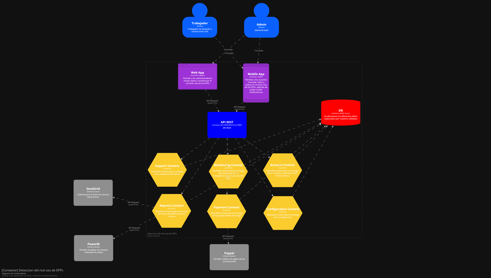
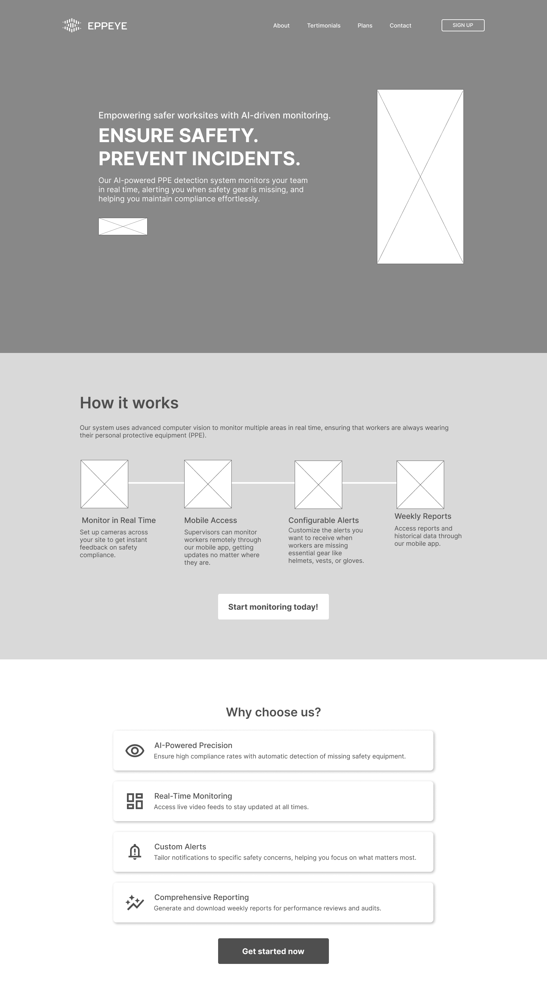
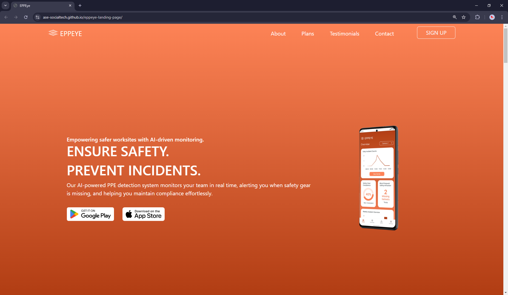

<div align="center">


**Universidad Peruana de Ciencias Aplicadas** <br>
**Ingeniería de Software** <br>
**Ciclo 2024-2** <br>

<h4>Arquitecturas de Software Emergentes</h4>

**Sección:** WS82
**Profesor:** Royer Edelwer Rojas Malasquez

<h3>INFORME DEL TRABAJO FINAL</h3>

**Startup:** SocialTech

**Producto:** EPPEye

**Integrantes:**

Achamizo Huamani, Jean Carlos (U202120841)<br>
Aliaga Trevejo, Lucía Guadalupe (U20211A452)<br>
Raymundo Guevara, Rodrigo Alejandro (U20181E098)<br>
Siancas Reategui, Luis Alberto (U20211G156)<br>
Trujillo Lopez, Luis Alberto (U20211C667)<br>

**Setiembre, 2024**

</div>

---

# Registro de Versiones del Informe
| Versión | Fecha      | Autor                                                                                                      | Descripción de la modificación                                         |
| ------- | ---------- | --------------------------------------------------------------------------------------------------------- | ---------------------------------------------------------------------- |
| 1.0     | 06/09/2024 | Achamizo Huamani Jean Carlos, Aliaga Trevejo Lucía Guadalupe, Raymundo Guevara Rodrigo Alejandro, Siancas Reategui Luis Alberto, Trujillo Lopez Luis Alberto | Se añadieron los elementos correspondientes al entregable de la TB1 (capítulos 1 al 4). |
| 2.0     | 22/09/2024 | Achamizo Huamani Jean Carlos, Aliaga Trevejo Lucía Guadalupe, Raymundo Guevara Rodrigo Alejandro, Siancas Reategui Luis Alberto, Trujillo Lopez Luis Alberto | Se añadieron los elementos correspondientes a los capítulos 5 y 6.     |
| 3.0     | 01/11/2024 | Achamizo Huamani Jean Carlos, Aliaga Trevejo Lucía Guadalupe, Raymundo Guevara Rodrigo Alejandro, Siancas Reategui Luis Alberto, Trujillo Lopez Luis Alberto | Se completaron los elementos correspondientes al capítulo 7, abarcando todos los apartados y secciones necesarias para esta fase del proyecto. |

# Project Report Collaboration Insights

URL del repositorio: https://github.com/ASE-SocialTech/report

**TB1**


**TP1**


---


# Contenido

## Tabla de Contenidos

- [Registro de Versiones del Informe](#registro-de-versiones-del-informe)
- [Project Report Collaboration Insights](#project-report-collaboration-insights)
- [Contenido](#contenido)
  - [Tabla de Contenidos](#tabla-de-contenidos)
- [Student Outcome](#student-outcome)
- [Capítulo I: Introducción](#capítulo-i-introducción)
  - [1.1. Startup Profile](#11-startup-profile)
    - [1.1.1. Descripción de la Startup](#111-descripción-de-la-startup)
    - [1.1.2. Perfiles de integrantes del equipo](#112-perfiles-de-integrantes-del-equipo)
  - [1.2. Solution Profile](#12-solution-profile)
    - [1.2.1 Antecedentes y problemática](#121-antecedentes-y-problemática)
    - [1.2.2 Lean UX Process](#122-lean-ux-process)
      - [1.2.2.1. Lean UX Problem Statements](#1221-lean-ux-problem-statements)
      - [1.2.2.2. Lean UX Assumptions](#1222-lean-ux-assumptions)
      - [1.2.2.3. Lean UX Hypothesis Statements](#1223-lean-ux-hypothesis-statements)
      - [1.2.2.4. Lean UX Canvas](#1224-lean-ux-canvas)
  - [1.3. Segmentos objetivo](#13-segmentos-objetivo)
- [Capítulo II: Requirements Elicitation \& Analysis](#capítulo-ii-requirements-elicitation--analysis)
  - [2.1. Competidores](#21-competidores)
    - [2.1.1. Análisis competitivo](#211-análisis-competitivo)
    - [2.1.2. Estrategias y tácticas frente a competidores](#212-estrategias-y-tácticas-frente-a-competidores)
  - [2.2. Entrevistas](#22-entrevistas)
    - [2.2.1. Diseño de entrevistas](#221-diseño-de-entrevistas)
    - [2.2.2. Registro de entrevistas](#222-registro-de-entrevistas)
    - [2.2.3. Análisis de entrevistas](#223-análisis-de-entrevistas)
  - [2.3. Needfinding](#23-needfinding)
    - [2.3.1. User Personas](#231-user-personas)
    - [2.3.2. User Task Matrix](#232-user-task-matrix)
    - [2.3.3. Empathy Mapping](#233-empathy-mapping)
    - [2.3.4. As-is Scenario Mapping](#234-as-is-scenario-mapping)
  - [2.4. Ubiquitous Language](#24-ubiquitous-language)
- [Capítulo III: Requirements Specification](#capítulo-iii-requirements-specification)
  - [3.1. To-Be Scenario Mapping](#31-to-be-scenario-mapping)
  - [3.2. User Stories](#32-user-stories)
  - [3.3. Impact Mapping](#33-impact-mapping)
  - [3.4. Product Backlog](#34-product-backlog)
- [Product Backlog](#product-backlog)
  - [Tabla de Product Backlog](#tabla-de-product-backlog)
- [Capítulo IV: Strategic-Level Software Design](#capítulo-iv-strategic-level-software-design)
  - [4.1. Strategic-Level Attribute-Driven Design](#41-strategic-level-attribute-driven-design)
    - [4.1.1. Design Purpose](#411-design-purpose)
    - [4.1.2. Attribute-Driven Design Inputs](#412-attribute-driven-design-inputs)
      - [4.1.2.1. Primary Functionality (Primary User Stories)](#4121-primary-functionality-primary-user-stories)
      - [4.1.2.2. Quality attribute](#4122-quality-attribute)
      - [4.1.2.3. Constraints](#4123-constraints)
    - [4.1.3. Architectural Drivers Backlog](#413-architectural-drivers-backlog)
    - [4.1.4. Architectural Design Decisions](#414-architectural-design-decisions)
    - [4.1.5. Quality Attribute Scenario Refinements](#415-quality-attribute-scenario-refinements)
  - [4.2. Strategic-Level Domain-Driven Design](#42-strategic-level-domain-driven-design)
    - [4.2.1. EventStorming](#421-eventstorming)
    - [4.2.2. Candidate Context Discovery](#422-candidate-context-discovery)
    - [4.2.3. Domain Message Flows Modeling](#423-domain-message-flows-modeling)
    - [4.2.4. Bounded Context Canvases](#424-bounded-context-canvases)
    - [4.2.5. Context Mapping](#425-context-mapping)
  - [4.3. Software Architecture](#43-software-architecture)
    - [4.3.1. Software Architecture System Landscape Diagram](#431-software-architecture-system-landscape-diagram)
    - [4.3.2. Software Architecture Context Level Diagrams](#432-software-architecture-context-level-diagrams)
    - [4.3.3. Software Architecture Container Level Diagrams](#433-software-architecture-container-level-diagrams)
    - [4.3.4. Software Architecture Deployment Diagrams](#434-software-architecture-deployment-diagrams)
- [Capítulo V: Bounded Contexts](#capítulo-v-bounded-contexts)  
    - [5.1. Bounded Context: Account](#51-bounded-context-account)  
        - [5.1.1. Domain Layer](#511-domain-layer)  
        - [5.1.2. Interface Layer](#512-interface-layer)  
        - [5.1.3. Application Layer](#513-application-layer)  
        - [5.1.4. Infrastructure Layer](#514-infrastructure-layer)  
        - [5.1.6. Bounded Context Software Architecture Component Level Diagrams](#516-bounded-context-software-architecture-component-level-diagrams)  
        - [5.1.7. Bounded Context Software Architecture Code Level Diagrams](#517-bounded-context-software-architecture-code-level-diagrams)  
          - [5.1.7.1. Bounded Context Domain Layer Class Diagrams](#5171-bounded-context-domain-layer-class-diagrams)  
          - [5.1.7.2. Bounded Context Database Design Diagram](#5172-bounded-context-database-design-diagram)  

    - [5.2. Bounded Context: Payment Subscription](#52-bounded-context-payment-subscription)  
        - [5.2.1. Domain Layer](#521-domain-layer)  
        - [5.2.2. Interface Layer](#522-interface-layer)  
        - [5.2.3. Application Layer](#523-application-layer)  
        - [5.2.4. Infrastructure Layer](#524-infrastructure-layer)  
        - [5.2.6. Bounded Context Software Architecture Component Level Diagrams](#526-bounded-context-software-architecture-component-level-diagrams)  
        - [5.2.7. Bounded Context Software Architecture Code Level Diagrams](#527-bounded-context-software-architecture-code-level-diagrams)  
          - [5.2.7.1. Bounded Context Domain Layer Class Diagrams](#5271-bounded-context-domain-layer-class-diagrams)  
          - [5.2.7.2. Bounded Context Database Design Diagram](#5272-bounded-context-database-design-diagram)  

    - [5.3. Bounded Context: Configuration](#53-bounded-context-configuration)  
        - [5.3.1. Domain Layer](#531-domain-layer)  
        - [5.3.2. Interface Layer](#532-interface-layer)  
        - [5.3.3. Application Layer](#533-application-layer)  
        - [5.3.4. Infrastructure Layer](#534-infrastructure-layer)  
        - [5.3.6. Bounded Context Software Architecture Component Level Diagrams](#536-bounded-context-software-architecture-component-level-diagrams)  
        - [5.3.7. Bounded Context Software Architecture Code Level Diagrams](#537-bounded-context-software-architecture-code-level-diagrams)  
          - [5.3.7.1. Bounded Context Domain Layer Class Diagrams](#5371-bounded-context-domain-layer-class-diagrams)  
          - [5.3.7.2. Bounded Context Database Design Diagram](#5372-bounded-context-database-design-diagram)  

    - [5.4. Bounded Context: Support and Maintenance](#54-bounded-context-support-and-maintenance)  
        - [5.4.1. Domain Layer](#541-domain-layer)  
        - [5.4.2. Interface Layer](#542-interface-layer)  
        - [5.4.3. Application Layer](#543-application-layer)  
        - [5.4.4. Infrastructure Layer](#544-infrastructure-layer)  
        - [5.4.6. Bounded Context Software Architecture Component Level Diagrams](#546-bounded-context-software-architecture-component-level-diagrams)  
        - [5.4.7. Bounded Context Software Architecture Code Level Diagrams](#547-bounded-context-software-architecture-code-level-diagrams)  
          - [5.4.7.1. Bounded Context Domain Layer Class Diagrams](#5471-bounded-context-domain-layer-class-diagrams)  
          - [5.4.7.2. Bounded Context Database Design Diagram](#5472-bounded-context-database-design-diagram)  

    - [5.5. Bounded Context: Monitoring](#55-bounded-context-monitoring)  
        - [5.5.1. Domain Layer](#551-domain-layer)  
        - [5.5.2. Interface Layer](#552-interface-layer)  
        - [5.5.3. Application Layer](#553-application-layer)  
        - [5.5.4. Infrastructure Layer](#554-infrastructure-layer)  
        - [5.5.6. Bounded Context Software Architecture Component Level Diagrams](#556-bounded-context-software-architecture-component-level-diagrams)  
        - [5.5.7. Bounded Context Software Architecture Code Level Diagrams](#557-bounded-context-software-architecture-code-level-diagrams)  
          - [5.5.7.1. Bounded Context Domain Layer Class Diagrams](#5571-bounded-context-domain-layer-class-diagrams)  
          - [5.5.7.2. Bounded Context Database Design Diagram](#5572-bounded-context-database-design-diagram)  

    - [5.6. Bounded Context: Reports and Alerts](#56-bounded-context-reports-and-alerts)  
        - [5.6.1. Domain Layer](#561-domain-layer)  
        - [5.6.2. Interface Layer](#562-interface-layer)  
        - [5.6.3. Application Layer](#563-application-layer)  
        - [5.6.4. Infrastructure Layer](#564-infrastructure-layer)  
        - [5.6.6. Bounded Context Software Architecture Component Level Diagrams](#566-bounded-context-software-architecture-component-level-diagrams)  
        - [5.6.7. Bounded Context Software Architecture Code Level Diagrams](#567-bounded-context-software-architecture-code-level-diagrams)  
          - [5.6.7.1. Bounded Context Domain Layer Class Diagrams](#5671-bounded-context-domain-layer-class-diagrams)  
          - [5.6.7.2. Bounded Context Database Design Diagram](#5672-bounded-context-database-design-diagram)  

- [Capítulo VI: Solution UX Design](#capítulo-vi-solution-ux-design)  
    - [6.1. Style Guidelines](#61-style-guidelines)  
        - [6.1.1. General Style Guidelines](#611-general-style-guidelines)  
        - [6.1.2. Web, Mobile & Devices Style Guidelines](#612-web-mobile--devices-style-guidelines)  
    - [6.2. Information Architecture](#62-information-architecture)  
        - [6.2.2. Labeling Systems](#622-labeling-systems)  
        - [6.2.3. Searching Systems](#623-searching-systems)  
        - [6.2.4. SEO Tags and Meta Tags](#624-seo-tags-and-meta-tags)  
        - [6.2.5. Navigation Systems](#625-navigation-systems)  
    - [6.3. Landing Page UI Design](#63-landing-page-ui-design)  
        - [6.3.1. Landing Page Wireframe](#631-landing-page-wireframe)  
        - [6.3.2. Landing Page Mock-up](#632-landing-page-mock-up)  
    - [6.4. Applications UX/UI Design](#64-applications-uxui-design)  
        - [6.4.1. Applications Wireframes](#641-applications-wireframes)  
        - [6.4.2. Applications Wireflow Diagrams](#642-applications-wireflow-diagrams)  
    
          
- [Conclusiones](#conclusiones)
- [Bibliografía](#bibliografía)
- [Anexos](#anexos)
  


---

# Student Outcome

| Criterio específico                                              | Acciones realizadas                                                                 | Conclusiones |
|------------------------------------------------------------------|-------------------------------------------------------------------------------------|--------------|
| Comunica oralmente con efectividad a diferentes rangos de audiencia | *Achamizo Huamani Jean Carlos* <br> TB1: <br> Durante la presentación del perfil de la startup SocialTech en la sección 1.1, me enfoqué en explicar la misión y visión de nuestra startup. Al describir el **Lean UX Canvas** (1.2.2.4), destaqué cómo nuestras hipótesis y suposiciones estaban alineadas con los problemas detectados en las entrevistas realizadas. Adapté mi discurso para diferentes audiencias, asegurándome de que tanto los stakeholders técnicos como los no técnicos comprendieran nuestro enfoque. <br> TP: <br> Realicé mockups y wireframes de la interfaz de usuario, presentando el flujo de interacción de forma visual y adaptando el diseño según las necesidades de cada grupo de usuarios identificados en el Lean UX Canvas. <br> TB2: <br> Colaboré en la comunicación de los avances en el desarrollo de la landing page, el entrenamiento de la IA de detección y el front end del sistema, asegurándome de que cada audiencia entendiera las implicaciones técnicas y funcionales de cada módulo. <br><br> *Aliaga Trevejo Lucía Guadalupe* <br> TB1: <br> En las reuniones de presentación de los resultados del análisis competitivo (2.1.1), me encargué de comunicar cómo las **estrategias y tácticas frente a los competidores** (2.1.2) influenciaban el desarrollo de la solución. Expliqué con claridad los desafíos y oportunidades, asegurándome de que la audiencia comprendiera las ventajas competitivas de SocialTech. <br> TP: <br> Presenté los wireframes correspondientes a la estrategia de diferenciación, mostrando cómo el diseño de la interfaz y la experiencia de usuario ofrecían un valor agregado frente a la competencia. <br> TB2: <br> Expuse los avances en la integración del front end, la landing page y el entrenamiento de la IA de detección, facilitando la comprensión de cómo estos componentes contribuyen a los objetivos de SocialTech. <br><br> *Raymundo Guevara Rodrigo Alejandro* <br> TB1: <br> Al presentar los resultados de las **entrevistas** (2.2), me aseguré de que los distintos perfiles de los usuarios potenciales, basados en el **Needfinding** (2.3), fueran comprendidos tanto por el equipo técnico como por los involucrados en la toma de decisiones. <br> TP: <br> Diseñé los mockups de las interfaces basadas en las necesidades detectadas en los perfiles de usuario, asegurándome de que cada interacción propuesta fuera coherente con los resultados del Needfinding. <br> TB2: <br> Comuniqué los aspectos técnicos del entrenamiento de la IA de detección y cómo la landing page y el front end respondían a las necesidades de los usuarios, facilitando una mejor comprensión entre todos los stakeholders. <br><br> *Siancas Reategui Luis Alberto* <br> TB1: <br> Mi presentación se centró en el mapeo de escenarios, donde describí tanto los **As-is** como los **To-be Scenarios** (2.3.4 y 3.1). Al comunicar las mejoras proyectadas para el sistema, ajusté mi lenguaje para que tanto los desarrolladores como los líderes de proyecto pudieran entender claramente los beneficios del diseño propuesto. <br> TP: <br> Realicé wireframes de los escenarios To-be, mostrando las mejoras proyectadas en la experiencia de usuario. <br> TB2: <br> Expuse cómo el entrenamiento de la IA de detección y los desarrollos en la landing page y front end facilitaron una interacción fluida y eficiente para los usuarios, adaptando el discurso según el perfil de la audiencia. <br><br> *Trujillo Lopez Luis Alberto* <br> TB1: <br> Durante las presentaciones sobre el **Impact Mapping** y la **Product Backlog** (3.3 y 3.4), destaqué cómo los **User Stories** (3.2) guiaban nuestro proceso de desarrollo. Adapté mi lenguaje para que el equipo técnico pudiera entender las historias de usuario y cómo estas reflejaban las necesidades identificadas en las entrevistas y el **Empathy Mapping** (2.3.3). <br> TP: <br> Diseñé mockups de las principales funcionalidades descritas en las User Stories. <br> TB2: <br> Presenté los avances del front end, la landing page y el entrenamiento de la IA, destacando cómo estos módulos cumplían con los requerimientos técnicos y de experiencia del usuario identificados en fases previas. <br><br> | *TB1* <br> La comunicación oral fue efectiva en la transmisión de conceptos complejos y estratégicos a audiencias diversas, adaptando el lenguaje y las explicaciones según el nivel de conocimiento técnico de cada público. Esto facilitó la toma de decisiones y la alineación de los objetivos del proyecto entre las partes interesadas. <br> *TP* <br> La presentación de mockups, wireframes y bounded context permitió una visualización clara de la propuesta de valor, facilitando la comprensión y alineación de las expectativas de diseño y funcionalidad entre los equipos. <br> *TB2* <br> La comunicación de los avances en la landing page, el front end y el entrenamiento de la IA de detección permitió que las distintas partes interesadas comprendieran la contribución de cada componente en la solución final, promoviendo una colaboración informada y alineada. |
| Comunica por escrito con efectividad a diferentes rangos de audiencia | *Achamizo Huamani Jean Carlos* <br> TB1: <br> Al redactar la sección sobre el **Lean UX Canvas** (1.2.2.4) y el análisis de la problemática (1.2.1), me aseguré de utilizar un lenguaje accesible para describir los **Problem Statements** (1.2.2.1) y su relación con las necesidades detectadas en la fase de entrevistas. <br> TP: <br> Documenté los wireframes y mockups desarrollados, explicando el propósito de cada pantalla y la interacción esperada del usuario. <br> TB2: <br> Redacté informes detallados sobre el desarrollo de la landing page, el entrenamiento de la IA de detección y los componentes del front end, especificando el funcionamiento de cada módulo y su alineación con los objetivos del proyecto. <br><br> *Aliaga Trevejo Lucía Guadalupe* <br> TB1: <br> En mi contribución escrita al **Análisis Competitivo** (2.1.1), detallé las fortalezas y debilidades de los competidores y cómo SocialTech podía diferenciarse. <br> TP: <br> Redacté la documentación de los wireframes relacionados con la estrategia de diferenciación. <br> TB2: <br> Documenté el proceso de integración del front end y el entrenamiento de la IA, explicando cómo cada uno de estos componentes aportaba a la experiencia de usuario y los objetivos estratégicos del proyecto. <br><br> *Raymundo Guevara Rodrigo Alejandro* <br> TB1: <br> Mi redacción sobre las **entrevistas** (2.2) fue clave para establecer una narrativa clara que conectara las necesidades del usuario con las soluciones propuestas. <br> TP: <br> Documenté los mockups basados en los resultados de las entrevistas. <br> TB2: <br> Redacté la documentación sobre el entrenamiento de la IA de detección y la landing page, detallando cómo cada interacción respondía a los requerimientos del usuario. <br><br> *Siancas Reategui Luis Alberto* <br> TB1: <br> En la sección de **To-Be Scenario Mapping** (3.1), me aseguré de que las propuestas de escenarios futuros estuvieran claramente explicadas. <br> TP: <br> Redacté la documentación de los wireframes de los escenarios To-be. <br> TB2: <br> Documenté el backend del entrenamiento de la IA y su relación con la landing page y el front end, asegurando que el equipo comprendiera cómo estas partes trabajaban en conjunto. <br><br> *Trujillo Lopez Luis Alberto* <br> TB1: <br> Al redactar la **Product Backlog** (3.4), me centré en asegurar que las **User Stories** (3.2) fueran claras y accesibles. <br> TP: <br> Documenté los mockups de las funcionalidades clave en la Product Backlog. <br> TB2: <br> Redacté la documentación de la integración del front end y el entrenamiento de la IA, describiendo la funcionalidad de cada módulo y cómo cada componente aportaba valor al proyecto. <br><br> | *TB1* <br> La comunicación escrita permitió detallar de forma clara los aspectos técnicos y estratégicos del proyecto, facilitando la comprensión y el alineamiento de las expectativas entre las partes interesadas. <br> *TP* <br> La documentación de los mockups, wireframes y bounded context facilitó la comunicación visual y técnica del proyecto. <br> *TB2* <br> La documentación de la landing page, el front end y el entrenamiento de la IA de detección proporcionó una visión completa de la solución propuesta, facilitando la colaboración y comprensión entre los equipos involucrados. |

---

# Capítulo I: Introducción

## 1.1. Startup Profile

### 1.1.1. Descripción de la Startup

SocialTech es un startup creado por estudiantes de la UPC, dedicada al desarrollo de soluciones innovadoras en el campo de la visión artificial. Nuestro equipo utiliza Python y otras tecnologías avanzadas para crear herramientas que transforman la manera en que se analizan y procesan las imágenes. En SocialTech, estamos comprometidos con la innovación y la accesibilidad, aplicando nuestros conocimientos y habilidades para ofrecer soluciones efectivas y escalables que aborden desafíos visuales complejos.

### 1.1.2. Perfiles de integrantes del equipo


<table>
    <tr>
        <td>Perfil</td>
        <td>Foto</td>
    </tr>
    <tr>
        <td><b>Nombre:</b> Achamizo Huamani, Jean Carlos<br>
            <b>Carrera:</b> Ingenieria de Software <br>
        <b>Descripcion:</b> Como estudiante de Ingeniería de Software en la Universidad UPC, mi entusiasmo por el aprendizaje constante me impulsa a buscar siempre nuevas maneras de perfeccionar mis habilidades académicas y aplicarlas en situaciones prácticas, también poseo aptitudes en comunicación asertiva y escucha activa. Reconozco la importancia de una comunicación clara y efectiva en cualquier proyecto de software, y cuento con la capacidad de escuchar de manera atenta para comprender las necesidades y expectativas de los clientes y colegas de equipo.  
        <td></td>
    </tr>
    <tr>
        <td><b>Nombre:</b> Aliaga Trevejo, Lucía Guadalupe <br>
            <b>Carrera:</b> Ingenieria de Software <br>
        <b>Descripcion:</b> Soy una estudiante de Ingeniería de Software, actualmente interesada en el desarrollo web front y back end. Me gusta crear interfaces intuitivas y llamativas para mejorar la experiencia de usuario. Me considero una persona responsable y centrada. Mis habilidades blandas incluyen comunicación efectiva, trabajo en equipo, liderazgo y adaptabilidad. Aspiro a contribuir de manera significativa en proyectos innovadores para seguir expandiendo mis conocimientos técnicos y capacidades. 
        <td></td>
    </tr>
    <tr>
        <td><b>Nombre:</b> Raymundo Guevara, Rodrigo Alejandro <br>
            <b>Carrera:</b> Ingenieria de Software <br>
        <b>Descripcion:</b> Soy estudiante de la carrera de Ingeniería de Software y un apasionado de la tecnología. Me gusta descubrir nuevas formas de solucionar problemas con diversos frameworks y algoritmos. Me considero una persona responsable y empática. Me gusta mucho trabajar en equipo y ayudar a mis compañeros 
        <td></td>
    </tr>
    <tr>
        <td><b>Nombre:</b> Siancas Reategui, Luis Alberto<br>
            <b>Carrera:</b> Ingenieria de Software <br>
        <b>Descripcion:</b> Soy estudiante de la carrera de Ingeniería de Software enfocado en el desarrollo backend. Me gusta crear API’s las cuales uso para mis proyectos, por otro lado, me gusta realizar el despliegue de mis aplicaciones así como también usar diferentes diseños de arquitectura para que mi aplicación tenga un funcionamiento estable y tenga alta disponibilidad. En cuanto a mis habilidades blandas, soy empático y tengo escucha activa, esto me ayuda en gran parte a la hora de trabajar en equipos ya que facilita la comunicación y por ende los resultados son mejores. 
        <td></td>
    </tr>
    <tr>
        <td><b>Nombre:</b> Trujillo Lopez, Luis Alberto<br>
            <b>Carrera:</b> Ingenieria de Software <br>
        <b>Descripcion:</b> Soy un estudiante de Ingeniería de Software interesado en las tecnologías de aprendizaje autónomo. Me gusta desarrollar en un entorno web páginas que se vean llamativas y que tengan múltiples funcionalidades enfocándome en la experiencia del usuario y en la creación de API’s. Poseo algunas habilidades que me permiten relacionarme en equipo, soy una persona responsable, con un enfoque centrado, comunicación asertiva, liderazgo y adaptabilidad. Mi meta es contribuir en el desarrollo de proyectos que me permitan mejorar y encontrar nuevas habilidades para adquirir mayores conocimientos laboral y profesionalmente.
        <td></td>
    </tr>
   <table>

## 1.2. Solution Profile

### 1.2.1 Antecedentes y problemática

La ausencia de Equipos de Protección Personal (EPP) adecuados incrementa significativamente la probabilidad de accidentes en el lugar de trabajo, lo que puede llevar a lesiones graves e incluso a la muerte. Los trabajadores que no utilizan cascos, guantes o botas de seguridad están más expuestos a caídas, cortes, quemaduras y otros peligros asociados con el trabajo en construcción. En muchas obras de construcción en Perú, especialmente en las pequeñas o informales, no existe una cultura sólida de seguridad. Los trabajadores a menudo no reciben capacitación adecuada sobre el uso de EPPs, y las empresas no siempre implementan sistemas efectivos para garantizar que se utilicen correctamente.

**What (Qué)** <br>
Actualmente existen algunas normativas y regulaciones que exigen el uso de EPPs, pero en la práctica no siempre se cumplen. Existen soluciones tradicionales para la gestión de la seguridad laboral, como auditorías manuales y capacitaciones, pero no están siendo suficientemente efectivas para garantizar el uso correcto y constante de los EPPs en los lugares de trabajo. Nuestra propuesta aborda este problema mediante el uso de tecnología de visión artificial para detectar en tiempo real si los trabajadores están utilizando correctamente los EPPs.

**When (Cuándo)** <br>
La problemática surge principalmente en el día a día de las actividades laborales en los sitios de construcción, cuando los trabajadores omiten o usan incorrectamente los EPPs. En muchos casos, los supervisores no pueden monitorear continuamente a todos los trabajadores debido a la carga de trabajo o a la cantidad de empleados. Esto pone en riesgo la seguridad de los trabajadores y expone a las empresas a sanciones legales y multas.

**Where (Dónde)** <br>
Nuestra solución se implementará inicialmente en sitios de construcción de Lima, Perú, tanto en proyectos de gran envergadura como en pequeñas obras, donde la falta de control y capacitación en el uso de EPPs es más evidente. Posteriormente, planeamos expandir nuestra solución a nivel nacional y, a largo plazo, a nivel internacional en regiones con problemáticas similares.

**Who (Quién)** <br>
Nuestra plataforma está dirigida a empresas del sector de la construcción y otros sectores industriales que necesiten asegurar el cumplimiento de las normativas de seguridad laboral. Los usuarios principales incluyen supervisores de obra, encargados de seguridad y salud ocupacional, así como trabajadores que deseen mejorar la seguridad en su entorno laboral.

**Why (Por qué)** <br>
Planteamos esta solución porque queremos reducir el número de accidentes laborales relacionados con la falta de uso de EPPs y mejorar la cultura de seguridad en las empresas. El uso adecuado de los EPPs no solo protege la vida de los trabajadores, sino que también mejora la productividad y reduce los costos asociados a accidentes y sanciones por incumplimiento de normativas de seguridad.

**How (Cómo)** <br>
Utilizaremos tecnología de visión artificial integrada a cámaras de vigilancia ya instaladas en los sitios de construcción, o cámaras especializadas si es necesario, para detectar en tiempo real si los trabajadores están usando correctamente los EPPs. Los responsables de seguridad recibirán alertas automáticas cuando se detecten infracciones, permitiendo una acción inmediata. Además, se generarán informes detallados para facilitar la gestión y cumplimiento de las normativas.

**How much (Cuánto)** <br>
En el Perú, aunque existen algunas soluciones para la gestión de la seguridad laboral, ninguna ofrece la capacidad de detección en tiempo real del uso de EPPs mediante visión artificial. Nuestra solución busca cerrar esta brecha tecnológica, contribuyendo a una mejora significativa en la seguridad laboral y posicionando a Perú a la vanguardia de la innovación en seguridad industrial.

### 1.2.2 Lean UX Process

#### 1.2.2.1. Lean UX Problem Statements

**PS1:** Los trabajadores en los diversos entornos industriales o de fabricación enfrentan el riesgo constante de accidentes debido al uso inadecuado o la falta de control sobre sus Equipos de Protección Personal (EPP). Necesitan un sistema que ayude a gestionar el uso correcto de los EPP para evitar posibles accidentes. ¿Cómo podemos desarrollar un sistema de monitoreo que garantice el uso adecuado de los EPP en tiempo real, para prevenir riesgos y asegurar el cumplimiento de las normativas de seguridad?

**PS2:** Los supervisores de seguridad carecen de herramientas efectivas para controlar si los trabajadores están utilizando correctamente sus EPP durante las operaciones. Es por ello que necesitan una herramienta que les permita monitorear de forma automática el cumplimiento de las EPP en entornos laborales. ¿Cómo podemos crear una solución que permita monitorear el estado y uso de los EPP de manera eficiente, reduciendo así los riesgos de accidentes laborales?

**PS3:** Existe una necesidad por un sistema que integre la supervisión del uso de EPP y genere alertas en caso de incumplimientos, lo que mejora la prevención de accidentes laborales. Es gracias a ello que se requiere una solución capaz de satisfacer las necesidades de los supervisores para evitar el accidente de los trabajadores. ¿Cómo podemos ofrecerles una herramienta que simplifique este proceso y asegure una mayor seguridad en el lugar de trabajo?

#### 1.2.2.2. Lean UX Assumptions

**Business outcomes**

- Incrementar el cumplimiento de las normativas de seguridad en un 20% en las empresas que implementen el sistema.
- Reducir los incidentes relacionados con el uso incorrecto de EPP en un 15% dentro de los primeros 6 meses de implementación.
- Mejorar la retención de clientes gracias a la integración de nuevas funcionalidades como la generación de reportes automáticos sobre el uso de EPP.


**User**

- Los usuarios son supervisores de seguridad que desean una solución que les permita controlar el uso de EPP en tiempo real de manera automática, sin depender de verificaciones manuales constantes.
- Los trabajadores aceptarán más fácilmente el monitoreo de EPP si el sistema es fácil de usar y no interfiere con sus actividades laborales en cualquier periodo regular.


**User & Customers**

¿Quién es el usuario?
- Los usuarios son los trabajadores que utilizan Equipos de Protección Personal (EPP) en entornos laborales con un grado de riesgo, como fábricas, manufacturas, plantas de construcción, minería, y otros sectores industriales.
- Los usuarios pueden incluir supervisores de seguridad de cualquier entorno laboral con un grado de riesgo como las mencionadas previamente

¿Dónde encajan nuestros productos en sus trabajos o vidas?
- El sistema de monitoreo de EPP se integra en el día a día de los supervisores de seguridad, permitiéndoles monitorear en tiempo real si los trabajadores cumplen con los requisitos de seguridad. Los trabajadores lo usan para asegurar que están siguiendo las normativas y evitar posibles sanciones o accidentes.
- La herramienta se convierte en una parte esencial del proceso de prevención de riesgos en las empresas, ayudando a cumplir con las normativas de seguridad ocupacional y a reducir los incidentes laborales.

¿Qué problema resuelve nuestro producto?
- El sistema se utiliza en tiempo real durante las operaciones laborales en los entornos de alto riesgo, donde los supervisores de seguridad monitorean de forma remota el estado de los EPP.
- Los trabajadores lo usan durante toda su jornada laboral, ya que el sistema verifica automáticamente si están utilizando los EPP correctos, generando alertas o notificaciones si detecta fallos o incumplimientos.

¿Qué características son importantes?
- Monitoreo en tiempo real del uso de los EPP por parte de los trabajadores.
- Alertas instantáneas a supervisores en caso de que los trabajadores no estén usando los EPP adecuados.
- Generación automática de reportes de cumplimiento para auditorías de seguridad.

¿Cómo debería verse y comportarse nuestro producto?
- El sistema debe tener una interfaz intuitiva y fácil de usar para supervisores, con paneles de control que muestren el estado del EPP de todos los trabajadores en tiempo real.
- El diseño debe ser visualmente claro, con códigos de colores y alertas para identificar rápidamente cualquier incumplimiento. Además, debe ser accesible desde múltiples dispositivos, incluyendo móviles y tabletas, para facilitar el monitoreo en campo.


**Features**
- El sistema debe permitir a los supervisores observar en tiempo real el estado del EPP de cada trabajador, verificando si están usando el equipo de protección requerido mientras están en zonas de riesgo.
- Enviar notificaciones instantáneas a los supervisores si el sistema detecta que un trabajador no está usando el EPP o si hay fallas en el equipo, como cascos o guantes mal ajustados, o detectores de gases sin activación.
- Generar reportes automáticos sobre el cumplimiento del uso de EPP para auditorías internas o externas. Estos informes deben ser personalizables y mostrar estadísticas clave como porcentajes de cumplimiento, incidentes y tiempos de respuesta.
- El sistema debe ser accesible desde dispositivos móviles, tabletas, y estaciones de trabajo, para permitir a los supervisores realizar el monitoreo y recibir alertas desde cualquier lugar, dentro o fuera del sitio de trabajo.
- Funcionalidad para detectar automáticamente cuando un trabajador ingresa a una zona de riesgo y verificar si está utilizando el EPP adecuado, generando una alerta si el sistema detecta un incumplimiento.

#### 1.2.2.3. Lean UX Hypothesis Statements

**H1: Monitoreo en Tiempo Real**

Creemos que: Si implementamos un sistema de monitoreo en tiempo real para el uso de EPP, entonces los supervisores podrán detectar y corregir incumplimientos más rápidamente.

Sabremos que habremos tenido éxito, cuando la tasa de incidentes relacionados con el uso incorrecto de EPP se reduzca en un 15% y la satisfacción de los supervisores con la rapidez y precisión del sistema supere el 80%.

**H2: Notificaciones Instantáneas**

Creemos que: Si el sistema envía notificaciones instantáneas a los supervisores cuando detecta un incumplimiento en el uso de EPP, entonces los supervisores podrán tomar medidas correctivas de manera más eficiente.

Sabremos que habremos tenido éxito, cuando el tiempo de respuesta a las notificaciones sea menor a 5 segundos y al menos el 85% de las alertas resulten en una acción correctiva efectiva.

**H3: Reportes Automáticos**

Creemos que: Si el sistema genera reportes automáticos sobre el uso de EPP, entonces los supervisores podrán realizar auditorías más precisas y tomar decisiones basadas en datos relevantes.

Sabremos que habremos tenido éxito, cuando la generación de reportes sea precisa y personalizable y la satisfacción del cliente con las funcionalidades de reporte sea superior al 85%.

#### 1.2.2.4. Lean UX Canvas
<table><tr><th colspan="1" valign="top"><p><b>Business Problem</b><br>  <br>` `Los trabajadores en entornos industriales enfrentan riesgos significativos debido al uso inadecuado o la falta de control sobre los Equipos de Protección Personal (EPP). Los supervisores carecen de herramientas efectivas para monitorear el cumplimiento de los EPP en tiempo real, lo que puede llevar a accidentes graves y violaciones de las normativas de seguridad.</p><p> </p></th><th colspan="1" rowspan="2" valign="top"><p><b>Solution Ideas</b></p><p>Monitorear el uso de EPP de los trabajadores en tiempo real.</p><p>Recibir notificaciones instantáneas en caso de incumplimientos.</p><p>Generar reportes automáticos sobre el uso de EPP.</p><p>Acceder al sistema desde múltiples dispositivos, incluyendo móviles y tabletas.</p></th><th colspan="1" valign="top"><p><b>Business Outcomes</b><br>Incrementar el cumplimiento de las normativas de seguridad en un 20% en las empresas que implementen el sistema.</p><p>Reducir los incidentes relacionados con el uso incorrecto de EPP en un 15% dentro de los primeros 6 meses de implementación.</p><p>Mejorar la retención de clientes gracias a la integración de nuevas funcionalidades como la generación de reportes automáticos sobre el uso de EPP.</b><br></p><p></p></th></tr>
<tr><td colspan="1" valign="top"><p><b>User & Customers</b><br>`  `<b>Usuarios</b>: Supervisores de seguridad y trabajadores en entornos industriales de alto riesgo, como fábricas, construcciones y minería.</p><p><b>Clientes</b>: Empresas que buscan mejorar la seguridad laboral y el cumplimiento de las normativas de protección.</p></td><td colspan="1" valign="top"><p><b>User Benefits<br><br>Supervisores de Seguridad:</b> Mayor visibilidad y control sobre el uso de EPP, capacidad para tomar decisiones basadas en datos, y reducción en la necesidad de supervisión manual constante.</p><p><b>Trabajadores:</b> Notificaciones y recordatorios que ayudan a asegurar el uso adecuado de EPP, acceso a guías y recomendaciones para mejorar el cumplimiento.</p><p></p></td></tr>
<tr><td colspan="1" valign="top"><p><b>Hypotheses</b><br>  <br>` `<b>Monitoreo en Tiempo Real:</b> Implementar un sistema de monitoreo en tiempo real reducirá los incidentes de EPP en un 15% y aumentará el cumplimiento de las normativas en un 20%.</p><p><b>Notificaciones Instantáneas:</b> Notificaciones instantáneas mejorarán la capacidad de los supervisores para responder rápidamente a incumplimientos, disminuyendo el riesgo de accidentes.</p><p><b>Reportes Automáticos:</b> La generación de reportes automáticos mejorará la toma de decisiones y la satisfacción del cliente, contribuyendo a la retención de clientes.</p></td><td colspan="1" valign="top"><p><b>What’s the most important</b><br>`  `<b>thing we need to learn</b><br>`  `<b>first?</b><br>  </p><p>Lo más importante que necesitamos aprender primero es: La eficacia del sistema de monitoreo en tiempo real para detectar y notificar incumplimientos de EPP.</p></td><td colspan="1" valign="top"><b>What’s the least amount of work</b><br>`  `<b>we need to do to learn the most</b><br>`  `<b>important</b> <b>thing?</b><br>  <br><b>Mínimo trabajo necesario:</b> Desarrollar un prototipo básico del sistema de monitoreo que incluya funcionalidades clave como monitoreo en tiempo real, notificaciones y generación de reportes. Realizar pruebas piloto en un entorno controlado para validar la efectividad del sistema y recopilar retroalimentación de los usuarios para iterar y mejorar el producto antes del lanzamiento completo.</td></tr>
</table>

## 1.3. Segmentos objetivo

**Segmento 1:** Trabajadores de almacenes o construcción civil

Los trabajadores del sector construcción en Perú son en su mayoría hombres, representando el 90% de la fuerza laboral entre 2019 y 2022. En este segmento predominan los adultos de 30 años o más, que constituyeron el 69.6% de los trabajadores en 2022, con un total aproximado de 907 mil ocupados (MTPE, 2024).

El empleo en el sector construcción se concentra principalmente en la costa del país, con Lima agrupando un 33.9% del total de trabajadores (MTPE, 2024). Estos trabajadores enfrentan importantes riesgos laborales, como trabajo en altura, manejo de maquinaria pesada y exposición a materiales peligrosos. Además, es común el uso inadecuado de Equipos de Protección Personal (EPPs), ya sea por falta de supervisión, incomodidad o desconocimiento.

**Segmento 2:** Jefes del área de seguridad

Los jefes de Seguridad, Salud Ocupacional y Medio Ambiente (SSOMA) son responsables de la gestión y supervisión de las políticas y procedimientos de seguridad en los lugares de trabajo, especialmente en sectores de alto riesgo como construcción y almacenamiento. Este segmento está compuesto por profesionales del sector industrial y de construcción, tales como: ingenieros civiles, industriales, etc.


---

# Capítulo II: Requirements Elicitation & Analysis

## 2.1. Competidores

| Nombre del Competidor | Descripción |
| :-------------------: | :---------- |
| GoDoWorks | GoDoWorks ofrece la funcionalidad de detección de EPP basada en IA en sus soluciones. Su tecnología utiliza cámaras de alta resolución y algoritmos de visión por computadora para monitorear el uso de equipos de protección personal en entornos industriales. El sistema de GoDoWorks analiza las imágenes capturadas en tiempo real para verificar el cumplimiento de las normativas de seguridad, asegurando que los trabajadores usen cascos, chalecos, guantes y otros implementos de protección de manera adecuada. La plataforma emite alertas automáticas si se detecta que un trabajador no está utilizando el EPP correctamente, ayudando a reducir riesgos y mejorar la seguridad en el lugar de trabajo. |
| SoterGenius | Soter Analytics y su software SoterGenius ofrecen un sistema integral para la supervisión del uso de equipos de protección personal, como cascos y chalecos, en entornos industriales. Su solución combina IA con cámaras de visión por computadora para monitorear el cumplimiento en tiempo real. El software analiza las imágenes capturadas para detectar si los trabajadores llevan el equipo de protección necesario y alerta a los supervisores sobre cualquier falta de cumplimiento o riesgo potencial, lo que ayuda a reducir accidentes y mejorar la seguridad general en el lugar de trabajo. |
| IA Box | IA Box ofrece una solución de seguridad basada en inteligencia artificial que analiza video en tiempo real para detectar el correcto uso de EPPs y otros riesgos en el entorno laboral. Utilizando cámaras y sensores ya existentes, su sistema es altamente flexible y configurable, permitiendo la integración con diferentes tecnologías. Además, emite alertas automáticas en caso de detectar anomalías, ayudando a prevenir accidentes y mejorar la seguridad en el lugar de trabajo. |

### 2.1.1. Análisis competitivo

<table border="1" cellpadding="10" cellspacing="0" style="border-collapse:collapse; width:100%;">
  <thead>
    <tr>
      <th colspan="7" style="text-align: center; font-size: 1.5em; padding: 10px;">Competitive Analysis Landscape</th>
    </tr>
  </thead>
  <tbody>
    <tr>
      <td colspan="2" rowspan="2" style="font-weight:bold;">¿Por qué llevar a cabo este análisis?</td>
      <td colspan="5">Comparar las características y funcionalidades clave de nuestra solución con las de la competencia para identificar ventajas competitivas y posibles áreas de mejora.</td>
    </tr>
    <tr></tr>
    <tr>
      <td colspan="3" style="font-weight:bold; text-align: center;">Competidores</td>
      <td style="font-weight:bold; text-align: center;">Nuestro producto</td>
      <td style="font-weight:bold; text-align: center;">GoDoWorks</td>
      <td style="font-weight:bold; text-align: center;">SoterGenius</td>
      <td style="font-weight:bold; text-align: center;">IA Box</td>
    </tr>
    <tr>
      <td rowspan="2" style="font-weight:bold;">Perfil</td>
      <td colspan="2">Overview</td>
      <td>Ofrece un software que permite detectar y prevenir el mal uso de los implementos de seguridad en almacenes y construcciones, utilizando IA para identificar la correcta utilización de los EPPs.</td>
      <td>Ofrece un software en tiempo real que analiza imágenes para verificar el uso adecuado de los EPPs y asegurar el cumplimiento de normas de seguridad.</td>
      <td>Proporciona un sistema que previene accidentes por el uso incorrecto de EPPs, utilizando IA entrenada con cientos de imágenes.</td>
      <td>Ofrece un software de seguridad basado en IA para monitorear en tiempo real el uso de EPPs y detectar riesgos, emitiendo alertas automáticas.</td>
    </tr>
    <tr>
      <td colspan="2" style="font-weight:bold;">Ventaja competitiva</td>
      <td>Monitoreo constante y alertas inmediatas en caso de mal uso de EPPs. Asistencia al cliente 24/7.</td>
      <td>Emite una alerta al personal de oficina al detectar la falta de EPPs.</td>
      <td>Ofrece asistencia técnica 24/7.</td>
      <td>Proporciona un valor significativo al mejorar la seguridad laboral mediante la detección en tiempo real de riesgos.</td>
    </tr>
    <tr>
      <td rowspan="2" style="font-weight:bold;">Perfil de Marketing</td>
      <td colspan="2" style="font-weight:bold;">Mercado objetivo</td>
      <td>Se centra en el uso de IA para la prevención de accidentes a través de la detección temprana del mal uso de EPPs.</td>
      <td>Enfocado en la integración de IA en la detección de EPPs, destacando innovación y seguridad en el lugar de trabajo.</td>
      <td>Se enfoca en la gestión de EPPs mediante tecnología de sensores y análisis de datos para mejorar la seguridad.</td>
      <td>Se presenta como líder en IA para la seguridad personal en entornos laborales, usando algoritmos específicos.</td>
    </tr>
    <tr>
      <td colspan="2" style="font-weight:bold;">Estrategias de marketing</td>
      <td>Promover el uso de IA para la prevención de accidentes, además de realizar programas de familiarización con el sistema.</td>
      <td>Utiliza la IA como principal atractivo, promocionando eficiencia y reducción de riesgos.</td>
      <td>Promueve el uso de tecnología avanzada y datos en tiempo real para optimizar el cumplimiento de normas de seguridad.</td>
      <td>Enfocados en educar sobre los beneficios de la IA en la seguridad.</td>
    </tr>
    <tr>
      <td rowspan="3" style="font-weight:bold;">Perfil de Producto</td>
      <td colspan="2" style="font-weight:bold;">Productos & Servicios</td>
      <td>Ofrece un software basado en IA para la detección correcta del uso de EPPs en entornos laborales.</td>
      <td>Ofrecen una solución basada en IA para la detección y prevención del uso incorrecto de EPPs.</td>
      <td>Ofrecen sistemas de monitoreo para EPPs con sensores que proporcionan datos analíticos.</td>
      <td>Ofrecen una variedad de productos relacionados con la seguridad en el trabajo.</td>
    </tr>
    <tr>
      <td colspan="2" style="font-weight:bold;">Precios y Costos</td>
      <td>Por definir</td>
      <td>No proporciona detalles específicos sobre precios.</td>
      <td>No ofrece detalles sobre precios específicos.</td>
      <td>No proporciona información sobre precios.</td>
    </tr>
    <tr>
      <td colspan="2" style="font-weight:bold;">Canales de distribución</td>
      <td>Distribución a través de la web y aplicación móvil.</td>
      <td>Distribución principal a través del sitio web.</td>
      <td>Distribución principalmente a través del sitio web.</td>
      <td>Distribución a través del sitio web.</td>
    </tr>
    <tr>
      <td rowspan="5" style="font-weight:bold;">Análisis SWOT</td>
      <td colspan="2" style="font-weight:bold;">Fortalezas</td>
      <td>- Uso de IA avanzada<br>- Mejora de seguridad<br>- Interfaz amigable</td>
      <td>- Innovación tecnológica<br>- Especialización en EPP</td>
      <td>- Monitoreo en tiempo real<br>- Análisis detallado</td>
      <td>- Enfoque en IA<br>- Educación del mercado</td>
    </tr>
    <tr>
      <td colspan="2" style="font-weight:bold;">Debilidades</td>
      <td>- Sin experiencia en el mercado objetivo<br>- Bajo conocimiento del software en el mercado</td>
      <td>- Falta de información sobre precios<br>- Dependencia de tecnología</td>
      <td>- Falta de detalles de precios<br>- Enfoque en un nicho específico</td>
      <td>- Información limitada sobre productos y precios<br>- Dependencia de tecnología específica</td>
    </tr>
    <tr>
      <td colspan="2" style="font-weight:bold;">Oportunidades</td>
      <td>- Pocas implementaciones en el mercado peruano<br>- Entrenar la IA con nuevos objetos</td>
      <td>- Aumento de la demanda de seguridad laboral<br>- Expansión a nuevos mercados</td>
      <td>- Necesidad de cumplimiento de normas<br>- Desarrollo de nuevas funcionalidades</td>
      <td>- Aumento de la conciencia sobre seguridad<br>- Expansión de contenidos educativos</td>
    </tr>
    <tr>
      <td colspan="2" style="font-weight:bold;">Amenazas</td>
      <td>- Competencia con más experiencia<br>- Falta de dataset para entrenar el modelo</td>
      <td>- Competencia en el sector<br>- Evolución rápida de la tecnología</td>
      <td>- Competencia intensa<br>- Problemas de privacidad y datos</td>
      <td>- Competencia en innovación<br>- Cambios en regulaciones</td>
    </tr>
  </tbody>
</table>


### 2.1.2. Estrategias y tácticas frente a competidores

<table border="1" cellspacing="0" cellpadding="10">
  <tr>
    <th colspan="3" valign="top"></th>
    <th colspan="4" valign="top"><b>OPORTUNIDADES</b></th>
    <th colspan="4" valign="top"><b>AMENAZAS</b></th>
  </tr>
  <tr>
    <th colspan="3" valign="top"></th>
    <td colspan="4" valign="top">
      O1: Pocas implementaciones parecidas en el mercado peruano<br>
      O2: Entrenar la IA con nuevos objetos para ampliar nuestro alcance
    </td>
    <td colspan="4" valign="top">
      A1: Competencia con más experiencia en el mercado<br>
      A2: Falta de dataset para entrenar el modelo
    </td>
  </tr>
  <tr>
    <th colspan="3" valign="top"><b>FORTALEZAS</b></th>
    <th colspan="4" valign="top"><b>ESTRATEGIAS FO (Ofensivas)</b></th>
    <th colspan="4" valign="top"><b>ESTRATEGIAS FA (Defensivas)</b></th>
  </tr>
  <tr>
    <td colspan="3" valign="top">
      F1: Uso de IA de última generación<br>
      F2: Mejora de seguridad en entorno laboral
    </td>
    <td colspan="4" valign="top">
      - Implementar campañas que destaquen el uso avanzado de IA para captar la atención de clientes que buscan innovaciones tecnológicas (F1, O1).<br>
      - Realizar pilotos en empresas locales para demostrar la efectividad del software y generar casos de estudio (F2, O1).<br>
      - Resaltar la facilidad de uso de la interfaz en campañas de marketing para atraer a usuarios menos técnicos (F3, O2).
    </td>
    <td colspan="4" valign="top">
      - Colaborar con universidades y centros de investigación para obtener datasets más amplios y mejorar el entrenamiento del modelo (F1, A2).<br>
      - Ofrecer soporte técnico personalizado y capacitación para diferenciarse de competidores más experimentados (F2, A1).<br>
      - Implementar una estrategia de retención basada en la simplicidad de uso para mantener la base de usuarios (F3, A1).
    </td>
  </tr>
  <tr>
    <th colspan="3" valign="top"><b>DEBILIDADES</b></th>
    <th colspan="4" valign="top"><b>ESTRATEGIAS DO (Reorientación)</b></th>
    <th colspan="4" valign="top"><b>ESTRATEGIAS DA (Supervivencia)</b></th>
  </tr>
  <tr>
    <td colspan="3" valign="top">
      D1: Sin experiencia en el mercado objetivo<br>
      D2: Poco conocimiento del software en el mercado
    </td>
    <td colspan="4" valign="top">
      - Adoptar una estrategia de alianzas con empresas locales para ganar credibilidad y visibilidad en el mercado (D1, O1).<br>
      - Realizar campañas educativas sobre los beneficios del software y la IA en la seguridad laboral, enfocadas en el mercado peruano (D2, O1).
    </td>
    <td colspan="4" valign="top">
      - Enfocarse en ofrecer un soporte técnico robusto y crear tutoriales que guíen a los nuevos usuarios (D1, A1).<br>
      - Ofrecer versiones de prueba gratuitas o a bajo costo para atraer usuarios y recolectar datos valiosos para mejorar el modelo (D2, A2).
    </td>
  </tr>
</table>


## 2.2. Entrevistas

### 2.2.1. Diseño de entrevistas

### 2.2.2. Registro de entrevistas

**Segmento 1:** Trabajadores de almacenes o construcción civil

<table border=1>
  <tr>
    <td>
      <b>Nombres y <br>apellidos:</b> Piero Valverde<br>
      <b>Edad: </b>20<br>
      <b>Distrito:</b> Independecia <br>
      <b>Timing:</b> 0:0:00 - 0:07:27  <br>
      <b>Duración:</b>  07:27 minutos
    </td>
    <td align=center>
      
    </td>
  </tr>
  <tr>
    <td colspan=2>
      <b>Enlace:</b> <a href="https://upcedupe-my.sharepoint.com/:v:/g/personal/u20211a452_upc_edu_pe/EYA63Hzg-k1Dk7dqBwwoU1UB45Nn96U2dYqSBtjv9TxVJA?nav=eyJyZWZlcnJhbEluZm8iOnsicmVmZXJyYWxBcHAiOiJPbmVEcml2ZUZvckJ1c2luZXNzIiwicmVmZXJyYWxBcHBQbGF0Zm9ybSI6IldlYiIsInJlZmVycmFsTW9kZSI6InZpZXciLCJyZWZlcnJhbFZpZXciOiJNeUZpbGVzTGlua0NvcHkifX0&e=7PE7je">https://goo.su/lLnzq</a>
      <br>
      <b>Resumen:</b> Piero Valverde, de 20 años, se desempeña actualmente como asistente de almacén en Sodimac. Durante la entrevista, nos comenta que las marcas más utilizadas por su empresa en cuanto a implementos de seguridad son 3M y Delta, debido a su alta calidad y reconocimiento. Piero se describe como una persona que sigue las normas al pie de la letra. Para comunicarse con sus compañeros de trabajo y mantenerse informado sobre los anuncios laborales, utiliza principalmente WhatsApp e Instagram. Sin embargo, menciona que en ocasiones los equipos de protección personal (EPP) que les proporcionan están algo anticuados y presentan defectos, como rajaduras. Además, admite que en algunas ocasiones ha trabajado sin EPPs debido a olvidos en la implementación, aunque al darse cuenta, se asegura de corregir la situación lo más rápido posible.
    </td>
  </tr>
</table>

<table border=1>
  <tr>
    <td>
      <b>Nombres y apellidos:</b> Italo Vargas <br>
      <b>Edad:</b>  24 años <br>
      <b>Distrito:</b> Los Olivos <br>
      <b>Timing:</b> 0:07:27 - 0:11:15  <br>
      <b>Duración:</b>  03:48 minutos
    </td>
    <td align=center>
      
    </td>
  </tr>
  <tr>
    <td colspan=2>
      <b>Enlace:</b> <a href="https://upcedupe-my.sharepoint.com/:v:/g/personal/u20211a452_upc_edu_pe/EYA63Hzg-k1Dk7dqBwwoU1UB45Nn96U2dYqSBtjv9TxVJA?nav=eyJyZWZlcnJhbEluZm8iOnsicmVmZXJyYWxBcHAiOiJPbmVEcml2ZUZvckJ1c2luZXNzIiwicmVmZXJyYWxBcHBQbGF0Zm9ybSI6IldlYiIsInJlZmVycmFsTW9kZSI6InZpZXciLCJyZWZlcnJhbFZpZXciOiJNeUZpbGVzTGlua0NvcHkifX0&e=7PE7je">https://goo.su/lLnzq</a>
      <br>
      <b>Resumen:</b> El trabajador menciona que las marcas le dan los equipos de seguridad sin una marca en especifico y que al desgastarse se le renuevan los equipos. Tambien menciona que una aplicacion que ayude a mejorar su uso de los epps. Tambien quisiera que le llegara un reporte del dia sobre su uso correcto de epps.
    </td>
  </tr>
</table>

<table border=1>
  <tr>
    <td>
      <b>Nombres y apellidos:</b> William Ramos <br>
      <b>Edad:</b>  28 <br>
      <b>Distrito:</b> Miraflores <br>
      <b>Timing:</b> 0:11:15 - 0:19:36  <br>
      <b>Duración:</b>  8:21 minutos
    </td>
    <td align=center>
      
    </td>
  </tr>
  <tr>
    <td colspan=2>
      <b>Enlace:</b> <a href="https://upcedupe-my.sharepoint.com/:v:/g/personal/u20211a452_upc_edu_pe/EYA63Hzg-k1Dk7dqBwwoU1UB45Nn96U2dYqSBtjv9TxVJA?nav=eyJyZWZlcnJhbEluZm8iOnsicmVmZXJyYWxBcHAiOiJPbmVEcml2ZUZvckJ1c2luZXNzIiwicmVmZXJyYWxBcHBQbGF0Zm9ybSI6IldlYiIsInJlZmVycmFsTW9kZSI6InZpZXciLCJyZWZlcnJhbFZpZXciOiJNeUZpbGVzTGlua0NvcHkifX0&e=7PE7je">https://goo.su/lLnzq</a>
      <br>
      <b>Resumen:</b>  William es un trabajador más especializado que nos menciona que se encarga de supervisar las medidas y cantidades de los materiales en la hora de la construcción, se encarga precisamente de supervisar el correcto uso de los materiales en el proceso de una obra, en varias ocasiones nos comenta que vio a trabajadores que hacen uso de EPPs de forma incorrecta, sin tomarle tanta importancia prevaleciendo la comodidad al momento de trabajar antes que la seguridad, sobretodo en algunas zonas que puedan se peligrosas. Además comenta que ocurren accidentes relacionados a los EPPs que pueden ocasionar lesiones en la obra debido a un maluso de los implementos de seguridad dificultando el correcto proceso de la misma obra.
    </td>
  </tr>
</table>

**Segmento 2:** Jefes del área de seguridad

<table border=1>
  <tr>
    <td>
      <b>Nombres y apellidos:</b> Edfrank Martinez  <br>
      <b>Edad:</b>  36 años <br>
      <b>Distrito:</b> Magdalena del Mar <br>
      <b>Timing:</b> 0:19:36 - 0:29:45  <br>
      <b>Duración:</b> 10:09 minutos 
    </td>
    <td align=center>
      
    </td>
  </tr>
  <tr>
    <td colspan=2>
      <b>Enlace:</b> <a href="https://upcedupe-my.sharepoint.com/:v:/g/personal/u20211a452_upc_edu_pe/EYA63Hzg-k1Dk7dqBwwoU1UB45Nn96U2dYqSBtjv9TxVJA?nav=eyJyZWZlcnJhbEluZm8iOnsicmVmZXJyYWxBcHAiOiJPbmVEcml2ZUZvckJ1c2luZXNzIiwicmVmZXJyYWxBcHBQbGF0Zm9ybSI6IldlYiIsInJlZmVycmFsTW9kZSI6InZpZXciLCJyZWZlcnJhbFZpZXciOiJNeUZpbGVzTGlua0NvcHkifX0&e=7PE7je">https://goo.su/lLnzq</a>
      <br>
      <b>Resumen:</b> Edfrank, de 36 años, trabaja actualmente como supervisor SSOMA. En la entrevista comenta que algunas de sus marcas preferidas para sus implementos de seguridad son 3M, Delta y Bata debido a su calidad. Suele utilizar redes como Instagram y TikTok para encontrar proveedores de EPPs. Respecto a su labor, menciona que se realizan supervisiones mensuales para asegurar que los implementos de seguridad están en buen estado. Uno de los desafíos que enfrenta es que los trabajadores nuevos no están acostumbrados al uso de los EPPs, razón por la cual no siempre se los colocan, por lo que considera importante capacitarlos y educarlos sobre la seguridad en el trabajo. En su día a día, se encarga de vigilar que los obreros tengan puestos todos sus EPPs, previamente entregados por los empleadores. Edfrank considera que un sistema de monitoreo debería tener la capacidad de identificar si los trabajadores están usando o no adecuadamente sus EPPs y enviar una alerta al dispositivo del supervisor, ya que no siempre existen suficientes supervisores para monitorear a todos en todo momento.
    </td>
  </tr>
</table>

<table border=1>
  <tr>
    <td>
      <b>Nombres y apellidos:</b> Andrea Eguavil   <br>
      <b>Edad:</b>  30 años <br>
      <b>Distrito:</b> Callao <br>
      <b>Timing:</b> 0:29:45 - 0:41:10  <br>
      <b>Duración:</b> 11:25 minutos 
    </td>
    <td align=center>
      
    </td>
  </tr>
  <tr>
    <td colspan=2>
      <b>Enlace:</b> <a href="https://upcedupe-my.sharepoint.com/:v:/g/personal/u20211a452_upc_edu_pe/EYA63Hzg-k1Dk7dqBwwoU1UB45Nn96U2dYqSBtjv9TxVJA?nav=eyJyZWZlcnJhbEluZm8iOnsicmVmZXJyYWxBcHAiOiJPbmVEcml2ZUZvckJ1c2luZXNzIiwicmVmZXJyYWxBcHBQbGF0Zm9ybSI6IldlYiIsInJlZmVycmFsTW9kZSI6InZpZXciLCJyZWZlcnJhbFZpZXciOiJNeUZpbGVzTGlua0NvcHkifX0&e=7PE7je">https://goo.su/lLnzq</a>
      <br>
      <b>Resumen:</b> Andrea es una supervisora SSOMA que labora en el Callao. Comenta que, en su centro de labor, se utilizan implementos de marca 3M, los cuales son renovados de acuerdo con su estado de uso. Suele utilizar redes sociales como Facebook, Instagram y TikTok. Andrea menciona que uno de los desafíos que enfrenta es que los trabajadores no siempre tienen colocados sus implementos de seguridad, por lo cual se les realizan amonestaciones. Se considera una persona estricta, pero trata de entender al personal y capacitarlo sobre la importancia del uso de las EPPs. En su día a día realiza inspecciones para asegurarse del uso adecuado de las EPPs. En cuanto a un sistema de monitoreo, le gustaría que se pueda supervisar a los trabajadores en cada área. Además, considera importante que el sistema sea rápido y eficaz para que las notificaciones lleguen a tiempo. 
    </td>
  </tr>
</table>

<table border=1>
  <tr>
    <td>
      <b>Nombres y apellidos:</b> Ricardo Carlos  <br>
      <b>Edad:</b>  42 años <br>
      <b>Distrito:</b> Jesús María <br>
      <b>Timing:</b> 0:41:10 - 1:01:14  <br>
      <b>Duración:</b> 20:02 minutos 
    </td>
    <td align=center>
      
    </td>
  </tr>
  <tr>
    <td colspan=2>
      <b>Enlace:</b> <a href="https://upcedupe-my.sharepoint.com/:v:/g/personal/u20211a452_upc_edu_pe/EYA63Hzg-k1Dk7dqBwwoU1UB45Nn96U2dYqSBtjv9TxVJA?nav=eyJyZWZlcnJhbEluZm8iOnsicmVmZXJyYWxBcHAiOiJPbmVEcml2ZUZvckJ1c2luZXNzIiwicmVmZXJyYWxBcHBQbGF0Zm9ybSI6IldlYiIsInJlZmVycmFsTW9kZSI6InZpZXciLCJyZWZlcnJhbFZpZXciOiJNeUZpbGVzTGlua0NvcHkifX0&e=7PE7je">https://goo.su/lLnzq</a>
      <br>
      <b>Resumen:</b> Ricardo, de 42 años, ocupa el puesto de Jefe de Seguridad Salud Ocupacional y Medio Ambiente en su empresa. En la entrevista menciona que algunas de las marcas más utilizadas son 3M, Hawk, Clute, entre otras, dependiendo del tipo de EPP. Las redes sociales que más usa son LinkedIn para el contacto con proveedores, además de Whatsapp, donde suele unirse a grupos para compartir información sobre seguridad. Respecto a su labor, menciona que se realizan inspecciones programadas e inspecciones diarias inopinadas (al azar) para verificar el estado de los EPPs. Ricardo comenta haber presenciado casos en los que los obreros no utilizan adecuadamente los EPPs y algunas de las razones por las cuales tienen este tipo de comportamientos inseguros son factores psicológicos e incomodidad al usarlos. Ante ello, considera que es importante capacitar no solo a los trabajadores, sino a todos los niveles de la empresa. Por último, Ricardo menciona que un sistema de monitoreo debería ser permanente y tener la capacidad de permitir al supervisor elegir qué EPPs se deben supervisar en ciertos ambientes, ya que los requerimientos pueden variar en las distintas áreas de la obra. Por ejemplo, en algunos pisos se requiere el uso de arnés, mientras que al inicio de la obra no es necesario.
    </td>
  </tr>
</table>

### 2.2.3. Análisis de entrevistas

**Segmento 1:** Trabajadores de almacenes o construcción civil

- El 66.7% trabajadores que reportan uso inadecuado de EPPs. 
- El 100% de los entrevistados reportan que son necesarias mejoras en los EPPs debido al desgaste o defectos.
- El 100% de los entrevistados considera relevante una mejora tecnológica para monitorear el uso de EPPs.

**Segmento 2:** Jefes del área de seguridad
- El 100% de los usuarios menciona que realiza supervisiones programadas y el 33.3% también realiza supervisiones inopinadas.
- El 100% de los supervisores menciona que existe resistencia al uso de EPPs por parte de los trabajadores, ya sea por falta de costumbre, capacitación o factores psicológicos.
- El 100% de los entrevistados considera útil un sistema que monitoree el uso adecuado de los EPPs y que pueda enviar alertas al detectar riesgos.

## 2.3. Needfinding

### 2.3.1. User Personas

**Segmento 1:** Trabajadores de almacenes o construcción civil


**Segmento 2:** Jefes del área de seguridad


### 2.3.2. User Task Matrix

**Segmento 1:** Trabajadores de almacenes o construcción civil

<table>
  <tr>
    <th>User Task</th>
    <th colspan="2">Luis Martinez</th>
  </tr>
  <tr>
    <th></th>
    <th>Frequency</th>
    <th>Importance</th>
  </tr>
  <tr>
    <td>Colocarse correctamente todos los EPPs antes de iniciar su trabajo</td>
    <td>SIEMPRE</td>
    <td>ALTA</td>
  </tr>
  <tr>
    <td>Informar a los supervisores sobre EPPs dañados o en mal estado</td>
    <td>SIEMPRE</td>
    <td>ALTA</td>
  </tr>
  <tr>
    <td>Verificar el estado de los EPPs antes de usarlos</td>
    <td>USUALMENTE</td>
    <td>MEDIA</td>
  </tr>
  <tr>
    <td>Asistir a capacitaciones sobre el uso de EPPs</td>
    <td>A VECES</td>
    <td>ALTA</td>
  </tr>
  <tr>
    <td>Reportar cualquier incidente relacionado con el uso de EPPs</td>
    <td>A VECES</td>
    <td>ALTA</td>
  </tr>
  <tr>
    <td>Mantener los EPPs en buen estado, limpiándolos y guardándolos adecuadamente</td>
    <td>SIEMPRE</td>
    <td>MEDIA</td>
  </tr>
</table>

**Segmento 2:** Jefes del área de seguridad

<table>
  <tr>
    <th>User Task</th>
    <th colspan="2">Santiago Fernandez</th>
  </tr>
  <tr>
    <th></th>
    <th>Frequency</th>
    <th>Importance</th>
  </tr>
  <tr>
    <td>Planificar las estrategias de seguridad</td>
    <td>USUALMENTE</td>
    <td>ALTA</td>
  </tr>
  <tr>
    <td>Realizar inspecciones para verificar el estado de los EPPs</td>
    <td>USUALMENTE</td>
    <td>ALTA</td>
  </tr>
  <tr>
    <td>Supervisar el uso de EPPs en campo</td>
    <td>SIEMPRE</td>
    <td>ALTA</td>
  </tr>
  <tr>
    <td>Organizar y conducir capacitaciones</td>
     <td>SIEMPRE</td>
    <td>ALTA</td>
  </tr>
  <tr>
    <td>Gestionar relación con proveedores de EPPs</td>
    <td>USUALMENTE</td>
    <td>MEDIA</td>
  </tr>
  <tr>
    <td>Reportar incidentes y aplicar medidas correctivas</td>
    <td>SIEMPRE</td>
    <td>ALTA</td>
  </tr>
  <tr>
    <td>Implementar sistemas de monitoreo de seguridad</td>
    <td>A VECES</td>
    <td>ALTA</td>
  </tr>
</table>

### 2.3.3. Empathy Mapping

**Segmento 1:** Trabajadores de almacenes o construcción civil


**Segmento 2:** Jefes del área de seguridad


### 2.3.4. As-is Scenario Mapping

**Segmento 1:** Trabajadores de almacenes o construcción civil


**Segmento 2:** Jefes del área de seguridad


## 2.4. Ubiquitous Language

| **Término**                        | **Definición**                                                                                                          |
|---------------------------------|-------------------------------------------------------------------------------------------------------------------------|
| **Personal Protective Equipment (PPE)** | Equipos que se usan para proteger a los trabajadores de peligros en el lugar de trabajo, como cascos, guantes, gafas de seguridad y chalecos reflectantes. |
| **Compliance**                  | Cumplimiento con el uso adecuado del EPP según las regulaciones de seguridad.                                           |
| **Monitoring**                  | Proceso de observar y verificar el uso del EPP entre los trabajadores para asegurar que se mantenga la seguridad.        |
| **Worker**                      | Persona que realiza labores en un sitio de construcción o almacén y que debe usar el EPP para su protección.              |
| **Report**                      | Documento que resume el estado del cumplimiento del EPP, incluyendo estadísticas y cualquier incidente relacionado.      |
| **Hazard**                      | Condición o situación en el lugar de trabajo que puede causar daño y que puede requerir el uso de un tipo específico de EPP. |
| **Incident**                    | Evento relacionado con el uso del EPP que ha ocurrido en el lugar de trabajo, incluyendo detalles sobre qué ocurrió y las acciones tomadas. |
| **Regulations**                 | Reglas y directrices establecidas para el uso del EPP y la seguridad en el lugar de trabajo.                            |
| **Training**                    | Capacitación proporcionada a los trabajadores sobre la importancia del EPP y cómo usarlo correctamente.                 |

---

# Capítulo III: Requirements Specification

## 3.1. To-Be Scenario Mapping

**Segmento 1:** Trabajadores de almacenes o construcción civil


**Segmento 2:** Jefes del área de seguridad


## 3.2. User Stories
| **Epic / User Story ID** | **Título**                                    | **Descripción**                                                                                                                                                                                                                            | **Criterios de Aceptación**                                                                                                                                                                                                                                                                                                                                                          | **Relacionado con (Epic ID)** |
|--------------------------|-----------------------------------------------|--------------------------------------------------------------------------------------------------------------------------------------------------------------------------------------------------------------------------------------------|-----------------------------------------------------------------------------------------------------------------------------------------------------------------------------------------------------------------------------------------------------------------------------------------------------------------------------------------------------------------------------------------------------------------|-------------------------------|
| **EP01**                 | **Monitoreo de Cumplimiento de EPP**          | Implementar funcionalidades para detectar y notificar incumplimientos en el uso de equipo de protección personal (EPP) por parte de los trabajadores.                                                                                       |                                                                                                                                                                                                                                                                                                                                                                                                                         |                               |
| **US01**                 | **Notificación de EPP Incorrecto**            | Como jefe de seguridad, quiero recibir notificaciones si se detectan incumplimientos en el uso de EPP en alguna zona de trabajo para poder tomar medidas inmediatas.                                                                        | - **Escenario 1:** Dado que el sistema detecta que no se está utilizando correctamente el EPP en una zona de trabajo específica, cuando se produce el incumplimiento, entonces recibo una notificación en el panel indicando la zona afectada y la naturaleza del problema.<br> - **Escenario 2:** Dado que recibo una notificación sobre el uso incorrecto del EPP en una zona, cuando la incidencia es corregida, entonces el sistema deja de enviar alertas para esa zona y actualiza el estado de cumplimiento en el panel.                                                                                                           | EP01                          |
| **US02**                 | **Historial de Notificaciones**               | Como jefe de seguridad, quiero revisar el historial de notificaciones sobre el uso de EPP en diferentes zonas de trabajo para entender y corregir errores recurrentes.                                                                      | - **Escenario 1:** Dado que quiero revisar el historial de notificaciones, cuando accedo a la sección de historial en la aplicación, entonces puedo ver todas las alertas generadas con fechas y detalles específicos de cada zona afectada.<br> - **Escenario 2:** Dado que se ha corregido el uso de EPP en una zona, cuando reviso el historial, entonces se indica claramente qué alertas han sido resueltas.                                                                                                                                          | EP01                          |
| **US03**                 | **Confirmación de Cumplimiento de EPP**       | Como jefe de seguridad, quiero recibir confirmaciones de cumplimiento del uso de EPP al inicio de la jornada en cada zona de trabajo para evitar problemas futuros.                                                                         | - **Escenario 1:** Dado que se va a iniciar una jornada de trabajo, cuando comienza el día laboral, entonces recibo un reporte en la aplicación confirmando que todas las zonas han verificado el uso adecuado del EPP.<br> - **Escenario 2:** Dado que se ha confirmado el uso adecuado de EPP en todas las zonas, cuando reviso el panel de cumplimiento, entonces el estado de cada zona se muestra en verde.                                                                                                                                                               | EP01                          |
| **US04**                 | **Guía de Uso de EPP**                        | Como jefe de seguridad, quiero tener acceso a una guía interactiva sobre el uso de EPP para asegurarme de que se están cumpliendo los requisitos en cada zona.                                                                              | - **Escenario 1:** Dado que quiero asegurarme de que las zonas cumplen con los requisitos de EPP, cuando accedo a la guía en la aplicación, entonces puedo ver videos y tutoriales interactivos sobre el uso adecuado de cada tipo de EPP.<br> - **Escenario 2:** Dado que necesito revisar un procedimiento específico, cuando selecciono un tema en la guía, entonces el sistema me lleva directamente al video o tutorial relacionado con ese tema.                                                                                                           | EP01                          |
| **US05**                 | **Recomendaciones Personalizadas**            | Como jefe de seguridad, quiero recibir recomendaciones personalizadas basadas en el historial de cumplimiento por zonas para mejorar el uso de EPP en el sitio.                                                                            | - **Escenario 1:** Dado que he tenido varios incumplimientos en ciertas zonas, cuando reviso mis notificaciones, entonces puedo ver recomendaciones personalizadas para mejorar el cumplimiento en el uso de EPP en esas áreas.<br> - **Escenario 2:** Dado que sigo las recomendaciones, cuando reviso el estado de cumplimiento posteriormente, entonces veo una mejora en las estadísticas de uso de EPP en las zonas afectadas.                                                                                                                                                       | EP01                          |
| **EP02**                 | **Gestión de Alertas y Auditorías**           | Implementar funcionalidades para gestionar alertas relacionadas con el incumplimiento de EPP y realizar auditorías para asegurar el cumplimiento de las normas de seguridad.                                                               |                                                                                                                                                                                                                                                                                                                                                                                                                         |                               |
| **US06**                 | **Visualización de Incumplimientos**          | Como jefe de seguridad, quiero recibir alertas de zonas de trabajo donde se detecten incumplimientos en el uso de EPP para tomar medidas correctivas generales.                                                                            | - **Escenario 1:** Dado que el sistema detecta incumplimientos en el uso de EPP en varias zonas, cuando accedo al panel de seguridad, entonces puedo ver un resumen con el número de incidentes y las zonas afectadas, sin detallar trabajadores específicos.<br> - **Escenario 2:** Dado que quiero ver detalles de un incidente en una zona, cuando selecciono la zona en el resumen, entonces se muestra información detallada del tipo de incumplimiento y las condiciones en las que se produjo.                                                                                                                | EP02                          |
| **US07**                 | **Generación de Reportes Semanales**          | Como jefe de seguridad, quiero generar reportes semanales sobre el uso de EPP para analizar el cumplimiento general por zona y tomar decisiones basadas en datos.                                                                           | - **Escenario 1:** Dado que es el final de la semana, cuando genero un reporte, entonces puedo ver un resumen de todos los incidentes relacionados con el EPP, incluidos detalles de fechas, horas y zonas involucradas.<br> - **Escenario 2:** Dado que necesito presentar el reporte a la gerencia, cuando exporto el reporte, entonces se genera un archivo PDF con todos los detalles y gráficos relevantes por zona.                                                                                                                                                         | EP02                          |
| **US08**                 | **Monitorización en Tiempo Real**             | Como jefe de seguridad, quiero ver un flujo en vivo de las áreas de trabajo para detectar incumplimientos de EPP en tiempo real por zona.                                                                                                   | - **Escenario 1:** Dado que estoy supervisando la seguridad en el sitio, cuando accedo al panel de monitorización, entonces puedo ver un flujo en vivo de las áreas de trabajo con indicaciones visuales de incumplimientos de EPP en diferentes zonas.<br> - **Escenario 2:** Dado que detecto un incumplimiento en tiempo real en una zona, cuando selecciono la alerta, entonces puedo ver detalles específicos del tipo de incumplimiento y las condiciones de la zona afectada.                                                                                       | EP02                          |
| **US09**                 | **Configuración de Alertas**                  | Como jefe de seguridad, quiero configurar alertas personalizadas para el incumplimiento de EPP por zona para adaptarlas a las necesidades específicas del sitio.                                                                            | - **Escenario 1:** Dado que quiero configurar alertas, cuando accedo a la sección de configuración de alertas, entonces puedo seleccionar las zonas, tipos de EPP y las condiciones específicas para emitir alertas.<br> - **Escenario 2:** Dado que he configurado alertas personalizadas por zona, cuando se incumple con el EPP en una de las zonas especificadas, entonces recibo una notificación basada en las condiciones que he especificado.                                                                                                           | EP02                          |
| **US10**                 | **Análisis de Tendencias**                    | Como jefe de seguridad, quiero analizar las tendencias en el uso de EPP por zona para identificar patrones y áreas de mejora.                                                                                                              | - **Escenario 1:** Dado que quiero analizar las tendencias, cuando accedo a la sección de análisis, entonces puedo ver gráficos y estadísticas sobre el uso de EPP por zonas durante un periodo específico.<br> - **Escenario 2:** Dado que quiero enfocar el análisis en una zona específica, cuando selecciono esa zona en el sistema, entonces los gráficos y estadísticas se actualizan para reflejar los datos de esa área en particular.                                                                                                           | EP02                          |

## 3.3. Impact Mapping


## 3.4. Product Backlog

# Product Backlog

## Tabla de Product Backlog

| **Orden** | **User Story Id** | **Título**                                    | **Descripción**                                                                                                                                                                                                                             | **Story Points** |
|-----------|-------------------|-----------------------------------------------|---------------------------------------------------------------------------------------------------------------------------------------------------------------------------------------------------------------------------------------------|------------------|
| 1         | US01              | Notificación de EPP Incorrecto                | Como jefe de seguridad, quiero recibir notificaciones si se detectan incumplimientos en el uso de EPP en alguna zona de trabajo para poder tomar medidas inmediatas.                                                                        | 5                |
| 2         | US02              | Historial de Notificaciones                   | Como jefe de seguridad, quiero revisar el historial de notificaciones sobre el uso de EPP en diferentes zonas de trabajo para entender y corregir errores recurrentes.                                                                      | 3                |
| 3         | US03              | Confirmación de Cumplimiento de EPP           | Como jefe de seguridad, quiero recibir confirmaciones de cumplimiento del uso de EPP al inicio de la jornada en cada zona de trabajo para evitar problemas futuros.                                                                         | 3                |
| 4         | US04              | Guía de Uso de EPP                            | Como jefe de seguridad, quiero tener acceso a una guía interactiva sobre el uso de EPP para asegurarme de que se están cumpliendo los requisitos en cada zona.                                                                              | 5                |
| 5         | US05              | Recomendaciones Personalizadas                | Como jefe de seguridad, quiero recibir recomendaciones personalizadas basadas en el historial de cumplimiento por zonas para mejorar el uso de EPP en el sitio.                                                                            | 5                |
| 6         | US06              | Visualización de Incumplimientos              | Como jefe de seguridad, quiero recibir alertas de zonas de trabajo donde se detecten incumplimientos en el uso de EPP para tomar medidas correctivas generales.                                                                            | 8                |
| 7         | US07              | Generación de Reportes Semanales              | Como jefe de seguridad, quiero generar reportes semanales sobre el uso de EPP para analizar el cumplimiento general por zona y tomar decisiones basadas en datos.                                                                           | 8                |
| 8         | US08              | Monitorización en Tiempo Real                 | Como jefe de seguridad, quiero ver un flujo en vivo de las áreas de trabajo para detectar incumplimientos de EPP en tiempo real por zona.                                                                                                   | 8                |
| 9         | US09              | Configuración de Alertas                      | Como jefe de seguridad, quiero configurar alertas personalizadas para el incumplimiento de EPP por zona para adaptarlas a las necesidades específicas del sitio de trabajo.                                                                | 5                |
| 10        | US10              | Análisis de Tendencias                        | Como jefe de seguridad, quiero analizar las tendencias en el uso de EPP por zona para identificar patrones y áreas de mejora.                                                                                                               | 5                |


# Capítulo IV: Strategic-Level Software Design

## 4.1. Strategic-Level Attribute-Driven Design

### 4.1.1. Design Purpose

El propósito del proceso de diseño de nuestra solución es abordar la problemática identificada en el sector de la seguridad industrial, donde la correcta utilización de Equipos de Protección Personal (EPP) es esencial para la protección de los trabajadores y el cumplimiento de las normativas de seguridad. Reconocemos la necesidad de proporcionar una plataforma que permita a las empresas monitorizar y garantizar el uso adecuado de los EPP por parte de sus empleados, mejorando así la seguridad en el lugar de trabajo y asegurando el cumplimiento normativo.

Nuestra solución está diseñada para satisfacer las necesidades de los segmentos objetivo, que incluyen tanto a las empresas industriales que requieren una gestión rigurosa del uso de EPP, como a los trabajadores que necesitan asegurar su protección en el entorno laboral. Al ofrecer una plataforma que utiliza tecnología de visión artificial para detectar en tiempo real el uso correcto de los EPP, así como la posibilidad de recibir notificaciones y reportes detallados sobre el cumplimiento, estamos proporcionando una herramienta integral que responde a las preocupaciones actuales del mercado de seguridad laboral.

Además, nuestro proceso de diseño se orienta a satisfacer las necesidades del negocio al establecer una propuesta de valor clara y diferenciada en el sector de la seguridad. Al enfocarnos en la innovación tecnológica, la educación sobre el uso de EPP, y la colaboración estratégica con proveedores de equipos de protección, estamos posicionando nuestra solución como líder en el mercado de la gestión de EPP, ofreciendo un equilibrio entre efectividad, facilidad de uso y cumplimiento de normativas.

En resumen, el propósito de nuestro proceso de diseño es crear una solución que aborde las necesidades específicas del sector de la seguridad industrial, garantizando el uso adecuado de los EPP mediante tecnología avanzada de detección, y proporcionando herramientas que faciliten la monitorización y el cumplimiento normativo, contribuyendo así a un entorno laboral más seguro y a la mejora del rendimiento empresarial en este ámbito crítico.

### 4.1.2. Attribute-Driven Design Inputs

#### 4.1.2.1. Primary Functionality (Primary User Stories)

|**Epic / User Story ID**|**Título**|**Descripción**|**Criterios de Aceptación**|
| :- | :- | :- | :- |
|USC01|Notificación de no uso de EPP|Detectar automáticamente cuando un trabajador no esté utilizando el EPP requerido y enviar notificaciones en tiempo real|<p>Escenario 1: Cuando el sistema detecta que un trabajador no está usando el EPP correcto (ej. casco o guantes), debe generar una notificación en menos de 5 segundos.</p><p>Escenario 2: Cuando un trabajador corrige el uso del EPP, la notificación debe cesar y el sistema debe actualizar su estado a "cumplimiento".</p><p></p>|
|USC06|Visualización de Incumplimientos|<p>Permitir a los supervisores visualizar una lista detallada de trabajadores que no están usando EPP correctamente, con alertas visuales en el panel de control.</p><p></p>|<p>Escenario 1: Cuando un trabajador no cumple con el uso de EPP, debe aparecer en una lista dentro del panel de control del supervisor, con detalles como nombre, ubicación y tipo de incumplimiento.</p><p>Escenario 2: Al hacer clic en un trabajador en la lista, se debe mostrar información detallada, incluyendo una foto del incumplimiento y el tiempo que lleva sin EPP adecuado.</p>|
|USC07|Generación de Reportes Semanales|Generar automáticamente reportes personalizados sobre el uso de EPP, incluyendo estadísticas y gráficos detallados, descargables para auditorías.|---|
|USC08|Monitorización en Tiempo Real|Proporcionar un flujo de vídeo en vivo de las áreas de trabajo con detección en tiempo real de incumplimientos.|Escenario 1: El sistema debe mostrar una transmisión en vivo de las cámaras de vigilancia instaladas en las zonas de riesgo.|
#### 4.1.2.2. Quality attribute 

|**Atributo**|**Fuente**|**Estímulo**|**Artefacto**|**Entorno**|**Respuesta**|**Medida**|
| :- | :- | :- | :- | :- | :- | :- |
|Seguridad|Gerente de IT	|Un usuario no autorizado intenta acceder al panel de control de seguridad.|Sistema de Gestión de EPP	|Entorno de producción	|El sistema debe bloquear el acceso no autorizado y generar una alerta.	|El acceso debe bloquearse en menos de 1 segundo tras la detección.|
|Escalabilidad|Gerente de IT	|La cantidad de trabajadores monitoreados aumenta un 50% en un nuevo sitio de construcción|Sistema de Monitoreo de EPP	|Expansión del sistema a nuevos sitios	|El sistema debe continuar operando sin degradación en el rendimiento.	|El sistema debe escalar y mantener el rendimiento con hasta 500 usuarios concurrentes.|
|Disponibilidad|Supervisor de seguridad|El sistema detecta que un trabajador no está usando el EPP correcto.|Sistema de Monitoreo de EPP|Operación normal	|El sistema debe enviar una notificación a los supervisores.|<p>El tiempo de respuesta debe ser menor a 5 segundos.</p><p></p>|
|Usabilidad|Trabajador|Un trabajador intenta revisar el historial de notificaciones en la aplicación móvil.|Interfaz de usuario de la aplicación	|Uso en el sitio de trabajo	|El trabajador debe poder acceder y navegar por el historial fácilmente.	|El tiempo para acceder a la función no debe superar los 3 clics o 5 segundos.|
|Fiabilidad|Supervisor de seguridad	|El sistema pierde la conexión a Internet durante 5 minutos.	|Sistema de Monitoreo de EPP	|Entorno de trabajo con pérdida de conexión	|El sistema debe continuar operando localmente y sincronizarse cuando se restablezca la conexión.	|La pérdida de datos no debe superar el 1% durante la desconexión|

#### 4.1.2.3. Constraints
Define las limitaciones técnicas, operativas y de diseño que influyen en las decisiones arquitectónicas y de desarrollo del sistema. Estas restricciones pueden ser impuestas por factores como el hardware, el software, la infraestructura, los recursos disponibles, la compatibilidad con tecnologías existentes o regulaciones de seguridad. Las restricciones ayudan a definir los límites dentro de los cuales debe operar el sistema, asegurando que el diseño cumpla con las expectativas y requerimientos predefinidos.

|**Technical Story ID**|**Título**|**Descripción**|**Criterios de Aceptación**|
| :- | :- | :- | :- |
|TC-01|Limitaciones de Hardware|Integración con Dispositivos de Monitoreo y Sensores|El sistema debe ser capaz de integrarse con dispositivos de monitoreo de seguridad, como cámaras, sensores de movimiento y dispositivos portátiles, que puedan detectar el uso o no uso de EPP en tiempo real. Los dispositivos deben ser compatibles con las normativas de seguridad en entornos industriales.|
|TC-02|Restricciones de Seguridad|Todos los datos capturados por el sistema deben ser almacenados y transmitidos utilizando protocolos de seguridad estándar, como encriptación de extremo a extremo, para garantizar la privacidad y la seguridad de los trabajadores y de las empresas que implementen el sistema.|<p>Los datos deben ser encriptados utilizando AES-256 tanto en reposo como en tránsito.</p><p>Cualquier intento no autorizado de acceso debe generar una alerta y registrar el incid</p>|
|TC-03|Escalabilidad para Grandes Volúmenes de Usuarios|El sistema debe ser escalable para soportar grandes volúmenes de trabajadores y supervisores, sin afectar el rendimiento ni la capacidad de generar alertas en tiempo real.|<p>El sistema debe poder gestionar un mínimo de 1,000 trabajadores simultáneamente por sitio sin comprometer el tiempo de respuesta de las alertas (máximo 5 segundos de retraso).</p><p>La infraestructura debe ser capaz de escalar horizontalmente sin degradación del rendimiento para hasta 10,000 usuarios simultáneos en múltiples sitios.</p><p></p>|
### 4.1.3. Architectural Drivers Backlog
l Architectural Drivers Backlog es una lista priorizada de los principales factores que influyen en el diseño arquitectónico del sistema. Los drivers son elementos clave como los requisitos funcionales, atributos de calidad, restricciones y cualquier otro aspecto que pueda impactar las decisiones técnicas y estructurales del proyecto. Esta lista permite al equipo de desarrollo enfocar los esfuerzos en los aspectos más críticos para cumplir con las expectativas de los stakeholders y asegurar que la solución técnica sea viable y sostenible.

|**Driver ID**|**Título de Driver**|**Descripción**|**Importancia para Stakeholders**|**Impacto en Architecture Technical Complexity**|
| :- | :- | :- | :- | :- |
|AD-01|Monitoreo en Tiempo Real	|El sistema debe monitorear el uso de EPP en tiempo real, generando alertas inmediatas en caso de fallos.	|Alta|Requiere una arquitectura escalable con capacidad de procesamiento en tiempo real y detección de eventos.	|
|AD-02|Notificaciones Automáticas	|Implementar notificaciones automáticas a supervisores y trabajadores cuando se detecten incumplimientos.	|Alta|Necesita integración con sistemas de notificación y procesamiento continuo para enviar alertas en tiempo real.	|
|AD-03|Accesibilidad Multiplataforma	|La solución debe ser accesible desde dispositivos móviles, tabletas y estaciones de trabajo.	|Media|Afecta el diseño de la interfaz de usuario y requiere compatibilidad con varios tipos de dispositivos y sistemas operativos.	|
|AD-04|Generación de Reportes	|Capacidad de generar reportes automáticos y personalizados para auditorías internas y externas.	|Alta |Necesita mecanismos eficientes para almacenar, acceder y procesar grandes volúmenes de datos históricos y generar reportes complejos.	|
|AD-05|Seguridad de Datos	|Asegurar que todos los datos de los trabajadores y su EPP se manejen de forma segura y cumplan con normativas.	|ALta |Implica la integración de medidas de seguridad como cifrado, autenticación y autorización en la arquitectura del sistema.|
|AD-06|Detección Automática de Incumplimientos	|El sistema debe identificar automáticamente cuando un trabajador entra en una zona de riesgo sin el EPP adecuado.	|Alta|Afecta directamente los algoritmos de detección y análisis de imágenes, y puede influir en el diseño del procesamiento de datos.	|
### 4.1.4. Architectural Design Decisions
Son las decisiones críticas que se toman durante el desarrollo de la arquitectura del sistema para definir su estructura y comportamiento. Estas decisiones afectan aspectos clave del sistema, como su rendimiento, escalabilidad, seguridad y mantenibilidad. Cada decisión está basada en los drivers arquitectónicos, restricciones y requisitos del proyecto. Documentar estas decisiones ayuda a asegurar que las soluciones arquitectónicas elegidas sean claras y comprensibles para todos los involucrados.
**Etapas de las Architectural Design Decisions:**
- Identificación de los Drivers Arquitectónicos: Basado en los architectural drivers identificados en el backlog, el equipo determina las áreas clave donde se deben tomar decisiones de diseño, como rendimiento, seguridad o escalabilidad.
- Evaluación de Alternativas: Para cada driver, se evalúan diferentes alternativas de diseño. Estas pueden incluir el uso de diferentes tecnologías, patrones de diseño o enfoques arquitectónicos (por ejemplo, arquitectura basada en microservicios vs. arquitectura monolítica).
- Análisis de Impacto: Cada alternativa es analizada en términos de su impacto en los requisitos funcionales, no funcionales (atributos de calidad) y las restricciones técnicas. Esto incluye factores como la complejidad, costo, tiempo de implementación, riesgos técnicos, etc.
- Selección de la Solución Óptima: Se selecciona la mejor solución basada en los análisis previos, tomando en cuenta las necesidades de los stakeholders, el impacto en la arquitectura y la viabilidad técnica.
- Documentación de la Decisión: Una vez tomada la decisión, se documenta claramente para que todos los miembros del equipo y los stakeholders entiendan las razones detrás de la elección y su impacto en el proyecto. Esto asegura coherencia y facilita futuras revisiones o modificaciones.
- Validación y Seguimiento: Finalmente, se valida la implementación de la decisión y se monitoriza su efectividad durante el desarrollo del sistema. Cualquier ajuste necesario se retroalimenta al proceso de toma de decisiones.
### 4.1.5. Quality Attribute Scenario Refinements

|**Atributo**|**Fuente**|**Estímulo**|**Artefacto**|**Entorno**|**Respuesta**|**Medida de éxito**|
| :- | :- | :- | :- | :- | :- | :- |
|Rendimiento|Usuario|El usuario solicita una notificación en tiempo real cuando un trabajador no usa el EPP adecuado.	|Sistema de Notificaciones	|Operación normal con carga alta	|El sistema envía la notificación en menos de 2 segundos.	|Notificación enviada en ≤ 2 segundos en el 95% de los casos.|
|Disponibilidad	|Sistema externo	|El sistema de autenticación externa (OAuth) se cae temporalmente.	|Módulo de autenticación	|Operación con falla de servicio externo	|El sistema debe permitir el acceso limitado usando credenciales almacenadas en caché.	|El sistema se recupera sin interrupciones mayores a 10 segundos.|
|Escalabilidad|Admin|El número de trabajadores conectados se duplica durante una auditoría de seguridad.	|Sistema de Monitoreo en Tiempo Real	|Sobrecarga de usuarios	|El sistema sigue monitoreando y procesando los datos sin disminución perceptible.	|El sistema soporta hasta el doble de usuarios sin degradación en el rendimiento.|
|Seguridad|Hacker	|Un atacante intenta acceder a los datos de EPP de los trabajadores mediante un ataque de fuerza bruta.	|Sistema de Autenticación	|Operación bajo ataque de seguridad	|El sistema detecta el ataque y bloquea el intento después de 3 intentos fallidos.	|<p>El 100% de los ataques de fuerza bruta son bloqueados sin comprometer datos.</p><p></p>|
|Mantenibilidad|Equipo de desarrollo	|Un desarrollador necesita realizar una actualización del sistema sin interrumpir el servicio.	|Backend|Durante operación normal	|La actualización se implementa sin causar interrupciones a los usuarios.	|<p>El 95% de las actualizaciones se realizan sin tiempo de inactividad.</p><p></p>|
|Usabilidad	|Trabajador|Un trabajador debe confirmar que está usando el EPP adecuado al entrar en una zona de riesgo.	|Interfaz de usuario	|Operación normal	|La interfaz guía al trabajador en menos de 3 pasos para verificar el uso de EPP.	|Los trabajadores completan la verificación en menos de 5 segundos el 90% de las veces.|
## 4.2. Strategic-Level Domain-Driven Design

### 4.2.1. EventStorming


Enlace completo del Miroo:
https://miro.com/app/board/uXjVKiSjLO0=/?share_link_id=691985821601 

### 4.2.2. Candidate Context Discovery


Enlace completo del Miroo:
https://miro.com/app/board/uXjVKiSjLO0=/?share_link_id=691985821601 

### 4.2.3. Domain Message Flows Modeling


Enlace completo del Miroo:
https://miro.com/app/board/uXjVKiV4G4c=/?share_link_id=415870075344 

### 4.2.4. Bounded Context Canvases


Enlace completo del Miroo:
https://miro.com/app/board/uXjVKiVZPPw=/?share_link_id=996437742111

### 4.2.5. Context Mapping


Enlace completo del Miroo:
https://miro.com/app/board/uXjVKiVZzx4=/?share_link_id=394583925589 

## 4.3. Software Architecture

### 4.3.1. Software Architecture System Landscape Diagram


### 4.3.2. Software Architecture Context Level Diagrams


### 4.3.3. Software Architecture Container Level Diagrams



### 4.3.4. Software Architecture Deployment Diagrams


---

# Capítulo V: Tactical-Level Software Design. 

## 5.1. Bounded Context: Account

Este contexto se encarga de la gestión de cuentas de usuario, incluyendo el registro, el acceso y la administración de roles dentro de la plataforma. Controla el flujo de registro de usuarios, la verificación de credenciales, la asignación de roles, y la notificación de cambios importantes, como recuperación de contraseñas o bloqueos de acceso tras intentos fallidos.

### Clases Identificadas

| **Clase**       | **User**                                                      |
|-----------------|---------------------------------------------------------------|
| **Propósito**   | Representa a un usuario registrado en la plataforma.          |
| **Atributos**   |                                                               |
| - `userID`      | Identificador único del usuario.                              |
| - `username`    | Nombre de usuario para acceso.                                |
| - `password`    | Contraseña encriptada.                                        |
| - `email`       | Correo electrónico asociado al usuario.                       |
| - `status`      | Estado de la cuenta (activo, inactivo, bloqueado).            |
| - `role`        | Rol asignado al usuario que determina sus permisos.           |
| **Métodos**     |                                                               |
| - `authenticate(password: String)` | Verifica si la contraseña proporcionada coincide con la almacenada. |
| - `changePassword(newPassword: String)` | Permite al usuario cambiar su contraseña.                    |
| - `updateEmail(newEmail: String)`   | Actualiza el correo electrónico del usuario.                    |
| - `deactivate()`                    | Cambia el estado del usuario a inactivo.                        |
| **Relaciones**  |                                                               |
| - `User` tiene una relación de agregación con `Role`.                           |


| **Clase**       | **Role**                                                      |
|-----------------|---------------------------------------------------------------|
| **Propósito**   | Define el conjunto de permisos y acceso del usuario en la plataforma. |
| **Atributos**   |                                                               |
| - `roleID`      | Identificador único del rol.                                  |
| - `name`        | Nombre del rol (e.g., Admin, User).                           |
| - `permissions` | Lista de permisos asociados al rol.                           |
| **Métodos**     |                                                               |
| - `addPermission(permission: String)`   | Agrega un permiso al rol.                  |
| - `removePermission(permission: String)` | Remueve un permiso del rol.                |
| - `hasPermission(permission: String)`    | Verifica si el rol tiene un permiso específico. |
| **Relaciones**  |                                                               |
| - Un `Role` puede ser asignado a uno o varios `User`.                           |


| **Clase**       | **AuthenticationToken**                                       |
|-----------------|---------------------------------------------------------------|
| **Propósito**   | Representa un token de autenticación generado al iniciar sesión, utilizado para validar las solicitudes del usuario. |
| **Atributos**   |                                                               |
| - `token`       | Cadena única que representa el token de autenticación.        |
| - `user`        | Usuario al que pertenece el token.                            |
| - `expirationDate` | Fecha de expiración del token.                             |
| **Métodos**     |                                                               |
| - `isValid()`   | Verifica si el token es válido en base a su fecha de expiración. |
| - `invalidate()`| Marca el token como inválido, forzando al usuario a iniciar sesión nuevamente. |
| **Relaciones**  |                                                               |
| - Un `User` puede tener uno o varios `AuthenticationToken` activos.             |

### 5.1.1. Domain Layer

En esta capa se definen las clases que representan el núcleo de la aplicación y las reglas de negocio específicas del contexto `Account`. Estas clases incluyen **entities, value objects, aggregates, factories, domain services, and repositories**. A continuación, se detallan las clases principales:

#### **Entities**

| **Clase**       | **User**                                                      |
|-----------------|---------------------------------------------------------------|
| **Propósito**   | Representa a un usuario registrado en la plataforma, gestionando sus datos y estado dentro del sistema. |
| **Atributos**   |                                                               |
| - `userID`      | Identificador único del usuario.                              |
| - `username`    | Nombre de usuario para acceso.                                |
| - `password`    | Contraseña encriptada.                                        |
| - `email`       | Correo electrónico asociado al usuario.                       |
| - `status`      | Estado de la cuenta (activo, inactivo, bloqueado).            |
| - `role`        | Rol asignado al usuario que determina sus permisos.           |
| **Métodos**     |                                                               |
| - `authenticate(password: String)` | Verifica si la contraseña proporcionada coincide con la almacenada. |
| - `changePassword(newPassword: String)` | Permite al usuario cambiar su contraseña.                    |
| - `updateEmail(newEmail: String)`   | Actualiza el correo electrónico del usuario.                    |
| - `deactivate()`                    | Cambia el estado del usuario a inactivo.                        |

| **Clase**       | **Role**                                                      |
|-----------------|---------------------------------------------------------------|
| **Propósito**   | Define el conjunto de permisos y acceso del usuario en la plataforma. |
| **Atributos**   |                                                               |
| - `roleID`      | Identificador único del rol.                                  |
| - `name`        | Nombre del rol (e.g., Admin, User).                           |
| - `permissions` | Lista de permisos asociados al rol.                           |
| **Métodos**     |                                                               |
| - `addPermission(permission: String)`   | Agrega un permiso al rol.                  |
| - `removePermission(permission: String)` | Remueve un permiso del rol.                |
| - `hasPermission(permission: String)`    | Verifica si el rol tiene un permiso específico. |

#### **Value Objects**

| **Clase**       | **Email**                                                     |
|-----------------|---------------------------------------------------------------|
| **Propósito**   | Representa el valor del correo electrónico del usuario, garantizando su validez y formato correcto. |
| **Atributos**   |                                                               |
| - `address`     | Dirección de correo electrónico del usuario.                  |
| **Métodos**     |                                                               |
| - `validate()`  | Verifica que la dirección de correo tenga un formato válido.  |

#### **Aggregates**

| **Aggregate Root** | **User**                                                   |
|--------------------|------------------------------------------------------------|
| **Descripción**    | `User` actúa como la raíz del agregado, garantizando la consistencia de las operaciones que involucran entidades relacionadas como `Role`. |

#### **Factories**

| **Clase**       | **UserFactory**                                               |
|-----------------|---------------------------------------------------------------|
| **Propósito**   | Facilita la creación de objetos `User` asegurando que se respeten las reglas de negocio y consistencia de datos. |
| **Métodos**     |                                                               |
| - `createUser(username: String, password: String, email: String, role: Role)` | Crea un nuevo usuario con los valores proporcionados y lo asocia a un rol específico. |

#### **Domain Services**

| **Clase**       | **AuthenticationService**                                     |
|-----------------|---------------------------------------------------------------|
| **Propósito**   | Proporciona lógica de negocio compleja relacionada con la autenticación de usuarios, gestionando la validación de credenciales y generación de tokens. |
| **Métodos**     |                                                               |
| - `authenticate(username: String, password: String)` | Verifica las credenciales del usuario y genera un token de autenticación en caso de éxito. |

#### **Repositories**

| **Interfaz**    | **UserRepository**                                            |
|-----------------|---------------------------------------------------------------|
| **Propósito**   | Define los métodos necesarios para la persistencia y recuperación de objetos `User` en la base de datos. |
| **Métodos**     |                                                               |
| - `findByID(userID: String)`     | Devuelve un usuario por su identificador.                           |
| - `findByUsername(username: String)` | Busca un usuario por nombre de usuario.                            |
| - `save(user: User)`            | Guarda o actualiza un usuario en la base de datos.                   |
| - `delete(userID: String)`      | Elimina un usuario de la base de datos por su identificador.         |


### 5.1.2. Interface Layer

En esta sección, el equipo introduce, presenta y explica las clases que forman parte de la **Interface/Presentation Layer** para el contexto `Account`. Estas clases incluyen controladores (Controllers) y consumidores (Consumers) que se encargan de gestionar la interacción entre el usuario y la lógica de aplicación, así como la comunicación con otros sistemas. A continuación, se detallan las clases principales:

#### **Controllers**

| **Clase**       | **AccountController**                                         |
|-----------------|---------------------------------------------------------------|
| **Propósito**   | Gestiona las solicitudes relacionadas con la administración de cuentas de usuario, incluyendo registro, inicio de sesión, y actualización de información. |
| **Métodos**     |                                                               |
| - `registerUser(request: RegisterUserRequest)`  | Procesa la solicitud de registro de un nuevo usuario. Valida la información proporcionada y utiliza el `UserService` para crear un nuevo usuario. |
| - `login(request: LoginRequest)`                | Autentica al usuario en la plataforma. Valida las credenciales y genera un token de sesión si son correctas. |
| - `updateProfile(request: UpdateProfileRequest)`| Permite al usuario actualizar su información de perfil, como correo electrónico y contraseña. |
| - `deactivateAccount(userID: String)`           | Desactiva la cuenta del usuario especificado, cambiando su estado a inactivo. |

#### **Consumers**

| **Clase**       | **SubscriptionStatusConsumer**                                |
|-----------------|---------------------------------------------------------------|
| **Propósito**   | Escucha y procesa mensajes provenientes del contexto `Payment Subscription` para verificar el estado de suscripción del usuario. Esto asegura que solo los usuarios con suscripciones activas puedan acceder a ciertas funcionalidades de la plataforma. |
| **Métodos**     |                                                               |
| - `consume(subscriptionStatusMessage: SubscriptionStatusMessage)` | Procesa el mensaje recibido. Actualiza el estado de suscripción del usuario y notifica al `AccountController` para que limite el acceso si la suscripción ha expirado. |

#### **Requests & Responses**

| **Clase**       | **RegisterUserRequest**                                       |
|-----------------|---------------------------------------------------------------|
| **Propósito**   | Estructura los datos necesarios para registrar un nuevo usuario en la plataforma. |
| **Atributos**   |                                                               |
| - `username`    | Nombre de usuario deseado.                                    |
| - `password`    | Contraseña para el nuevo usuario.                             |
| - `email`       | Correo electrónico del usuario.                               |
| - `role`        | Rol inicial asignado al usuario.                              |

| **Clase**       | **LoginRequest**                                              |
|-----------------|---------------------------------------------------------------|
| **Propósito**   | Estructura los datos necesarios para autenticar a un usuario en la plataforma. |
| **Atributos**   |                                                               |
| - `username`    | Nombre de usuario.                                            |
| - `password`    | Contraseña del usuario.                                       |

| **Clase**       | **UpdateProfileRequest**                                      |
|-----------------|---------------------------------------------------------------|
| **Propósito**   | Estructura los datos necesarios para que un usuario actualice su perfil. |
| **Atributos**   |                                                               |
| - `userID`      | Identificador único del usuario.                              |
| - `newEmail`    | Nuevo correo electrónico (opcional).                          |
| - `newPassword` | Nueva contraseña (opcional).                                  |

| **Clase**       | **SubscriptionStatusMessage**                                 |
|-----------------|---------------------------------------------------------------|
| **Propósito**   | Representa el mensaje recibido desde el contexto `Payment Subscription` con la información del estado de suscripción del usuario. |
| **Atributos**   |                                                               |
| - `userID`      | Identificador único del usuario.                              |
| - `subscriptionStatus` | Estado de la suscripción (activa, inactiva, cancelada).                    |

Estas clases en el *Interface Layer* permiten la interacción con los usuarios y otros sistemas, manejando la entrada y salida de datos y coordinando las solicitudes de los usuarios con la lógica de aplicación subyacente.

### 5.1.3. Application Layer

En esta sección se describen las clases que manejan los flujos de procesos del negocio dentro del contexto `Account`. Estas clases implementan la lógica de aplicación que coordina las interacciones entre la capa de dominio y la capa de presentación o interfaz. Se incluyen clases del tipo `Command Handlers` e `Event Handlers` para gestionar comandos y eventos específicos del contexto, asegurando que se respeten las reglas del negocio y que se implementen las capacidades de la aplicación en relación con el contexto `Account`.

#### **Command Handlers**

| **Clase**       | **RegisterUserCommandHandler**                                |
|-----------------|---------------------------------------------------------------|
| **Propósito**   | Maneja el proceso de registro de un nuevo usuario. Valida los datos del comando, crea el usuario utilizando el `UserFactory` y guarda el nuevo usuario en el repositorio correspondiente. |
| **Métodos**     |                                                               |
| - `handle(command: RegisterUserCommand)` | Ejecuta el proceso de registro de un nuevo usuario, asegurando que los datos proporcionados sean válidos y que el usuario no exista previamente en el sistema. |

| **Comando Asociado** | **RegisterUserCommand**                                  |
|----------------------|----------------------------------------------------------|
| **Propósito**        | Representa el comando que inicia el proceso de registro de un nuevo usuario en la plataforma. |
| **Atributos**        |                                                          |
| - `username`         | Nombre de usuario deseado.                               |
| - `password`         | Contraseña para el nuevo usuario.                        |
| - `email`            | Correo electrónico del usuario.                          |
| - `role`             | Rol asignado al usuario (opcional).                      |

| **Clase**       | **UpdateUserProfileCommandHandler**                           |
|-----------------|---------------------------------------------------------------|
| **Propósito**   | Gestiona el proceso de actualización del perfil de usuario. Valida los datos del comando, actualiza la información del usuario y guarda los cambios en el repositorio. |
| **Métodos**     |                                                               |
| - `handle(command: UpdateUserProfileCommand)` | Procesa la actualización del perfil de usuario, garantizando la consistencia y validez de los datos modificados. |

| **Comando Asociado** | **UpdateUserProfileCommand**                             |
|----------------------|----------------------------------------------------------|
| **Propósito**        | Representa el comando para actualizar los datos de perfil de un usuario en la plataforma. |
| **Atributos**        |                                                          |
| - `userID`           | Identificador único del usuario.                         |
| - `newEmail`         | Nuevo correo electrónico (opcional).                     |
| - `newPassword`      | Nueva contraseña (opcional).                             |

| **Clase**       | **DeactivateUserCommandHandler**                              |
|-----------------|---------------------------------------------------------------|
| **Propósito**   | Maneja el proceso de desactivación de una cuenta de usuario. Verifica la validez del comando, busca al usuario y actualiza su estado a inactivo en el sistema. |
| **Métodos**     |                                                               |
| - `handle(command: DeactivateUserCommand)` | Procesa la desactivación de la cuenta de usuario, asegurando que no haya restricciones antes de realizar la operación. |

| **Comando Asociado** | **DeactivateUserCommand**                                |
|----------------------|----------------------------------------------------------|
| **Propósito**        | Representa el comando para desactivar una cuenta de usuario en la plataforma. |
| **Atributos**        |                                                          |
| - `userID`           | Identificador único del usuario.                         |

#### **Event Handlers**

| **Clase**       | **UserRegisteredEventHandler**                                |
|-----------------|---------------------------------------------------------------|
| **Propósito**   | Escucha el evento de usuario registrado y ejecuta acciones relacionadas, como enviar un correo de bienvenida o notificar a otros servicios. |
| **Métodos**     |                                                               |
| - `handle(event: UserRegisteredEvent)` | Procesa el evento de registro de usuario y ejecuta las tareas necesarias, como enviar notificaciones. |

| **Evento Asociado** | **UserRegisteredEvent**                                   |
|---------------------|-----------------------------------------------------------|
| **Propósito**       | Representa el evento que se dispara cuando un usuario ha sido registrado exitosamente en la plataforma. |
| **Atributos**       |                                                           |
| - `userID`          | Identificador único del usuario registrado.               |
| - `username`        | Nombre de usuario registrado.                             |
| - `email`           | Correo electrónico del usuario registrado.                |

| **Clase**       | **UserSubscriptionUpdatedEventHandler**                       |
|-----------------|---------------------------------------------------------------|
| **Propósito**   | Maneja el evento relacionado con la actualización del estado de suscripción del usuario. Ajusta el estado del usuario y notifica a otros servicios según sea necesario. |
| **Métodos**     |                                                               |
| - `handle(event: UserSubscriptionUpdatedEvent)` | Procesa el evento de actualización de suscripción y toma las acciones correspondientes, como limitar el acceso a ciertas funcionalidades. |

| **Evento Asociado** | **UserSubscriptionUpdatedEvent**                          |
|---------------------|-----------------------------------------------------------|
| **Propósito**       | Representa el evento que se dispara cuando el estado de la suscripción de un usuario cambia en el contexto `Payment Subscription`. |
| **Atributos**       |                                                           |
| - `userID`          | Identificador único del usuario.                          |
| - `subscriptionStatus` | Estado de la suscripción (activa, inactiva, cancelada).                     |

Estas clases en la *Application Layer* implementan la lógica de negocio de alto nivel para gestionar los flujos de proceso del contexto `Account`, asegurando que se respeten las reglas del negocio y que las acciones se ejecuten de manera consistente y coordinada en toda la aplicación.

### 5.1.4. Infrastructure Layer

En esta capa se presentan las clases que acceden a servicios externos, como bases de datos, sistemas de mensajería o servicios de correo electrónico. Aquí se encuentra la implementación de repositorios para las interfaces definidas en el *Domain Layer*, así como la integración con sistemas externos a través de brokers de mensajes y otros servicios de infraestructura. A continuación, se detallan las clases principales:

#### **Repositories Implementation**

| **Clase**       | **UserRepositoryImpl**                                        |
|-----------------|---------------------------------------------------------------|
| **Propósito**   | Implementación de la interfaz `UserRepository` definida en el *Domain Layer*. Se encarga de la persistencia y recuperación de datos de los usuarios en la base de datos. |
| **Métodos**     |                                                               |
| - `findByID(userID: String)`     | Busca y devuelve un usuario por su identificador único desde la base de datos. |
| - `findByUsername(username: String)` | Busca y devuelve un usuario por su nombre de usuario.                      |
| - `save(user: User)`            | Guarda o actualiza un usuario en la base de datos.                           |
| - `delete(userID: String)`      | Elimina un usuario de la base de datos por su identificador único.           |
| **Dependencias**|                                                               |
| - `DatabaseConnection`: Objeto que maneja la conexión con la base de datos.     |

| **Clase**       | **RoleRepositoryImpl**                                        |
|-----------------|---------------------------------------------------------------|
| **Propósito**   | Implementación de la interfaz `RoleRepository`. Gestiona la persistencia de roles y permisos en la base de datos. |
| **Métodos**     |                                                               |
| - `findByID(roleID: String)`     | Busca y devuelve un rol por su identificador único.                         |
| - `findByName(name: String)`     | Busca un rol por su nombre.                                                 |
| - `save(role: Role)`             | Guarda o actualiza un rol en la base de datos.                              |
| - `delete(roleID: String)`       | Elimina un rol de la base de datos por su identificador único.              |
| **Dependencias**|                                                               |
| - `DatabaseConnection`: Objeto que maneja la conexión con la base de datos.     |

#### **Messaging Systems**

| **Clase**       | **MessageBrokerService**                                      |
|-----------------|---------------------------------------------------------------|
| **Propósito**   | Interactúa con el sistema de mensajería para enviar y recibir mensajes entre los diferentes contextos de la aplicación. |
| **Métodos**     |                                                               |
| - `publishMessage(topic: String, message: Object)` | Publica un mensaje en un tópico específico para que otros contextos lo consuman. |
| - `subscribe(topic: String, handler: Function)`    | Se suscribe a un tópico específico y define un manejador para procesar los mensajes entrantes. |
| **Dependencias**|                                                               |
| - `MessageBrokerClient`: Cliente para interactuar con el sistema de mensajería (e.g., Kafka, RabbitMQ). |

| **Clase**       | **SubscriptionEventPublisher**                                 |
|-----------------|---------------------------------------------------------------|
| **Propósito**   | Publica eventos relacionados con cambios en la suscripción de usuarios, como activación, renovación o cancelación de suscripciones. |
| **Métodos**     |                                                               |
| - `publishSubscriptionStatusChange(userID: String, status: String)` | Publica un evento cuando el estado de la suscripción de un usuario cambia. |
| **Dependencias**|                                                               |
| - `MessageBrokerService`: Servicio que maneja la interacción con el sistema de mensajería. |

#### **Email Services**

| **Clase**       | **EmailService**                                              |
|-----------------|---------------------------------------------------------------|
| **Propósito**   | Proporciona funcionalidades para enviar correos electrónicos, como notificaciones de registro o alertas de cambios en la cuenta. |
| **Métodos**     |                                                               |
| - `sendWelcomeEmail(user: User)`            | Envía un correo electrónico de bienvenida al usuario registrado.            |
| - `sendPasswordResetEmail(user: User)`      | Envía un correo electrónico con instrucciones para restablecer la contraseña. |
| - `sendSubscriptionUpdateEmail(user: User)` | Envía un correo electrónico notificando cambios en la suscripción del usuario. |
| **Dependencias**|                                                               |
| - `EmailClient`: Cliente que interactúa con un servicio de correo electrónico externo (e.g., SMTP, AWS SES). |

#### **External Services Integration**

| **Clase**       | **ExternalUserVerificationService**                           |
|-----------------|---------------------------------------------------------------|
| **Propósito**   | Proporciona integración con servicios externos para la verificación de usuarios, como validación de identidad o autenticación multifactor. |
| **Métodos**     |                                                               |
| - `verifyIdentity(userID: String)`            | Verifica la identidad del usuario utilizando un servicio externo.             |
| - `sendVerificationCode(user: User)`          | Envía un código de verificación al usuario a través de un servicio externo.   |
| **Dependencias**|                                                               |
| - `VerificationClient`: Cliente que se conecta con el servicio externo de verificación. |

Estas clases en la *Infrastructure Layer* permiten la interacción con servicios externos, proporcionando la implementación necesaria para la persistencia de datos, la mensajería entre contextos y el envío de correos electrónicos. Además, facilitan la integración con servicios externos necesarios para soportar las operaciones del contexto `Account`.

### 5.1.6. Bounded Context Software Architecture Component Level Diagrams


### 5.1.7. Bounded Context Software Architecture Code Level Diagrams
#### 5.1.7.1. Bounded Context Domain Layer Class Diagrams


#### 5.1.7.2. Bounded Context Database Design Diagram


## 5.2. Bounded Context: Payment Subscription

Este contexto maneja todo lo relacionado con la gestión de suscripciones y pagos en la plataforma. Abarca desde la suscripción inicial de los usuarios, la actualización de planes, la facturación periódica, la cancelación de suscripciones y el procesamiento de recordatorios de pago. Además, se encarga de asegurar la integración con sistemas de pago externos como PayPal.

### 5.2.1. Domain Layer

En esta capa se definen las clases que representan el núcleo del negocio y las reglas del dominio para la gestión de suscripciones y pagos. Incluye **entities, value objects, aggregates y domain services**. A continuación, se detallan las principales clases del dominio:

#### **Entities**

| **Clase**       | **Subscription**                                              |
|-----------------|---------------------------------------------------------------|
| **Propósito**   | Representa la suscripción de un usuario a un plan específico, incluyendo su estado, fechas de inicio y fin, y tipo de plan. |
| **Atributos**   |                                                               |
| - `subscriptionID` | Identificador único de la suscripción.                     |
| - `userID`         | Identificador del usuario asociado.                        |
| - `plan`           | Plan al que está suscrito el usuario.                      |
| - `startDate`      | Fecha de inicio de la suscripción.                         |
| - `endDate`        | Fecha de finalización de la suscripción.                   |
| - `status`         | Estado de la suscripción (activa, pendiente, cancelada).   |
| **Métodos**     |                                                               |
| - `activate()`       | Activa la suscripción.                                   |
| - `cancel()`         | Cancela la suscripción.                                  |
| - `upgrade(plan: Plan)` | Mejora la suscripción a un nuevo plan.               |

| **Clase**       | **Plan**                                                      |
|-----------------|---------------------------------------------------------------|
| **Propósito**   | Representa un plan de suscripción disponible para los usuarios. Cada plan tiene diferentes características y precios. |
| **Atributos**   |                                                               |
| - `planID`         | Identificador único del plan.                              |
| - `name`           | Nombre del plan (e.g., Básico, Premium).                   |
| - `description`    | Descripción del plan.                                      |
| - `price`          | Precio del plan.                                           |
| - `duration`       | Duración del plan (e.g., 1 mes, 1 año).                    |
| **Métodos**     |                                                               |
| - `getDetails()`   | Retorna los detalles del plan.                             |

#### **Aggregates**

| **Aggregate Root** | **Subscription**                                           |
|--------------------|------------------------------------------------------------|
| **Descripción**    | `Subscription` actúa como la raíz del agregado, garantizando la consistencia de las operaciones que involucran entidades relacionadas como `Plan`. |

#### **Value Objects**

| **Clase**       | **PaymentDetails**                                            |
|-----------------|---------------------------------------------------------------|
| **Propósito**   | Representa los detalles del pago, incluyendo método de pago, monto y fecha de pago. |
| **Atributos**   |                                                               |
| - `paymentMethod`   | Método de pago (e.g., PayPal, Tarjeta de Crédito).        |
| - `amount`          | Monto del pago.                                           |
| - `paymentDate`     | Fecha en la que se realizó el pago.                       |
| **Métodos**     |                                                               |
| - `validate()`      | Valida la información de pago.                            |

### 5.2.2. Interface Layer

En esta sección, se presentan las clases que forman parte de la **Interface/Presentation Layer** para el contexto `Payment Subscription`. Estas clases incluyen `Controllers` y `Consumers` que gestionan la interacción entre los usuarios, los sistemas externos y la lógica de aplicación.

#### **Controllers**

| **Clase**       | **SubscriptionController**                                    |
|-----------------|---------------------------------------------------------------|
| **Propósito**   | Gestiona las solicitudes relacionadas con la suscripción, como la creación, actualización, y cancelación de suscripciones. |
| **Métodos**     |                                                               |
| - `createSubscription(request: CreateSubscriptionRequest)` | Crea una nueva suscripción para un usuario. |
| - `updateSubscription(request: UpdateSubscriptionRequest)` | Actualiza los detalles de una suscripción existente. |
| - `cancelSubscription(request: CancelSubscriptionRequest)` | Cancela una suscripción activa. |

#### **Consumers**

| **Clase**       | **PaymentConfirmationConsumer**                               |
|-----------------|---------------------------------------------------------------|
| **Propósito**   | Escucha mensajes provenientes de sistemas de pago externos (e.g., PayPal) para confirmar los pagos y actualizar el estado de las suscripciones. |
| **Métodos**     |                                                               |
| - `consume(paymentConfirmationMessage: PaymentConfirmationMessage)` | Procesa el mensaje recibido. Actualiza el estado de la suscripción y notifica al `SubscriptionController`. |

### 5.2.3. Application Layer

En esta sección se describen las clases que manejan los flujos de procesos del negocio dentro del contexto `Payment Subscription`. Estas clases implementan la lógica de aplicación que coordina las interacciones entre la capa de dominio y la capa de interfaz. Se incluyen clases del tipo `Command Handlers` e `Event Handlers`.

#### **Command Handlers**

| **Clase**       | **CreateSubscriptionCommandHandler**                          |
|-----------------|---------------------------------------------------------------|
| **Propósito**   | Maneja el proceso de creación de una nueva suscripción. Valida los datos del comando, crea la suscripción y la guarda en el repositorio. |
| **Métodos**     |                                                               |
| - `handle(command: CreateSubscriptionCommand)` | Ejecuta el proceso de creación de una nueva suscripción, asegurando que los datos proporcionados sean válidos y que el plan exista. |

| **Comando Asociado** | **CreateSubscriptionCommand**                             |
|----------------------|----------------------------------------------------------|
| **Propósito**        | Representa el comando que inicia el proceso de creación de una nueva suscripción. |
| **Atributos**        |                                                          |
| - `userID`           | Identificador del usuario.                               |
| - `planID`           | Identificador del plan al que se desea suscribir.        |
| - `paymentDetails`   | Detalles del pago realizado.                             |

#### **Event Handlers**

| **Clase**       | **SubscriptionUpdatedEventHandler**                           |
|-----------------|---------------------------------------------------------------|
| **Propósito**   | Escucha el evento de actualización de suscripción y ejecuta acciones relacionadas, como el envío de notificaciones o la actualización del estado de los servicios asociados. |
| **Métodos**     |                                                               |
| - `handle(event: SubscriptionUpdatedEvent)` | Procesa el evento de actualización de suscripción y toma las acciones correspondientes, como enviar notificaciones al usuario. |

| **Evento Asociado** | **SubscriptionUpdatedEvent**                              |
|---------------------|-----------------------------------------------------------|
| **Propósito**       | Representa el evento que se dispara cuando una suscripción ha sido actualizada exitosamente en la plataforma. |
| **Atributos**       |                                                           |
| - `subscriptionID`  | Identificador único de la suscripción actualizada.        |
| - `status`          | Nuevo estado de la suscripción.                           |
| - `details`         | Detalles de la actualización realizada.                   |

### 5.2.4. Infrastructure Layer

En esta capa se presentan las clases que acceden a servicios externos, como bases de datos, sistemas de mensajería o servicios de pago. Aquí se encuentra la implementación de repositorios para las interfaces definidas en el *Domain Layer*, así como la integración con sistemas externos a través de brokers de mensajes y otros servicios de infraestructura.

#### **Repositories Implementation**

| **Clase**       | **SubscriptionRepositoryImpl**                                |
|-----------------|---------------------------------------------------------------|
| **Propósito**   | Implementación de la interfaz `SubscriptionRepository` definida en el *Domain Layer*. Se encarga de la persistencia y recuperación de datos de suscripciones en la base de datos. |
| **Métodos**     |                                                               |
| - `findByID(subscriptionID: String)`     | Busca y devuelve una suscripción por su identificador único desde la base de datos. |
| - `findByUserID(userID: String)`         | Busca y devuelve las suscripciones de un usuario específico.              |
| - `save(subscription: Subscription)`     | Guarda o actualiza una suscripción en la base de datos.                           |
| - `delete(subscriptionID: String)`       | Elimina una suscripción de la base de datos por su identificador único.           |
| **Dependencias**|                                                               |
| - `DatabaseConnection`: Objeto que maneja la conexión con la base de datos.     |

#### **Messaging Systems**

| **Clase**       | **PaymentBrokerService**                                      |
|-----------------|---------------------------------------------------------------|
| **Propósito**   | Interactúa con el sistema de mensajería para enviar y recibir mensajes de confirmación de pago entre los diferentes contextos de la aplicación y sistemas externos como PayPal. |
| **Métodos**     |                                                               |
| - `publishMessage(topic: String, message: Object)` | Publica un mensaje en un tópico específico para confirmar pagos. |
| - `subscribe(topic: String, handler: Function)`    | Se suscribe a un tópico específico y define un manejador para procesar los mensajes entrantes relacionados con pagos. |
| **Dependencias**|                                                               |
| - `MessageBrokerClient`: Cliente para interactuar con el sistema de mensajería (e.g., Kafka, RabbitMQ). |

#### **External Payment Services Integration**

| **Clase**       | **PayPalIntegrationService**                                  |
|-----------------|---------------------------------------------------------------|
| **Propósito**   | Proporciona integración con el sistema de pago externo PayPal para la gestión de pagos, reembolsos y validación de transacciones. |
| **Métodos**     |                                                               |
| - `processPayment(paymentDetails: PaymentDetails)` | Procesa un pago a través de la API de PayPal.                       |
| - `refundPayment(transactionID: String)`          | Realiza un reembolso de una transacción específica.               |
| - `validateTransaction(transactionID: String)`    | Valida una transacción para verificar su autenticidad.            |
| **Dependencias**|                                                               |
| - `PayPalAPI`: Cliente que se conecta con la API de PayPal para realizar operaciones. |

Estas clases en la *Infrastructure Layer* permiten la interacción con servicios externos, proporcionando la implementación necesaria para la persistencia de datos, la mensajería entre contextos y la integración con sistemas de pago externos.

### 5.2.6. Bounded Context Software Architecture Component Level Diagrams


### 5.2.7. Bounded Context Software Architecture Code Level Diagrams
#### 5.2.7.1. Bounded Context Domain Layer Class Diagrams


#### 5.2.7.2. Bounded Context Database Design Diagram


## 5.3. Bounded Context: Configuration

Este contexto se encarga de la configuración y personalización de los requisitos de PPE (Personal Protective Equipment) en diferentes áreas de trabajo y roles. Administra la validación de los requisitos de PPE, la actualización de estándares de seguridad y garantiza el cumplimiento con las regulaciones locales. Además, gestiona la adición y eliminación de equipos de protección personal a medida que cambian los requisitos.

### 5.3.1. Domain Layer

En esta capa se definen las clases que representan el núcleo del negocio y las reglas del dominio para la gestión de la configuración de PPE. Incluye **entities, value objects, aggregates y domain services**. A continuación, se detallan las principales clases del dominio:

#### **Entities**

| **Clase**       | **PPEConfiguration**                                           |
|-----------------|----------------------------------------------------------------|
| **Propósito**   | Representa la configuración de PPE para una determinada área de trabajo o rol, incluyendo los requisitos específicos de EPP. |
| **Atributos**   |                                                                |
| - `configurationID` | Identificador único de la configuración.                   |
| - `areaID`          | Identificador del área de trabajo asociado.                |
| - `roleID`          | Identificador del rol asociado a la configuración.         |
| - `ppeRequirements` | Lista de requisitos de PPE para el área y rol especificados. |
| **Métodos**     |                                                                |
| - `addRequirement(requirement: PPERequirement)` | Agrega un nuevo requisito de PPE.                          |
| - `removeRequirement(requirementID: String)`   | Elimina un requisito de PPE.                               |
| - `updateRequirement(requirement: PPERequirement)` | Actualiza un requisito existente.                      |

| **Clase**       | **PPERequirement**                                             |
|-----------------|----------------------------------------------------------------|
| **Propósito**   | Define un requisito específico de EPP, como el tipo de equipo, cantidad mínima y estándares de seguridad aplicables. |
| **Atributos**   |                                                                |
| - `requirementID`    | Identificador único del requisito.                        |
| - `type`             | Tipo de equipo de protección personal (e.g., casco, guantes). |
| - `quantity`         | Cantidad mínima requerida.                                |
| - `safetyStandards`  | Estándares de seguridad aplicables (e.g., OSHA, ISO).     |
| **Métodos**     |                                                                |
| - `validate()`       | Valida que el requisito cumpla con los estándares especificados. |

#### **Aggregates**

| **Aggregate Root** | **PPEConfiguration**                                        |
|--------------------|-------------------------------------------------------------|
| **Descripción**    | `PPEConfiguration` actúa como la raíz del agregado, garantizando la consistencia de los requisitos de PPE para un área de trabajo y rol específicos. |

#### **Value Objects**

| **Clase**       | **SafetyStandard**                                             |
|-----------------|----------------------------------------------------------------|
| **Propósito**   | Representa un estándar de seguridad aplicable a un tipo de EPP, como normas internacionales y locales. |
| **Atributos**   |                                                                |
| - `standardID`       | Identificador único del estándar de seguridad.            |
| - `description`      | Descripción del estándar.                                 |
| **Métodos**     |                                                                |
| - `isApplicable(equipmentType: String)` | Verifica si el estándar es aplicable a un tipo de equipo específico. |

### 5.3.2. Interface Layer

En esta sección se presentan las clases que forman parte de la **Interface/Presentation Layer** para el contexto `Configuration`. Estas clases incluyen `Controllers` y `Consumers` que gestionan la interacción entre los usuarios, los sistemas externos y la lógica de aplicación.

#### **Controllers**

| **Clase**       | **ConfigurationController**                                    |
|-----------------|----------------------------------------------------------------|
| **Propósito**   | Gestiona las solicitudes relacionadas con la configuración de PPE, como la creación, actualización y validación de configuraciones. |
| **Métodos**     |                                                                |
| - `createConfiguration(request: CreateConfigurationRequest)` | Crea una nueva configuración de PPE para un área de trabajo o rol. |
| - `updateConfiguration(request: UpdateConfigurationRequest)` | Actualiza una configuración existente.             |
| - `validateConfiguration(request: ValidateConfigurationRequest)` | Valida una configuración de PPE según los estándares de seguridad. |

#### **Consumers**

| **Clase**       | **StandardsUpdateConsumer**                                    |
|-----------------|----------------------------------------------------------------|
| **Propósito**   | Escucha mensajes relacionados con actualizaciones de estándares de seguridad y ajusta las configuraciones de PPE según sea necesario. |
| **Métodos**     |                                                                |
| - `consume(standardsUpdateMessage: StandardsUpdateMessage)` | Procesa el mensaje recibido y ajusta las configuraciones de PPE para asegurar el cumplimiento con las nuevas normas. |

### 5.3.3. Application Layer

En esta sección se describen las clases que manejan los flujos de procesos del negocio dentro del contexto `Configuration`. Estas clases implementan la lógica de aplicación que coordina las interacciones entre la capa de dominio y la capa de interfaz. Se incluyen clases del tipo `Command Handlers` e `Event Handlers`.

#### **Command Handlers**

| **Clase**       | **CreateConfigurationCommandHandler**                          |
|-----------------|----------------------------------------------------------------|
| **Propósito**   | Maneja el proceso de creación de una nueva configuración de PPE. Valida los datos del comando, crea la configuración y la guarda en el repositorio. |
| **Métodos**     |                                                                |
| - `handle(command: CreateConfigurationCommand)` | Ejecuta el proceso de creación de una nueva configuración, asegurando que los datos proporcionados sean válidos y que los requisitos de PPE cumplan con los estándares. |

| **Comando Asociado** | **CreateConfigurationCommand**                             |
|----------------------|-----------------------------------------------------------|
| **Propósito**        | Representa el comando que inicia el proceso de creación de una nueva configuración de PPE. |
| **Atributos**        |                                                           |
| - `areaID`           | Identificador del área de trabajo.                        |
| - `roleID`           | Identificador del rol.                                    |
| - `ppeRequirements`  | Lista de requisitos de PPE para la configuración.         |

#### **Event Handlers**

| **Clase**       | **ConfigurationUpdatedEventHandler**                           |
|-----------------|----------------------------------------------------------------|
| **Propósito**   | Escucha el evento de actualización de configuración y ejecuta acciones relacionadas, como la notificación a otros contextos o la actualización de reportes. |
| **Métodos**     |                                                                |
| - `handle(event: ConfigurationUpdatedEvent)` | Procesa el evento de actualización de configuración y toma las acciones correspondientes, como enviar notificaciones a sistemas relacionados. |

| **Evento Asociado** | **ConfigurationUpdatedEvent**                              |
|---------------------|------------------------------------------------------------|
| **Propósito**       | Representa el evento que se dispara cuando una configuración de PPE ha sido actualizada exitosamente en la plataforma. |
| **Atributos**       |                                                            |
| - `configurationID` | Identificador único de la configuración actualizada.       |
| - `changes`         | Detalles de los cambios realizados en la configuración.    |

### 5.3.4. Infrastructure Layer

En esta capa se presentan las clases que acceden a servicios externos, como bases de datos, sistemas de mensajería o servicios de actualización de estándares. Aquí se encuentra la implementación de repositorios para las interfaces definidas en el *Domain Layer*, así como la integración con sistemas externos a través de brokers de mensajes y otros servicios de infraestructura.

#### **Repositories Implementation**

| **Clase**       | **ConfigurationRepositoryImpl**                                |
|-----------------|----------------------------------------------------------------|
| **Propósito**   | Implementación de la interfaz `ConfigurationRepository` definida en el *Domain Layer*. Se encarga de la persistencia y recuperación de datos de configuraciones de PPE en la base de datos. |
| **Métodos**     |                                                                |
| - `findByID(configurationID: String)`     | Busca y devuelve una configuración por su identificador único desde la base de datos. |
| - `findByAreaAndRole(areaID: String, roleID: String)` | Busca y devuelve configuraciones específicas para un área y rol. |
| - `save(configuration: PPEConfiguration)`     | Guarda o actualiza una configuración en la base de datos.                    |
| - `delete(configurationID: String)`       | Elimina una configuración de la base de datos por su identificador único.    |
| **Dependencias**|                                                                |
| - `DatabaseConnection`: Objeto que maneja la conexión con la base de datos.      |

#### **Messaging Systems**

| **Clase**       | **StandardsUpdateBrokerService**                               |
|-----------------|----------------------------------------------------------------|
| **Propósito**   | Interactúa con el sistema de mensajería para enviar y recibir mensajes relacionados con actualizaciones de estándares de seguridad entre los diferentes contextos de la aplicación. |
| **Métodos**     |                                                                |
| - `publishMessage(topic: String, message: Object)` | Publica un mensaje en un tópico específico para notificar cambios en estándares de seguridad. |
| - `subscribe(topic: String, handler: Function)`    | Se suscribe a un tópico específico y define un manejador para procesar los mensajes entrantes relacionados con actualizaciones de estándares. |
| **Dependencias**|                                                                |
| - `MessageBrokerClient`: Cliente para interactuar con el sistema de mensajería (e.g., Kafka, RabbitMQ). |

#### **External Standards Services Integration**

| **Clase**       | **SafetyStandardsIntegrationService**                          |
|-----------------|----------------------------------------------------------------|
| **Propósito**   | Proporciona integración con servicios externos de estándares de seguridad para la gestión de actualizaciones y validación de normas aplicables a EPP. |
| **Métodos**     |                                                                |
| - `fetchStandards()` | Recupera la lista de estándares de seguridad actualizados desde un sistema externo. |
| - `validateStandard(standardID: String)` | Valida un estándar de seguridad para verificar su aplicabilidad a una configuración. |
| **Dependencias**|                                                                |
| - `StandardsAPI`: Cliente que se conecta con la API externa de estándares de seguridad para realizar operaciones. |

Estas clases en la *Infrastructure Layer* permiten la interacción con servicios externos, proporcionando la implementación necesaria para la persistencia de datos, la mensajería entre contextos y la integración con servicios externos de estándares de seguridad.

### 5.3.6. Bounded Context Software Architecture Component Level Diagrams


### 5.3.7. Bounded Context Software Architecture Code Level Diagrams
#### 5.3.7.1. Bounded Context Domain Layer Class Diagrams


#### 5.3.7.2. Bounded Context Database Design Diagram


## 5.4. Bounded Context: Support and Maintenance

Este contexto se encarga del soporte y mantenimiento continuo de la plataforma. Incluye la gestión de problemas técnicos reportados, la planificación y ejecución de actualizaciones de la plataforma, así como el envío de alertas de mantenimiento. Además, este contexto coordina la automatización de las actualizaciones de software y seguridad, asegurando que los usuarios estén informados de cualquier interrupción o mejora del sistema.

### 5.4.1. Domain Layer

En esta capa se definen las clases que representan el núcleo del negocio y las reglas del dominio para la gestión de soporte y mantenimiento de la plataforma. Incluye **entities, value objects, aggregates y domain services**. A continuación, se detallan las principales clases del dominio:

#### **Entities**

| **Clase**       | **IncidentReport**                                            |
|-----------------|----------------------------------------------------------------|
| **Propósito**   | Representa un informe de incidente técnico reportado en la plataforma, incluyendo detalles del problema y su estado de resolución. |
| **Atributos**   |                                                                |
| - `incidentID`       | Identificador único del incidente.                       |
| - `description`      | Descripción detallada del incidente reportado.           |
| - `status`           | Estado del incidente (pendiente, en progreso, resuelto). |
| - `reportedDate`     | Fecha en la que se reportó el incidente.                 |
| - `resolvedDate`     | Fecha en la que se resolvió el incidente.                |
| **Métodos**     |                                                                |
| - `updateStatus(status: String)` | Actualiza el estado del incidente.                              |
| - `closeIncident()`   | Cierra el incidente marcándolo como resuelto.           |

| **Clase**       | **MaintenanceSchedule**                                       |
|-----------------|----------------------------------------------------------------|
| **Propósito**   | Representa un calendario de mantenimiento programado para la plataforma, incluyendo el tipo de mantenimiento y su frecuencia. |
| **Atributos**   |                                                                |
| - `scheduleID`      | Identificador único del calendario de mantenimiento.      |
| - `type`            | Tipo de mantenimiento (software, seguridad, infraestructura). |
| - `frequency`       | Frecuencia del mantenimiento (diaria, semanal, mensual).  |
| - `nextMaintenance` | Fecha del próximo mantenimiento programado.               |
| **Métodos**     |                                                                |
| - `scheduleMaintenance(date: Date)` | Programa un mantenimiento en una fecha específica.              |
| - `cancelMaintenance()` | Cancela el mantenimiento programado.                  |

#### **Aggregates**

| **Aggregate Root** | **IncidentReport**                                          |
|--------------------|-------------------------------------------------------------|
| **Descripción**    | `IncidentReport` actúa como la raíz del agregado, garantizando la consistencia de las operaciones que involucran informes de incidentes y su resolución. |

#### **Value Objects**

| **Clase**       | **UpdateDetails**                                             |
|-----------------|----------------------------------------------------------------|
| **Propósito**   | Representa los detalles de una actualización de software o seguridad, como la versión y las características incluidas. |
| **Atributos**   |                                                                |
| - `updateID`          | Identificador único de la actualización.                |
| - `version`           | Versión de la actualización.                            |
| - `description`       | Descripción de las características y mejoras incluidas. |
| **Métodos**     |                                                                |
| - `getUpdateInfo()`   | Retorna la información detallada de la actualización.   |

### 5.4.2. Interface Layer

En esta sección se presentan las clases que forman parte de la **Interface/Presentation Layer** para el contexto `Support and Maintenance`. Estas clases incluyen `Controllers` y `Consumers` que gestionan la interacción entre los usuarios, los sistemas externos y la lógica de aplicación.

#### **Controllers**

| **Clase**       | **IncidentController**                                         |
|-----------------|----------------------------------------------------------------|
| **Propósito**   | Gestiona las solicitudes relacionadas con la creación, actualización y resolución de incidentes técnicos en la plataforma. |
| **Métodos**     |                                                                |
| - `createIncident(request: CreateIncidentRequest)` | Crea un nuevo informe de incidente.                      |
| - `updateIncident(request: UpdateIncidentRequest)` | Actualiza los detalles o el estado de un incidente existente. |
| - `resolveIncident(request: ResolveIncidentRequest)` | Marca un incidente como resuelto y cierra el informe. |

| **Clase**       | **MaintenanceController**                                      |
|-----------------|----------------------------------------------------------------|
| **Propósito**   | Gestiona las solicitudes relacionadas con la programación y actualización de calendarios de mantenimiento de la plataforma. |
| **Métodos**     |                                                                |
| - `scheduleMaintenance(request: ScheduleMaintenanceRequest)` | Programa un nuevo mantenimiento en el calendario.   |
| - `updateMaintenance(request: UpdateMaintenanceRequest)` | Actualiza los detalles de un mantenimiento programado.   |
| - `cancelMaintenance(request: CancelMaintenanceRequest)` | Cancela un mantenimiento programado.                  |

#### **Consumers**

| **Clase**       | **ConfigurationUpdateConsumer**                                |
|-----------------|----------------------------------------------------------------|
| **Propósito**   | Escucha mensajes relacionados con cambios de configuración que podrían requerir actualizaciones o ajustes en la plataforma. |
| **Métodos**     |                                                                |
| - `consume(configurationUpdateMessage: ConfigurationUpdateMessage)` | Procesa el mensaje recibido y ajusta el calendario de mantenimiento o ejecuta actualizaciones necesarias. |

### 5.4.3. Application Layer

En esta sección se describen las clases que manejan los flujos de procesos del negocio dentro del contexto `Support and Maintenance`. Estas clases implementan la lógica de aplicación que coordina las interacciones entre la capa de dominio y la capa de interfaz. Se incluyen clases del tipo `Command Handlers` e `Event Handlers`.

#### **Command Handlers**

| **Clase**       | **CreateIncidentCommandHandler**                               |
|-----------------|----------------------------------------------------------------|
| **Propósito**   | Maneja el proceso de creación de un nuevo informe de incidente. Valida los datos del comando y crea el informe en el repositorio. |
| **Métodos**     |                                                                |
| - `handle(command: CreateIncidentCommand)` | Ejecuta el proceso de creación de un nuevo informe de incidente, asegurando que los datos proporcionados sean válidos. |

| **Comando Asociado** | **CreateIncidentCommand**                                 |
|----------------------|-----------------------------------------------------------|
| **Propósito**        | Representa el comando que inicia el proceso de creación de un nuevo informe de incidente. |
| **Atributos**        |                                                           |
| - `description`      | Descripción detallada del incidente reportado.            |
| - `reportedDate`     | Fecha en la que se reportó el incidente.                  |

#### **Event Handlers**

| **Clase**       | **MaintenanceScheduledEventHandler**                           |
|-----------------|----------------------------------------------------------------|
| **Propósito**   | Escucha el evento de programación de mantenimiento y ejecuta acciones relacionadas, como la notificación a otros contextos o la actualización de calendarios. |
| **Métodos**     |                                                                |
| - `handle(event: MaintenanceScheduledEvent)` | Procesa el evento de programación de mantenimiento y toma las acciones correspondientes, como enviar notificaciones a sistemas relacionados. |

| **Evento Asociado** | **MaintenanceScheduledEvent**                              |
|---------------------|------------------------------------------------------------|
| **Propósito**       | Representa el evento que se dispara cuando un mantenimiento ha sido programado exitosamente en la plataforma. |
| **Atributos**       |                                                            |
| - `scheduleID`      | Identificador único del calendario de mantenimiento.       |
| - `type`            | Tipo de mantenimiento programado.                          |
| - `scheduledDate`   | Fecha del mantenimiento programado.                        |

### 5.4.4. Infrastructure Layer

En esta capa se presentan las clases que acceden a servicios externos, como bases de datos, sistemas de mensajería o servicios de notificación. Aquí se encuentra la implementación de repositorios para las interfaces definidas en el *Domain Layer*, así como la integración con sistemas externos a través de brokers de mensajes y otros servicios de infraestructura.

#### **Repositories Implementation**

| **Clase**       | **IncidentRepositoryImpl**                                     |
|-----------------|----------------------------------------------------------------|
| **Propósito**   | Implementación de la interfaz `IncidentRepository` definida en el *Domain Layer*. Se encarga de la persistencia y recuperación de datos de informes de incidentes en la base de datos. |
| **Métodos**     |                                                                |
| - `findByID(incidentID: String)`     | Busca y devuelve un informe de incidente por su identificador único desde la base de datos. |
| - `findAllOpenIncidents()`           | Busca y devuelve todos los incidentes abiertos en la plataforma.    |
| - `save(incident: IncidentReport)`   | Guarda o actualiza un informe de incidente en la base de datos.     |
| - `delete(incidentID: String)`       | Elimina un informe de incidente de la base de datos por su identificador único. |
| **Dependencias**|                                                                |
| - `DatabaseConnection`: Objeto que maneja la conexión con la base de datos.      |

#### **Messaging Systems**

| **Clase**       | **MaintenanceNotificationService**                             |
|-----------------|----------------------------------------------------------------|
| **Propósito**   | Interactúa con el sistema de mensajería para enviar y recibir mensajes relacionados con actualizaciones de mantenimiento y notificaciones de incidentes. |
| **Métodos**     |                                                                |
| - `publishMessage(topic: String, message: Object)` | Publica un mensaje en un tópico específico para notificar actualizaciones de mantenimiento. |
| - `subscribe(topic: String, handler: Function)`    | Se suscribe a un tópico específico y define un manejador para procesar los mensajes entrantes relacionados con incidentes. |
| **Dependencias**|                                                                |
| - `MessageBrokerClient`: Cliente para interactuar con el sistema de mensajería (e.g., Kafka, RabbitMQ). |

#### **Notification Services Integration**

| **Clase**       | **UserNotificationService**                                    |
|-----------------|----------------------------------------------------------------|
| **Propósito**   | Proporciona integración con servicios de notificación externos para enviar alertas y actualizaciones a los usuarios sobre el estado de la plataforma y mantenimiento. |
| **Métodos**     |                                                                |
| - `sendNotification(userID: String, message: String)` | Envía una notificación a un usuario específico.          |
| - `broadcastMessage(message: String)`                | Envía una notificación a todos los usuarios.            |
| **Dependencias**|                                                                |
| - `NotificationAPI`: Cliente que se conecta con la API de notificaciones externas para realizar operaciones. |

Estas clases en la *Infrastructure Layer* permiten la interacción con servicios externos, proporcionando la implementación necesaria para la persistencia de datos, la mensajería entre contextos y la integración con servicios externos de notificación y soporte.

### 5.4.6. Bounded Context Software Architecture Component Level Diagrams


### 5.4.7. Bounded Context Software Architecture Code Level Diagrams
#### 5.4.7.1. Bounded Context Domain Layer Class Diagrams


#### 5.4.7.2. Bounded Context Database Design Diagram


## 5.5. Bounded Context: Monitoring

El contexto de Monitoring se encarga de la supervisión en tiempo real del uso del equipo de protección personal por parte de los trabajadores. Monitorea si los trabajadores están usando correctamente el EPP y genera alertas automáticas en caso de incumplimiento. También gestiona el envío de notificaciones para que los trabajadores corrijan su uso de EPP y mantiene un registro de cumplimiento para futuras auditorías y análisis.

### 5.5.1. Domain Layer

En esta capa se definen las clases que representan el núcleo del negocio y las reglas del dominio para la supervisión y monitoreo del uso del EPP en tiempo real. Incluye **entities, value objects, aggregates y domain services**. A continuación, se detallan las principales clases del dominio:

#### **Entities**

| **Clase**       | **MonitoringSession**                                          |
|-----------------|----------------------------------------------------------------|
| **Propósito**   | Representa una sesión de monitoreo en tiempo real del uso de EPP, incluyendo el estado de los trabajadores y cualquier incidente detectado. |
| **Atributos**   |                                                                |
| - `sessionID`        | Identificador único de la sesión de monitoreo.            |
| - `startTime`        | Hora de inicio de la sesión de monitoreo.                 |
| - `endTime`          | Hora de finalización de la sesión de monitoreo.           |
| - `workerID`         | Identificador del trabajador monitoreado.                 |
| - `status`           | Estado de cumplimiento del EPP (cumple, no cumple).       |
| - `incidents`        | Lista de incidentes detectados durante la sesión.         |
| **Métodos**     |                                                                |
| - `addIncident(incident: MonitoringIncident)` | Agrega un nuevo incidente a la sesión.                      |
| - `closeSession(endTime: Date)` | Finaliza la sesión de monitoreo.               |

| **Clase**       | **MonitoringIncident**                                         |
|-----------------|----------------------------------------------------------------|
| **Propósito**   | Define un incidente detectado durante una sesión de monitoreo, como el uso incorrecto o la ausencia de EPP. |
| **Atributos**   |                                                                |
| - `incidentID`       | Identificador único del incidente.                       |
| - `incidentType`     | Tipo de incidente (e.g., falta de casco, uso incorrecto de guantes). |
| - `detectedTime`     | Hora en la que se detectó el incidente.                  |
| - `description`      | Descripción del incidente.                               |
| **Métodos**     |                                                                |
| - `resolveIncident()` | Marca el incidente como resuelto.                       |

#### **Aggregates**

| **Aggregate Root** | **MonitoringSession**                                       |
|--------------------|-------------------------------------------------------------|
| **Descripción**    | `MonitoringSession` actúa como la raíz del agregado, garantizando la consistencia de las operaciones que involucran la supervisión y detección de incidentes durante la sesión de monitoreo. |

#### **Value Objects**

| **Clase**       | **ComplianceStatus**                                           |
|-----------------|----------------------------------------------------------------|
| **Propósito**   | Representa el estado de cumplimiento del EPP para un trabajador durante una sesión de monitoreo. |
| **Atributos**   |                                                                |
| - `statusID`         | Identificador único del estado de cumplimiento.           |
| - `isCompliant`      | Indica si el trabajador cumple con el uso de EPP.         |
| - `description`      | Descripción del estado de cumplimiento.                   |
| **Métodos**     |                                                                |
| - `checkCompliance()` | Verifica si el estado cumple con los requisitos establecidos. |

### 5.5.2. Interface Layer

En esta sección se presentan las clases que forman parte de la **Interface/Presentation Layer** para el contexto `Monitoring`. Estas clases incluyen `Controllers` y `Consumers` que gestionan la interacción entre los usuarios, los sistemas externos y la lógica de aplicación.

#### **Controllers**

| **Clase**       | **MonitoringController**                                       |
|-----------------|----------------------------------------------------------------|
| **Propósito**   | Gestiona las solicitudes relacionadas con la creación, actualización y cierre de sesiones de monitoreo, así como la generación de reportes de cumplimiento. |
| **Métodos**     |                                                                |
| - `startMonitoring(request: StartMonitoringRequest)` | Inicia una nueva sesión de monitoreo en tiempo real.         |
| - `updateMonitoring(request: UpdateMonitoringRequest)` | Actualiza los detalles de una sesión de monitoreo en curso. |
| - `closeMonitoring(request: CloseMonitoringRequest)` | Finaliza una sesión de monitoreo y genera el reporte.      |

| **Clase**       | **IncidentController**                                         |
|-----------------|----------------------------------------------------------------|
| **Propósito**   | Gestiona las solicitudes relacionadas con la creación y resolución de incidentes detectados durante el monitoreo. |
| **Métodos**     |                                                                |
| - `reportIncident(request: ReportIncidentRequest)` | Reporta un nuevo incidente durante una sesión de monitoreo.  |
| - `resolveIncident(request: ResolveIncidentRequest)` | Marca un incidente como resuelto y cierra el reporte.       |

#### **Consumers**

| **Clase**       | **ConfigurationConsumer**                                      |
|-----------------|----------------------------------------------------------------|
| **Propósito**   | Escucha mensajes relacionados con cambios en la configuración del EPP para verificar que el monitoreo se ajuste a los requisitos más recientes. |
| **Métodos**     |                                                                |
| - `consume(configurationMessage: ConfigurationMessage)` | Procesa el mensaje recibido y ajusta las sesiones de monitoreo según los nuevos requisitos. |

### 5.5.3. Application Layer

En esta sección se describen las clases que manejan los flujos de procesos del negocio dentro del contexto `Monitoring`. Estas clases implementan la lógica de aplicación que coordina las interacciones entre la capa de dominio y la capa de interfaz. Se incluyen clases del tipo `Command Handlers` e `Event Handlers`.

#### **Command Handlers**

| **Clase**       | **StartMonitoringCommandHandler**                               |
|-----------------|----------------------------------------------------------------|
| **Propósito**   | Maneja el proceso de inicio de una nueva sesión de monitoreo, validando los datos del comando y creando la sesión en el repositorio. |
| **Métodos**     |                                                                |
| - `handle(command: StartMonitoringCommand)` | Ejecuta el proceso de inicio de una nueva sesión de monitoreo, asegurando que los datos proporcionados sean válidos. |

| **Comando Asociado** | **StartMonitoringCommand**                                 |
|----------------------|-----------------------------------------------------------|
| **Propósito**        | Representa el comando que inicia el proceso de una nueva sesión de monitoreo. |
| **Atributos**        |                                                           |
| - `workerID`         | Identificador del trabajador a monitorear.                |
| - `startTime`        | Hora de inicio de la sesión de monitoreo.                 |
| - `configID`         | Identificador de la configuración de EPP aplicada.        |

#### **Event Handlers**

| **Clase**       | **IncidentReportedEventHandler**                                |
|-----------------|----------------------------------------------------------------|
| **Propósito**   | Escucha el evento de reporte de incidente durante una sesión de monitoreo y ejecuta acciones relacionadas, como la notificación a otros contextos o la actualización de registros. |
| **Métodos**     |                                                                |
| - `handle(event: IncidentReportedEvent)` | Procesa el evento de reporte de incidente y toma las acciones correspondientes, como enviar notificaciones a sistemas relacionados. |

| **Evento Asociado** | **IncidentReportedEvent**                                   |
|---------------------|------------------------------------------------------------|
| **Propósito**       | Representa el evento que se dispara cuando un incidente ha sido reportado durante una sesión de monitoreo. |
| **Atributos**       |                                                            |
| - `incidentID`      | Identificador único del incidente reportado.               |
| - `workerID`        | Identificador del trabajador involucrado.                  |
| - `detectedTime`    | Hora en la que se detectó el incidente.                    |

### 5.5.4. Infrastructure Layer

En esta capa se presentan las clases que acceden a servicios externos, como bases de datos, sistemas de mensajería o servicios de notificación. Aquí se encuentra la implementación de repositorios para las interfaces definidas en el *Domain Layer*, así como la integración con sistemas externos a través de brokers de mensajes y otros servicios de infraestructura.

#### **Repositories Implementation**

| **Clase**       | **MonitoringSessionRepositoryImpl**                             |
|-----------------|----------------------------------------------------------------|
| **Propósito**   | Implementación de la interfaz `MonitoringSessionRepository` definida en el *Domain Layer*. Se encarga de la persistencia y recuperación de datos de sesiones de monitoreo en la base de datos. |
| **Métodos**     |                                                                |
| - `findByID(sessionID: String)`     | Busca y devuelve una sesión de monitoreo por su identificador único desde la base de datos. |
| - `findByWorkerID(workerID: String)` | Busca y devuelve todas las sesiones de monitoreo asociadas a un trabajador. |
| - `save(session: MonitoringSession)` | Guarda o actualiza una sesión de monitoreo en la base de datos.           |
| - `delete(sessionID: String)`       | Elimina una sesión de monitoreo de la base de datos por su identificador único. |
| **Dependencias**|                                                                |
| - `DatabaseConnection`: Objeto que maneja la conexión con la base de datos.      |

#### **Messaging Systems**

| **Clase**       | **AlertNotificationService**                                   |
|-----------------|----------------------------------------------------------------|
| **Propósito**   | Interactúa con el sistema de mensajería para enviar y recibir mensajes relacionados con alertas generadas durante el monitoreo. |
| **Métodos**     |                                                                |
| - `publishMessage(topic: String, message: Object)` | Publica un mensaje en un tópico específico para notificar alertas generadas. |
| - `subscribe(topic: String, handler: Function)`    | Se suscribe a un tópico específico y define un manejador para procesar los mensajes entrantes relacionados con alertas de monitoreo. |
| **Dependencias**|                                                                |
| - `MessageBrokerClient`: Cliente para interactuar con el sistema de mensajería (e.g., Kafka, RabbitMQ). |

#### **Notification Services Integration**

| **Clase**       | **WorkerNotificationService**                                  |
|-----------------|----------------------------------------------------------------|
| **Propósito**   | Proporciona integración con servicios de notificación externos para enviar alertas a los trabajadores sobre incumplimientos detectados en el uso de EPP. |
| **Métodos**     |                                                                |
| - `sendNotification(workerID: String, message: String)` | Envía una notificación a un trabajador específico.           |
| - `broadcastAlert(message: String)`                | Envía una alerta a todos los trabajadores sobre una posible incidencia general. |
| **Dependencias**|                                                                |
| - `NotificationAPI`: Cliente que se conecta con la API de notificaciones externas para realizar operaciones. |

Estas clases en la *Infrastructure Layer* permiten la interacción con servicios externos, proporcionando la implementación necesaria para la persistencia de datos, la mensajería entre contextos y la integración con servicios externos de notificación y monitoreo.

### 5.5.6. Bounded Context Software Architecture Component Level Diagrams


### 5.5.7. Bounded Context Software Architecture Code Level Diagrams
#### 5.5.7.1. Bounded Context Domain Layer Class Diagrams


#### 5.5.7.2. Bounded Context Database Design Diagram


## 5.6. Bounded Context: Reports and Alerts

El contexto de Reports and Alerts se encarga de la generación de reportes periódicos sobre el uso del EPP y de las alertas emitidas. Utiliza los datos de monitoreo para identificar patrones generales de incumplimiento y crear informes detallados que se envían a las empresas para el análisis de cumplimiento. También permite a los supervisores recibir alertas en tiempo real sobre incumplimientos críticos a nivel general sin focalizarse en trabajadores individuales.

### 5.6.1. Domain Layer

En esta capa se definen las clases que representan el núcleo del negocio y las reglas del dominio para la generación de reportes y gestión de alertas. Incluye **entities, value objects, aggregates y domain services**. A continuación, se detallan las principales clases del dominio:

#### **Entities**

| **Clase**       | **ComplianceReport**                                          |
|-----------------|----------------------------------------------------------------|
| **Propósito**   | Representa un reporte de cumplimiento generado a partir de los datos de monitoreo del uso de EPP, incluyendo estadísticas generales y patrones de incumplimiento. |
| **Atributos**   |                                                                |
| - `reportID`        | Identificador único del reporte.                          |
| - `generatedDate`   | Fecha en la que se generó el reporte.                      |
| - `summary`         | Resumen del reporte con las principales estadísticas y hallazgos. |
| - `details`         | Detalle del reporte con datos generales por área o tipo de incumplimiento. |
| **Métodos**     |                                                                |
| - `generateSummary()` | Genera un resumen del reporte con las estadísticas principales. |
| - `addDetail(detail: ReportDetail)` | Agrega un detalle específico al reporte.             |

| **Clase**       | **Alert**                                                     |
|-----------------|----------------------------------------------------------------|
| **Propósito**   | Define una alerta generada durante el monitoreo, como la detección de patrones críticos de incumplimiento o la falta de respuesta ante incidentes reportados. |
| **Atributos**   |                                                                |
| - `alertID`         | Identificador único de la alerta.                         |
| - `alertType`       | Tipo de alerta (e.g., incumplimiento crítico, ausencia de reporte). |
| - `detectedDate`    | Fecha en la que se detectó la situación que generó la alerta. |
| - `description`     | Descripción de la alerta generada.                        |
| **Métodos**     |                                                                |
| - `resolveAlert()` | Marca la alerta como resuelta.                             |

#### **Aggregates**

| **Aggregate Root** | **ComplianceReport**                                       |
|--------------------|-------------------------------------------------------------|
| **Descripción**    | `ComplianceReport` actúa como la raíz del agregado, garantizando la consistencia de las operaciones que involucran la generación y gestión de reportes de cumplimiento. |

#### **Value Objects**

| **Clase**       | **ReportDetail**                                              |
|-----------------|----------------------------------------------------------------|
| **Propósito**   | Representa un detalle específico dentro de un reporte de cumplimiento, asociado a un área, categoría de incumplimiento o incidente específico. |
| **Atributos**   |                                                                |
| - `detailID`         | Identificador único del detalle de reporte.              |
| - `incidentType`     | Tipo de incidente o incumplimiento (e.g., falta de casco). |
| - `incidentCount`    | Número de incidentes relacionados con el detalle.        |
| - `comments`         | Comentarios adicionales sobre el detalle.                |
| **Métodos**     |                                                                |
| - `addComment(comment: String)` | Agrega un comentario adicional al detalle.    |

### 5.6.2. Interface Layer

En esta sección se presentan las clases que forman parte de la **Interface/Presentation Layer** para el contexto `Reports and Alerts`. Estas clases incluyen `Controllers` y `Consumers` que gestionan la interacción entre los usuarios, los sistemas externos y la lógica de aplicación.

#### **Controllers**

| **Clase**       | **ReportController**                                          |
|-----------------|----------------------------------------------------------------|
| **Propósito**   | Gestiona las solicitudes relacionadas con la generación de reportes de cumplimiento, la consulta de reportes existentes y la solicitud de reportes personalizados. |
| **Métodos**     |                                                                |
| - `generateReport(request: GenerateReportRequest)` | Genera un nuevo reporte de cumplimiento basado en los datos de monitoreo. |
| - `getReport(request: GetReportRequest)`         | Devuelve un reporte de cumplimiento específico.        |
| - `getCustomReport(request: GetCustomReportRequest)` | Devuelve un reporte personalizado basado en criterios específicos. |

| **Clase**       | **AlertController**                                           |
|-----------------|----------------------------------------------------------------|
| **Propósito**   | Gestiona las solicitudes relacionadas con la creación, actualización y cierre de alertas generadas durante el monitoreo. |
| **Métodos**     |                                                                |
| - `createAlert(request: CreateAlertRequest)`   | Crea una nueva alerta en el sistema basada en un evento detectado. |
| - `updateAlert(request: UpdateAlertRequest)`   | Actualiza la información de una alerta existente.      |
| - `resolveAlert(request: ResolveAlertRequest)` | Marca una alerta como resuelta y cierra el ciclo de notificación. |

#### **Consumers**

| **Clase**       | **MonitoringConsumer**                                        |
|-----------------|----------------------------------------------------------------|
| **Propósito**   | Escucha mensajes relacionados con datos de monitoreo y alertas generadas, y los procesa para la generación de reportes y notificaciones de cumplimiento. |
| **Métodos**     |                                                                |
| - `consume(monitoringMessage: MonitoringMessage)` | Procesa el mensaje recibido y actualiza los reportes y alertas de cumplimiento. |

### 5.6.3. Application Layer

En esta sección se describen las clases que manejan los flujos de procesos del negocio dentro del contexto `Reports and Alerts`. Estas clases implementan la lógica de aplicación que coordina las interacciones entre la capa de dominio y la capa de interfaz. Se incluyen clases del tipo `Command Handlers` e `Event Handlers`.

#### **Command Handlers**

| **Clase**       | **GenerateReportCommandHandler**                               |
|-----------------|----------------------------------------------------------------|
| **Propósito**   | Maneja el proceso de generación de un nuevo reporte de cumplimiento, validando los datos del comando y generando el reporte en el repositorio. |
| **Métodos**     |                                                                |
| - `handle(command: GenerateReportCommand)` | Ejecuta el proceso de generación de un nuevo reporte de cumplimiento, asegurando que los datos proporcionados sean válidos. |

| **Comando Asociado** | **GenerateReportCommand**                                  |
|----------------------|-----------------------------------------------------------|
| **Propósito**        | Representa el comando que inicia el proceso de generación de un nuevo reporte de cumplimiento. |
| **Atributos**        |                                                           |
| - `monitoringData`   | Datos de monitoreo que se utilizarán para generar el reporte. |
| - `startDate`        | Fecha de inicio del periodo del reporte.                  |
| - `endDate`          | Fecha de fin del periodo del reporte.                     |

#### **Event Handlers**

| **Clase**       | **AlertCreatedEventHandler**                                   |
|-----------------|----------------------------------------------------------------|
| **Propósito**   | Escucha el evento de creación de alerta y ejecuta acciones relacionadas, como la notificación a otros contextos o la generación de reportes adicionales. |
| **Métodos**     |                                                                |
| - `handle(event: AlertCreatedEvent)` | Procesa el evento de creación de alerta y toma las acciones correspondientes, como enviar notificaciones a sistemas relacionados. |

| **Evento Asociado** | **AlertCreatedEvent**                                       |
|---------------------|------------------------------------------------------------|
| **Propósito**       | Representa el evento que se dispara cuando se ha creado una nueva alerta durante el monitoreo. |
| **Atributos**       |                                                            |
| - `alertID`         | Identificador único de la alerta creada.                   |
| - `alertType`       | Tipo de alerta creada.                                     |
| - `detectedDate`    | Fecha en la que se detectó la situación que generó la alerta. |

### 5.6.4. Infrastructure Layer

En esta capa se presentan las clases que acceden a servicios externos, como bases de datos, sistemas de mensajería o servicios de notificación. Aquí se encuentra la implementación de repositorios para las interfaces definidas en el *Domain Layer*, así como la integración con sistemas externos a través de brokers de mensajes y otros servicios de infraestructura.

#### **Repositories Implementation**

| **Clase**       | **ReportRepositoryImpl**                                       |
|-----------------|----------------------------------------------------------------|
| **Propósito**   | Implementación de la interfaz `ReportRepository` definida en el *Domain Layer*. Se encarga de la persistencia y recuperación de datos de reportes de cumplimiento en la base de datos. |
| **Métodos**     |                                                                |
| - `findByID(reportID: String)`     | Busca y devuelve un reporte de cumplimiento por su identificador único desde la base de datos. |
| - `findByDateRange(startDate: Date, endDate: Date)` | Busca y devuelve todos los reportes generados dentro de un rango de fechas. |
| - `save(report: ComplianceReport)` | Guarda o actualiza un reporte de cumplimiento en la base de datos. |
| - `delete(reportID: String)`       | Elimina un reporte de cumplimiento de la base de datos por su identificador único. |
| **Dependencias**|                                                                |
| - `DatabaseConnection`: Objeto que maneja la conexión con la base de datos.      |

#### **Messaging Systems**

| **Clase**       | **AlertNotificationService**                                   |
|-----------------|----------------------------------------------------------------|
| **Propósito**   | Interactúa con el sistema de mensajería para enviar y recibir mensajes relacionados con alertas generadas y notificaciones de cumplimiento. |
| **Métodos**     |                                                                |
| - `publishMessage(topic: String, message: Object)` | Publica un mensaje en un tópico específico para notificar alertas y cumplimiento. |
| - `subscribe(topic: String, handler: Function)`    | Se suscribe a un tópico específico y define un manejador para procesar los mensajes entrantes relacionados con alertas y cumplimiento. |
| **Dependencias**|                                                                |
| - `MessageBrokerClient`: Cliente para interactuar con el sistema de mensajería (e.g., Kafka, RabbitMQ). |

#### **Notification Services Integration**

| **Clase**       | **SupervisorNotificationService**                              |
|-----------------|----------------------------------------------------------------|
| **Propósito**   | Proporciona integración con servicios de notificación externos para enviar alertas y reportes a los supervisores sobre el cumplimiento general y patrones críticos detectados a nivel de área o proceso. |
| **Métodos**     |                                                                |
| - `sendNotification(supervisorID: String, message: String)` | Envía una notificación a un supervisor específico.           |
| - `broadcastAlert(message: String)`                | Envía una alerta a todos los supervisores sobre una posible incidencia general. |
| **Dependencias**|                                                                |
| - `NotificationAPI`: Cliente que se conecta con la API de notificaciones externas para realizar operaciones. |

Estas clases en la *Infrastructure Layer* permiten la interacción con servicios externos, proporcionando la implementación necesaria para la persistencia de datos, la mensajería entre contextos y la integración con servicios externos de notificación y monitoreo.

### 5.6.6. Bounded Context Software Architecture Component Level Diagrams


### 5.6.7. Bounded Context Software Architecture Code Level Diagrams
#### 5.6.7.1. Bounded Context Domain Layer Class Diagrams


#### 5.6.7.2. Bounded Context Database Design Diagram


# Capítulo VI: Solution UX Design

## 6.1. Style Guidelines
### 6.1.1. General Style Guidelines

#### Brand Overview
En un entorno donde la seguridad y la correcta utilización de los Equipos de Protección Personal (EPP) son fundamentales para la protección de los trabajadores y el cumplimiento de las normativas de seguridad, **EPPEye** surge como una solución tecnológica avanzada. Nuestra plataforma combina la potencia de la visión artificial y el aprendizaje automático para monitorear y garantizar el uso adecuado de los EPP en tiempo real, brindando a las empresas industriales la tranquilidad y confianza necesarias para proteger a su personal y cumplir con los requisitos de seguridad.

**EPPEye** se concibe como la respuesta a la necesidad crítica de una supervisión más precisa y proactiva del uso de EPP en entornos de trabajo. Mediante la implementación de algoritmos de inteligencia artificial y sistemas de monitoreo visual, aseguramos que cada trabajador utilice correctamente su equipo de protección, minimizando los riesgos de accidentes laborales y optimizando el cumplimiento de las regulaciones de seguridad.

Nuestro equipo se compromete a ofrecer una experiencia excepcional para las empresas, supervisores y trabajadores, con una interfaz intuitiva y fácil de usar que permite monitorear el estado del cumplimiento en tiempo real. Nos esforzamos por proporcionar alertas oportunas y reportes detallados sobre el uso de EPP, facilitando la toma de decisiones informadas y la mejora continua de los procesos de seguridad laboral.

**EPPEye** se posiciona como la herramienta esencial para cualquier organización que valore la seguridad y la integridad de su fuerza laboral. Con nuestro enfoque en la innovación tecnológica y la calidad del servicio, estamos transformando la manera en que las empresas gestionan la seguridad de sus trabajadores, garantizando un entorno laboral más seguro y conforme a las normativas vigentes.

#### Brand Name (EPPEye)
El nombre **EPPEye** combina "EPP" (Equipo de Protección Personal) y "Eye" (ojo en inglés), simbolizando la capacidad de observación y supervisión del sistema sobre el uso correcto de los equipos de protección. Se eligió este nombre en inglés para destacar la naturaleza tecnológica y global del producto, asegurando que sea fácilmente reconocible y memorable para usuarios potenciales en todo el mundo. Al escuchar el nombre "EPPEye", los usuarios deben asociar el servicio con la supervisión precisa y proactiva del uso de EPP, reflejando así los valores de seguridad, eficiencia y cumplimiento que definen nuestra plataforma.

A continuación, se presenta el logo o marca de nuestra solución propuesta.


#### Typography

La tipografía es necesaria para estructurar y organizar el lenguaje visual de todas las plataformas que se desarrollarán para cumplir con las características principales de la aplicación. Se ha tomado en cuenta que las fuentes deben ser legibles y deben aportar a la experiencia del usuario, por ello se optó por el tipo de letra **K2D** de Google Fonts.

**K2D** es una fuente moderna y versátil que combina legibilidad y elegancia, ideal para interfaces de usuario. Su diseño claro y profesional se adapta perfectamente a la identidad visual de **EPPEye**, facilitando la lectura de textos en distintos tamaños y dispositivos. Esta tipografía se utilizará de manera consistente en toda la plataforma para garantizar una experiencia visual coherente y agradable para los usuarios.

#### Color Palette


La paleta de colores para **EPPEye** ha sido cuidadosamente seleccionada para transmitir calidez, accesibilidad y modernidad en el diseño de la plataforma. Estos colores ayudan a crear una interfaz intuitiva y agradable para el usuario, alineada con la identidad de la marca.

- **Color Principal 1: Rust** (`#B03D13`)  
  Representa estabilidad y seriedad para destacar acciones importantes dentro de la aplicación.

- **Color Principal 2: Coral** (`#FD8356`)  
  Simboliza vitalidad y energía a la acción que requieren la atención inmediata del usuario.

- **Color Secundario 1: Misty Rose** (`#FFE5DB`)  
  Un tono suave y neutral creando un ambiente visualmente ligero y acogedor.

- **Color Secundario 2: Battleship Gray** (`#959595`)  
  Un color gris neutro que se emplea en elementos que no deben competir visualmente con los colores principales.

- **Color de Fondo: White** (`#FFFFFF`)  
  Un color limpio y minimalista que se utiliza como fondo principal de la interfaz, permitiendo que los colores primarios y secundarios resalten con claridad.

Esta paleta garantiza una experiencia visual coherente y atractiva en toda la plataforma de **EPPEye**, facilitando la navegación y asegurando que los elementos importantes se destaquen de manera efectiva. Cada color ha sido seleccionado para complementar la identidad de la marca y mejorar la experiencia del usuario en todas las plataformas.


### 6.1.2. Web, Mobile & Devices Style Guidelines

### 6.1.2. Web, Mobile & Devices Style Guidelines

#### Web and Mobile Style Guide

En esta sección se explica e ilustra las decisiones sobre los estándares visuales y de interacción para aplicaciones móviles nativas de **EPPEye**. Se han establecido lineamientos específicos para asegurar una experiencia de usuario consistente y optimizada en todos los dispositivos.

#### Native Mobile Interfaces

Para las aplicaciones móviles nativas de **EPPEye**, se han adoptado estándares específicos para iOS y Android, manteniendo la consistencia visual y funcional en ambas plataformas:

1. **Diseño Nativo:**
   - Uso de componentes nativos de interfaz de usuario (UI) para cada plataforma, respetando las guías de diseño de iOS (Human Interface Guidelines) y Android (Material Design).
   - Integración de gestos táctiles específicos para navegación y acciones, como deslizamientos y presiones largas.

2. **Navegación y Jerarquía de Información:**
   - Navegación basada en tabs para facilitar el acceso a las principales secciones de la aplicación.
   - Uso de listas y tarjetas para presentar información de manera clara y accesible, con detalles expandibles y acciones contextuales.

3. **Tipografía y Tamaño de Texto:**
   - Adaptación de la tipografía **K2D** a tamaños apropiados para pantallas móviles, asegurando la legibilidad en diferentes densidades de píxeles.
   - Ajustes dinámicos de tamaño de texto para asegurar la legibilidad en dispositivos con diferentes configuraciones de accesibilidad.

4. **Iconografía y Colores:**
   - Iconos claros y consistentes que representan las acciones principales de la aplicación, alineados con la paleta de colores de **EPPEye**.
   - Colores de alerta y confirmación (como Rust y Coral) utilizados para destacar notificaciones y mensajes importantes.

5. **Interacciones y Feedback:**
   - Feedback visual y táctil (haptic feedback) en botones y acciones críticas para mejorar la experiencia del usuario.
   - Animaciones sutiles para transiciones entre pantallas, proporcionando una experiencia fluida y agradable.

Estas guías aseguran que la experiencia de **EPPEye** sea intuitiva, consistente y accesible en cualquier dispositivo, permitiendo a los usuarios interactuar con la plataforma de manera eficiente y efectiva, ya sea en una interfaz web o en una aplicación móvil nativa.


## 6.2. Information Architecture
### 6.2.1. Labeling Systems

El sistema de etiquetado en **EPPEye** se diseñará para garantizar que los usuarios puedan identificar y comprender fácilmente la información presentada, evitando confusión y facilitando la navegación. Se utilizarán etiquetas claras y concisas con el menor número de palabras posible, optimizando la experiencia del usuario.

1. **Etiquetas de Secciones Principales:**
   - **Dashboard:** Resumen general de métricas y alertas relevantes.
   - **Alertas:** Notificaciones sobre incumplimientos detectados en el uso de EPP.
   - **Reportes:** Generación y visualización de informes de cumplimiento.
   - **Configuración:** Opciones para personalizar las alertas y ajustar las configuraciones de la aplicación.
   - **Ayuda:** Recursos de asistencia y guías de uso de la plataforma.

2. **Etiquetas en Formularios:**
   - Se utilizarán etiquetas cortas y descriptivas, como "Nombre", "Correo Electrónico", "Zona de Trabajo", y "Tipo de EPP".
   - Se evitará el uso de términos técnicos o jerga innecesaria para asegurar la comprensión por parte de todos los usuarios.

3. **Etiquetas en Tablas y Listados:**
   - Se utilizarán encabezados de columnas claros, como "Fecha", "Zona", "Incidencia", "Estado", y "Acciones".
   - Para cada registro, se proporcionará una breve descripción de la alerta o reporte correspondiente.

4. **Etiquetas de Navegación:**
   - Se emplearán nombres de menús y botones fáciles de entender, como "Inicio", "Alertas Recientes", "Ver Reportes", "Ajustes" y "Salir".

Este sistema de etiquetado busca facilitar la navegación y comprensión del contenido en toda la plataforma, asegurando una experiencia de usuario fluida y sin complicaciones.

### 6.2.2. Searching Systems

El sistema de búsqueda en **EPPEye** se ha diseñado para ayudar a los usuarios a encontrar rápidamente la información que necesitan, evitando que se sientan perdidos en el volumen de datos disponibles. Las características principales de este sistema incluyen:

1. **Barra de Búsqueda Global:**
   - Una barra de búsqueda presente en todas las pantallas principales de la aplicación, permitiendo a los usuarios buscar alertas, reportes o configuraciones específicas.
   - La búsqueda se realiza por palabras clave, como "zona", "fecha", "tipo de EPP" o "estado de cumplimiento".

2. **Filtros de Búsqueda Avanzada:**
   - Los usuarios pueden refinar su búsqueda utilizando filtros específicos, tales como:
     - **Rango de Fechas:** Buscar datos en un periodo específico.
     - **Zona de Trabajo:** Filtrar información según la ubicación o zona específica.
     - **Tipo de EPP:** Encontrar incidencias relacionadas con un tipo particular de EPP.
     - **Estado:** Ver solo alertas activas o reportes pendientes de revisión.

3. **Sugerencias de Búsqueda:**
   - Al escribir en la barra de búsqueda, se mostrarán sugerencias basadas en coincidencias anteriores y términos populares.
   - Las sugerencias incluyen alertas recientes, reportes generados y configuraciones de EPP.

4. **Resultados de Búsqueda:**
   - Los resultados se muestran de manera clara y organizada, destacando las coincidencias más relevantes primero.
   - Cada resultado incluye un resumen con la información principal y opciones para ver más detalles o tomar acciones inmediatas.

Este sistema de búsqueda está diseñado para proporcionar una experiencia de usuario eficiente y satisfactoria, permitiendo a los usuarios encontrar fácilmente la información que buscan.

### 6.2.3. SEO Tags and Meta Tags

Para optimizar la visibilidad de **EPPEye** en motores de búsqueda y mejorar la experiencia de los usuarios en el sitio web, se definirán los siguientes SEO Tags y Meta Tags:

1. **Landing Page:**
   - **Title:** "EPPEye - Monitoreo Inteligente de EPP en Tiempo Real"
   - **Meta Description:** "EPPEye es una plataforma avanzada que utiliza inteligencia artificial y visión artificial para monitorear el uso adecuado de Equipos de Protección Personal (EPP) en entornos laborales. Mejore la seguridad y cumpla con las normativas de seguridad industrial."
   - **Keywords:** "EPP, seguridad industrial, monitoreo de EPP, visión artificial, cumplimiento de normativas, EPPEye"
   - **Author:** "EPPEye Team"

2. **Web Application:**
   - **Title:** "EPPEye Web App - Gestión y Monitoreo de EPP"
   - **Meta Description:** "Acceda a la plataforma de gestión y monitoreo de EPPEye para visualizar alertas, generar reportes y asegurar el cumplimiento en tiempo real del uso de EPP en su organización."
   - **Keywords:** "gestión de EPP, alertas de seguridad, reportes de EPP, cumplimiento de seguridad"
   - **Author:** "EPPEye Team"

3. **SEO para Páginas de Contenido:**
   - **Title:** "Blog EPPEye - Mejores Prácticas de Seguridad con EPP"
   - **Meta Description:** "Descubra artículos y guías sobre el uso adecuado de EPP y cómo la tecnología de monitoreo en tiempo real puede mejorar la seguridad en el lugar de trabajo."
   - **Keywords:** "mejores prácticas de EPP, tecnología de monitoreo, seguridad laboral"
   - **Author:** "EPPEye Team"

4. **ASO (App Store Optimization) para Aplicaciones Móviles:**
   - **App Title:** "EPPEye - Monitoreo de EPP"
   - **App Keywords:** "EPP, seguridad laboral, monitoreo de EPP, alertas de seguridad, cumplimiento de normativas"
   - **App Subtitle:** "Supervisión de EPP en tiempo real para entornos laborales"
   - **App Description:** "EPPEye utiliza visión artificial y aprendizaje automático para monitorear el uso adecuado de Equipos de Protección Personal (EPP) en tiempo real. Reciba alertas y genere reportes para asegurar el cumplimiento y mejorar la seguridad de su organización."

Estos elementos SEO y ASO asegurarán que **EPPEye** sea fácilmente encontrado por usuarios potenciales y optimizarán la visibilidad de la plataforma en motores de búsqueda y tiendas de aplicaciones.

### 6.2.4. Navigation Systems

El sistema de navegación en **EPPEye** se ha diseñado para guiar a los usuarios de manera eficiente a través de la plataforma, permitiéndoles acceder rápidamente a la información que necesitan y cumplir sus objetivos de manera efectiva.

1. **Estructura de Navegación:**
   - **Menú Principal:** Un menú superior fijo con enlaces a las secciones principales: Dashboard, Alertas, Reportes, Configuración y Ayuda.
   - **Menú de Navegación Lateral (para versión web):** Un menú lateral que se despliega para mostrar subcategorías y opciones adicionales dentro de cada sección principal.
   - **Breadcrumbs:** Se utiliza un sistema de migas de pan para indicar la ubicación del usuario dentro de la estructura de la plataforma y permitir una navegación rápida hacia niveles superiores.

2. **Navegación en Dispositivos Móviles:**
   - **Menú de Hamburguesa:** Un menú desplegable accesible desde el icono de hamburguesa en la esquina superior izquierda, mostrando todas las opciones de navegación principales y subcategorías.
   - **Navegación por Gestos:** Los usuarios pueden deslizar hacia la izquierda o derecha para moverse entre secciones, como Dashboard, Alertas y Reportes.

3. **Elementos de Navegación Interactivos:**
   - **Botones de Acción Rápida:** Botones flotantes en la parte inferior derecha para realizar acciones frecuentes como generar un nuevo reporte o ver alertas recientes.
   - **Enlaces Contextuales:** Enlaces dentro del contenido que guían al usuario a más información relevante o permiten realizar acciones relacionadas con el contenido visualizado.

4. **Guías y Asistencia:**
   - **Tours Guiados:** Tours interactivos que aparecen la primera vez que el usuario accede a una sección nueva, explicando las funcionalidades clave y cómo navegar por la interfaz.
   - **Punto de Asistencia:** Un ícono de ayuda siempre visible que permite acceder a recursos adicionales y soporte en caso de dudas.

Estos sistemas de navegación garantizan que los usuarios de **EPPEye** puedan desplazarse fácilmente por la plataforma, encontrar rápidamente la información que necesitan y realizar sus tareas de manera eficiente, mejorando así la experiencia general del usuario.

# 6.3. Landing Page UI Design

### 6.3.1. Landing Page Wireframe




### 6.3.2. Landing Page Mock-up


# 6.4. Applications UX/UI Design

### 6.4.1. Applications Wireframes

##### Mobile Application Wireframes

Login


Register


Dashboard


Views


Reports


### 6.4.2. Applications Wireflow Diagrams

Goal:  Realizar el Iniciar Sesión


Goal:  Realizar el registro de usuario


Goal:  Obserbvar el dashboard de una camara en especifica


Goal:  Configurar las alertas según epp


Goal:  Generar reporte


# Capítulo VII: Product Implementation, Validation & Deployment

## 7.1. Software Configuration Management
- ### 7.1.1. Software Development Environment Configuration
En esta sección, el equipo especifica los productos de software utilizados durante el ciclo de vida del proyecto, clasificándolos por su función y proporcionando enlaces de referencia o descarga según corresponda.

### Project Management
**Trello**  
Trello es una herramienta visual que permite gestionar proyectos de manera colaborativa, ayudando al equipo a organizar tareas, establecer flujos de trabajo y asignar responsables.  
- **Ruta de referencia**: [https://trello.com/es](https://trello.com/es)

### Requirements Management
**Pivotal Tracker**  
Pivotal Tracker facilita la gestión de user stories, epics y prioridades del proyecto. Permite que el equipo comparta una visión en tiempo real del estado de cada tarea.  
- **Ruta de referencia**: [https://www.pivotaltracker.com](https://www.pivotaltracker.com)

### Product UX/UI Design
**Figma**  
Figma permite crear prototipos web y gráficos vectoriales, facilitando el diseño de interfaces para versiones web y móvil.  
- **Ruta de referencia**: [https://www.figma.com/design/](https://www.figma.com/design/)

**Uxpressia**  
Herramienta en línea para mapeo de la experiencia del usuario, incluyendo User Persona, Empathy Map y Journey Map.  
- **Ruta de referencia**: [https://uxpressia.com/](https://uxpressia.com/)

**MIRO**  
Pizarra digital colaborativa usada para la investigación, creación de ideas y mapas mentales.  
- **Ruta de referencia**: [https://miro.com/app/dashboard/](https://miro.com/app/dashboard/)

**Lucid Chart**  
Herramienta de diagramación basada en la web, utilizada para crear diagramas UML, mapas mentales y prototipos de software.  
- **Ruta de referencia**: [https://lucid.app/documents#/dashboard](https://lucid.app/documents#/dashboard)

**Structurizr**  
Soporta el modelo C4 para visualizar la arquitectura de software de la solución.  
- **Ruta de referencia**: [https://structurizr.com/](https://structurizr.com/)

### Software Development
**Visual Studio Code (VSCode)**  
Editor de código potente utilizado para construir el backend y el frontend del proyecto, con soporte para múltiples extensiones y personalización.  
- **Ruta de descarga**: [https://code.visualstudio.com/](https://code.visualstudio.com/)

**Google Colab**  
Entorno de ejecución que permite desarrollar y probar modelos de visión artificial y deep learning. Usado principalmente para el entrenamiento de la IA de detección de EPP.  
- **Ruta de referencia**: [https://colab.research.google.com/](https://colab.research.google.com/)

**IntelliJ IDEA**  
Entorno de desarrollo usado para trabajar con el backend en Java y otras tareas avanzadas de desarrollo.  
- **Ruta de descarga**: [https://www.jetbrains.com/idea/](https://www.jetbrains.com/idea/)

**Android Studio**  
IDE utilizado para la creación de aplicaciones móviles, permitiendo el desarrollo con Flutter y Dart para el módulo de mobile.  
- **Ruta de descarga**: [https://developer.android.com/studio](https://developer.android.com/studio)

**GitHub**  
Repositorio comunitario que facilita la colaboración en el código y la gestión de versiones del proyecto.  
- **Ruta de referencia**: [https://github.com/Arquitectura-Software-Emergentes-Grupo1](https://github.com/Arquitectura-Software-Emergentes-Grupo1)

**Lenguajes y Frameworks**  
- **JavaScript**: Lenguaje de programación utilizado para el desarrollo de funcionalidades interactivas en el frontend de la aplicación.  
  - **Ruta de referencia**: [https://www.javascript.com/](https://www.javascript.com/)

- **Python**: Lenguaje de programación de alto nivel utilizado principalmente para el entrenamiento de modelos de visión artificial.  
  - **Ruta de referencia**: [https://www.python.org/](https://www.python.org/)

- **Java**: Lenguaje orientado a objetos usado en el backend para la construcción de lógica de negocio y procesamiento de datos.  
  - **Ruta de referencia**: [https://www.java.com/es/](https://www.java.com/es/)

- **Flutter/Dart**: Framework y lenguaje de programación utilizados para el desarrollo de aplicaciones móviles multiplataforma.  
  - **Ruta de referencia**: [https://flutter.dev/](https://flutter.dev/)  

- **Angular**: Framework de JavaScript utilizado para crear aplicaciones web robustas y modulares.  
  - **Ruta de referencia**: [https://angular.io/](https://angular.io/)

- **YOLOv8 y TensorFlow**: Frameworks y librerías para el desarrollo y entrenamiento de modelos de detección de objetos, utilizados en el procesamiento de imágenes de EPP.  
  - **Ruta de referencia YOLOv8**: [https://github.com/ultralytics/yolov8](https://github.com/ultralytics/yolov8)
  - **Ruta de referencia TensorFlow**: [https://www.tensorflow.org/](https://www.tensorflow.org/)

### Software Testing
**Gherkin**  
Lenguaje específico de dominio (DSL) utilizado para describir pruebas de aceptación de manera estructurada y comprensible.  
- **Ruta de referencia**: [https://cucumber.io/docs/gherkin/](https://cucumber.io/docs/gherkin/)

### Software Deployment
**GitHub Pages**  
Servicio de GitHub que permite alojar la landing page del proyecto.  
- **Ruta de referencia**: [https://pages.github.com/](https://pages.github.com/)

**Firebase**  
Plataforma de Google utilizada para alojar el frontend de la aplicación web.  
- **Ruta de referencia**: [https://firebase.google.com/?hl=es](https://firebase.google.com/?hl=es)

### Software Documentation
**Markdown en GitHub**  
El equipo utiliza archivos Markdown en GitHub para documentar el proyecto de manera clara y accesible.  
- **Ruta de referencia**: [https://guides.github.com/features/mastering-markdown/](https://guides.github.com/features/mastering-markdown/)

**OpenAPI Specification vía Swagger**  
Herramienta para documentar y visualizar los servicios web RESTful del proyecto, mejorando la claridad en la estructura de las APIs. 
- ### 7.1.2. Source Code Management
## 7.1.2. Source Code Management (SCM)

En esta sección se detalla la gestión de código fuente, conocida como SCM (Source Code Management). Este proceso permite llevar un control preciso de las modificaciones que cada integrante realiza en el repositorio de código fuente, facilitando la organización y el desarrollo colaborativo en GitHub. Al implementar GitFlow como modelo de ramas, el equipo asegura que el código se mantenga organizado y fácil de integrar, con un flujo claro entre desarrollo, pruebas y despliegue.

### GitFlow
GitFlow es un modelo de ramificación y control de versiones para Git, diseñado por Vincent Driessen. Este modelo permite gestionar las ramas de desarrollo y producción de manera estructurada, lo que es especialmente útil para proyectos de equipo que requieren un flujo de trabajo colaborativo y organizado. 

El flujo de trabajo de GitFlow incluye las siguientes ramas:

#### Estructura de Ramas

1. **Main Branches**
   - **main**: Rama principal que contiene la versión de producción más estable y el historial de publicaciones. Al final de cada ciclo de desarrollo, las ramas `release` o `hotfix` se fusionan aquí para actualizar la versión pública.
   - **develop**: Rama de desarrollo creada a partir de `main`, donde se integran y prueban las nuevas funcionalidades antes de ser preparadas para producción. Esta rama es la base para todos los desarrollos en curso.

2. **Support Branches**
   - **Feature Branches**
     - **Origen**: `develop`
     - **Destino**: `develop`
     - Estas ramas se crean para desarrollar nuevas funcionalidades específicas. Permiten a los desarrolladores trabajar en funciones independientes sin afectar la rama `develop` hasta que la funcionalidad esté completa y testeada. Una vez finalizada, la rama se fusiona de nuevo a `develop`.
     - **Convención de nombres**: `feature/<nombre_feature>`
       - **Ejemplos**: `feature/welcome`, `feature/about`, `feature/myfeature`

   - **Release Branches**
     - **Origen**: `develop`
     - **Destino**: `develop` / `main`
     - Las ramas de lanzamiento se crean cuando se acerca una fecha de despliegue, lo que permite preparar la versión final con ajustes y correcciones menores. La rama `release` se utiliza para corregir errores y preparar la versión de producción, sin agregar nuevas funcionalidades.
     - **Convención de nombres**: `release-*` (donde * se reemplaza por la versión semántica)
       - **Ejemplo**: `release-1.2.0`

   - **Hotfix Branches**
     - **Origen**: `main`
     - **Destino**: `develop` / `main`
     - Las ramas de hotfix son similares a las de `release`, pero se usan para corregir errores críticos directamente en producción. Estas ramas permiten resolver problemas urgentes y aplicar correcciones rápidas, fusionándose después en `main` y `develop` para mantener ambas ramas actualizadas.
     - **Convención de nombres**: `hotfix-*` (donde * se reemplaza por la versión semántica)
       - **Ejemplo**: `hotfix-1.2.1`

### Semantic Versioning
El equipo utiliza **Semantic Versioning** para nombrar sus versiones de lanzamiento. Esto proporciona una estructura clara en el control de versiones, en el formato `MAJOR.MINOR.PATCH` (X.Y.Z), donde:

- **Patch version (Z)**: Se incrementa para pequeñas correcciones de errores o ajustes sin afectación a la compatibilidad.
- **Minor version (Y)**: Se incrementa para agregar nuevas funcionalidades compatibles con versiones anteriores.
- **Major version (X)**: Se incrementa para cambios que alteran la compatibilidad con versiones anteriores.

Este esquema permite una visión clara de los cambios y facilita la gestión de dependencias y versiones en el proyecto.

**Convenciones para Naming**
- **Feature Branch**: `feature/<nombre_feature>` (ej., `feature/user-authentication`)
- **Release Branch**: `release-*` (ej., `release-1.2.0`)
- **Hotfix Branch**: `hotfix-*` (ej., `hotfix-1.2.1`)

### Conventional Commits
El equipo sigue las pautas de **Conventional Commits** para mantener consistencia en los mensajes de commits, mejorando la comprensión y trazabilidad de cambios en el código. Cada mensaje de commit se estructura de la siguiente manera: <type>[optional scope]: <description> [optional body] [optional footer(s)]


**Tipos de Commits**:
- **feat**: Para nuevas funcionalidades.
- **fix**: Para corregir errores.
- **build**: Cambios que afectan el proceso de compilación o dependencias.
- **chore**: Cambios de mantenimiento que no afectan el código.
- **docs**: Cambios en la documentación.
- **refactor**: Reestructuración del código sin cambios en el comportamiento.
- **perf**: Mejoras de rendimiento.
- **style**: Cambios que no afectan el funcionamiento (formato, espacios, etc.).
- **test**: Commits que agregan o modifican pruebas.

**Scope** (opcional): Proporciona un contexto adicional, por ejemplo, `feat(auth): add login functionality`.

**Description**: Debe ser breve y en tiempo imperativo, describiendo de forma clara el cambio realizado. Ejemplo: `feat(authentication): add login functionality for new users`.

**Body** (opcional): Explica la motivación del cambio y, en caso de ser necesario, detalles adicionales sobre el comportamiento modificado.

**Footer** (opcional): Se usa para mencionar información adicional importante o cambios relevantes, como `BREAKING CHANGE`.

**Ejemplo de un Commit**:
- `feat(authentication): add login functionality for new users`
- `fix(auth): correct token expiration issue`

Al aplicar estas convenciones, el equipo garantiza que los cambios sean rastreables, fáciles de entender y colaborativos, mejorando la calidad y claridad en el desarrollo del proyecto.


- ### 7.1.3. Source Code Style Guide & Conventions

En esta sección se describen las convenciones de codificación para HTML, CSS, JavaScript, TypeScript, Angular, Java y Gherkin. Estas normas aseguran calidad, legibilidad y mantenimiento del código.

### Nomenclatura General
- **Idioma**: Todos los nombres estarán en inglés para consistencia.
- **Formato**:
  - **lowerCamelCase** para variables y funciones.
  - **UpperCamelCase** para clases e interfaces.

### Sangría
Usar 2 espacios de sangría en HTML, CSS y JavaScript, evitando tabulaciones.

**Ejemplos de Sangría:**

HTML:
<div>
  <h1>Sample Title</h1>
  <p>This is a sample paragraph for demonstration purposes.</p>
</div>

CSS:
html {
  background: #fff;
  color: #404;
}

JavaScript:
function toCelsius(fahrenheit) {
  return (5 / 9) * (fahrenheit - 32);
}

### HTML
- **Declaración de Documento**: Usar `<!DOCTYPE html>` en la primera línea.
- **Saltos de Línea**: Insertar líneas en blanco entre bloques de contenido.
- **Comillas Dobles**: Utilizar comillas dobles en valores de atributos.

Ejemplo:
<!DOCTYPE html>
<html>
  <head>
    <title>App Title</title>
  </head>
  <body>
    <h1>Welcome to our app</h1>
  </body>
</html>

### CSS
- **Propiedades en Línea**: Abreviar propiedades cuando sea posible.
- **Punto y Coma**: Finalizar cada declaración con un punto y coma.

Ejemplo:
html {
  background: #fff;
  color: #404;
}

### JavaScript
- **Espacios en Operadores**: Colocar un espacio alrededor de cada operador.
- **Punto y Coma**: Finalizar cada declaración con punto y coma.

Ejemplo:
let x = y + z;
const myArray = ["Volvo", "Saab", "Fiat"];

### TypeScript
- **UpperCamelCase** para clases e interfaces, **lowerCamelCase** para variables y funciones.
- Usar `const` por defecto y `let` solo si es necesario reasignar.

Ejemplo:
let randomName: string = 'Juan';
function randomFunction() {}
class View {}

### Angular
- **Naming Components**: Utilizar la estructura `feature.type.ts`, por ejemplo, `information.component.ts`.
- **Naming Services**: Los nombres de los servicios deben terminar en `Service`, por ejemplo, `DataService`.

Ejemplo:
@Component({
  selector: 'app-information',
  templateUrl: './information.component.html'
})
export class InformationComponent {}

### Java
- **Visibilidad**: Siempre especificar visibilidad (public, protected, private).
- **Naming**: **UpperCamelCase** para clases, **lowerCamelCase** para variables y métodos.

Ejemplo:
public void setGroupNames(Group group, String name) {
  // method code
}

### Gherkin
- **Given-When-Then Blocks**: Usar sangría en los pasos para mejorar la legibilidad.
- **Step with Tables**: Utilizar tablas para valores de entrada en los pasos, si corresponde.

Ejemplo:
Scenario: User login
  Given the user is on the login page
  When the user enters valid credentials
  Then the user is redirected to the dashboard

Estas convenciones ayudan a mantener el código organizado, legible y fácil de mantener.

- ### 7.1.4. Software Deployment Configuration

En esta sección se detallan los pasos y configuraciones necesarios para el despliegue de la solución. El objetivo es asegurar que, a partir de los repositorios de código fuente, cada producto digital de la solución se pueda desplegar o publicar satisfactoriamente. Esto incluye tanto la configuración del entorno de despliegue como los procesos automáticos que facilitan la actualización de los productos.

### Pasos de Despliegue

1. **Preparación del Entorno de Despliegue**
   - Configurar servidores y servicios requeridos, asegurando que cuenten con el sistema operativo y dependencias necesarias.
   - Verificar la configuración de permisos para acceso seguro a los recursos de la solución.

2. **Configuración de Variables de Entorno**
   - Configurar variables sensibles (API keys, rutas de bases de datos, etc.) mediante archivos `.env` o configuraciones específicas del servidor.
   - Variables clave a configurar:
     - `API_KEY` para servicios de terceros.
     - `DB_URL` para la conexión de la base de datos.
     - `PORT` para especificar el puerto en el que se ejecutará el servicio.

3. **Instalación de Dependencias**
   - Usar los gestores de paquetes necesarios (npm para Node.js, pip para Python) para instalar todas las dependencias listadas en los archivos de configuración del proyecto.
   - Ejemplo de comandos:
     ```
     npm install  # Para proyectos Node.js
     pip install -r requirements.txt  # Para proyectos Python
     ```

4. **Compilación y Construcción**
   - Compilar y construir los proyectos necesarios, como el frontend y el backend, para preparar los archivos de producción.
   - Ejemplo de comandos:
     ```
     npm run build  # Compilar el frontend
     ./gradlew build  # Para proyectos en Java
     ```

5. **Despliegue en el Servidor**
   - Transferir los archivos compilados al servidor de producción mediante FTP, SSH o herramientas de integración continua (CI/CD).
   - Configurar un sistema de despliegue automático para facilitar futuras actualizaciones.

6. **Configuración de la Base de Datos**
   - Crear la base de datos e importar la estructura y datos iniciales necesarios para la aplicación.
   - Configurar el acceso desde la aplicación al servidor de base de datos.

7. **Configuración de Balanceo de Carga y Proxy Inverso**
   - Configurar un balanceador de carga para distribuir las peticiones a múltiples instancias de la aplicación, si es necesario.
   - Configurar un proxy inverso (como Nginx o Apache) para gestionar las conexiones HTTP/HTTPS.

8. **Pruebas de Despliegue**
   - Ejecutar pruebas para verificar que el despliegue se haya realizado correctamente, incluyendo pruebas de integración y validación de las configuraciones.

9. **Monitoreo y Logs**
    - Configurar herramientas de monitoreo (como Prometheus o Grafana) para observar el rendimiento de la aplicación.
    - Configurar el almacenamiento de logs para registrar errores y eventos de la aplicación.

### Diagrama de Despliegue (Deployment Diagram) - Modelo C4

El Deployment Diagram es una representación visual de cómo se despliegan los componentes en el entorno de producción. Se utiliza el Modelo C4 para detallar la infraestructura y las interacciones entre los servicios y componentes. 

**Descripción del Deployment Diagram:**
- **Niveles del Diagrama**:
  - **Nube de Proveedores**: Servicios en la nube, como el almacenamiento de bases de datos y servicios de autenticación.
  - **Servidor de Aplicación**: Entorno donde se ejecutan el frontend y backend de la aplicación.
  - **Proxy Inverso y Balanceador de Carga**: Responsable de distribuir las solicitudes y gestionar las conexiones HTTPS.
  - **Bases de Datos y Almacenamiento**: Servidores de bases de datos y almacenamiento de archivos de la solución.
  
Este esquema ayuda a visualizar la infraestructura de la solución, permitiendo identificar las relaciones entre los distintos componentes y cómo se gestionan los servicios en el entorno de producción.

## 7.2. Solution Implementation
- ### 7.2.1. Sprint 1
  - #### 7.2.1.1. Sprint Planning 1

    | **Sprint #**                                | Sprint n                          |
    |---------------------------------------------|-----------------------------------|
    | **Sprint Planning Background**              |                                   |
    | **Date**                                    | 26/10/2024                       |
    | **Time**                                    | 10:00 PM                       |
    | **Location**                                | Discord |
    | **Prepared By**                             | Rodrigo Alejandro Raymundo Guevara |
    | **Attendees (to planning meeting)**         | Raymundo Guevara Rodrigo Alejandro / Achamizo Huamani Jean Carlos / Aliaga Trevejo Lucía Guadalupe / Siancas Reategui Luis Alberto / Trujillo Lopez Luis Alberto |
    | **Sprint Goal & User Stories**              |  |
    | **Sprint n Goal**                           | Establecer la base de la aplicación completando las configuraciones iniciales y funcionalidades esenciales. Este sprint tiene como objetivo implementar la autenticación de usuarios, la interfaz de usuario inicial, la integración de un modelo básico de detección de EPP mediante visión artificial, y la documentación de las API para asegurar una comunicación efectiva entre frontend y backend. La métrica de cumplimiento es que el sistema de autenticación y la detección de EPP estén funcionales y probados en el entorno de desarrollo. |
    | **Sprint n Velocity**                       | 21 |
    | **Sum of Story Points**                     | 18 |


  - #### 7.2.1.2. Sprint Backlog 1

| **User Story** |           | **Work-Item / Task**       |           |           |         |
|----------------|-----------|---------------------------|-----------|-----------|---------|
| **Id**        | **Title** | **Id**                    | **Title** | **Description** | **Estimation (Hours)** | **Assigned To** | **Status (To-do / In Progress / Done)** |
| **US01**      | Notificación de EPP Incorrecto |
| 1.1           | Configuración del sistema de notificaciones | Configurar el sistema de notificaciones para alertas de incumplimiento en EPP. | 5 horas | Luis Trujillo | In Process |
| 1.2           | Prueba de notificación de incumplimiento | Probar el sistema para verificar la notificación al detectar incumplimientos de EPP. | 3 horas | Lucía Aliaga | In Process |
| **US06**      | Visualización de Incumplimientos |
| 6.1           | Implementación de alertas visuales | Crear alertas visuales en la interfaz para zonas con incumplimientos de EPP. | 6 horas | Jean Achamizo | In Process |
| 6.2           | Integración con el backend | Integrar la funcionalidad de visualización de incumplimientos con el backend para detección en tiempo real. | 5 horas | Luis Siancas | In Process |
| 6.3           | Prueba de visualización de alertas | Verificar que las alertas visuales funcionen correctamente en el entorno de pruebas. | 4 horas | Luis Siancas  | In Process |
| **US08**      | Monitorización en Tiempo Real |
| 8.1           | Configuración del flujo en tiempo real | Configurar el flujo de datos en tiempo real desde las cámaras para monitoreo de EPP. | 8 horas | Luis Trujillo | In Process |
| 8.2           | Desarrollo de la interfaz de monitorización | Crear una interfaz de usuario para mostrar el flujo en vivo de zonas de trabajo. | 6 horas | Rodrigo Raymundo | In Process |
| 8.3           | Pruebas de flujo en tiempo real | Ejecutar pruebas para validar la estabilidad del flujo en tiempo real. | 5 horas | Rodrigo Raymundo | In Process |

  - #### 7.2.1.3. Development Evidence for Sprint Review

*Landing Page*

<table  align="left" border="1" width="100%">
    <tr>
        <th>Repository</th>
        <th>Branch</th>
        <th>Commit ID</th>
        <th>Commit Message</th>
        <th>Commit Message Body</th>
        <th>Commited On (Date)</th>
    </tr>
    <tr>
        <td rowspan=19>ASE-SocialTech/eppeye-landing-page</td>
        <td>/main</td>
        <td>9a87191</td>
        <td>Initial commit</td>
        <td>Initial commit</td>
        <td>09/10/2024</td>
    </tr>
    <tr>
        <td>/development</td>
        <td>66b2436</td>
        <td>Add: Navbar</td>
        <td>Added navbar and styles</td>
        <td>10/10/2024</td>
    </tr>
    <tr>
        <td>/hero-section</td>
        <td>0c34b29</td>
        <td>Add: Hero section</td>
        <td>Added hero section and styles</td>
        <td>10/10/2024</td>
    </tr>
    <tr>
        <td>/how-it-works-section</td>
        <td>8184b21</td>
        <td>Add: How it works section</td>
        <td>Added How it works section and styles</td>
        <td>10/10/2024</td>
    </tr>
    <tr>
        <td>/how-it-works-section</td>
        <td>eab9f39</td>
        <td>Fix: images</td>
        <td>Fixed images src</td>
        <td>10/10/2024</td>
    </tr>
    <tr>
        <td>/why-choose-us-section</td>
        <td>4695b90</td>
        <td>Add: why choose us section</td>
        <td>Added Why choose us section and styles</td>
        <td>15/10/2024</td>
    </tr>
    <tr>
        <td>/plans-section</td>
        <td>34b7201</td>
        <td>Add: Plans section and cards</td>
        <td>Add: Plans section and cards</td>
        <td>26/10/2024</td>
    </tr>
    <tr>
        <td>/footer</td>
        <td>756a713</td>
        <td>Added: Footer</td>
        <td>Added: Footer</td>
        <td>27/10/2024</td>
    </tr>
    <tr>
        <td>/testimonials-section</td>
        <td>8efca71</td>
        <td>Add: testimonials section and styles</td>
        <td>Add: testimonials section and styles</td>
        <td>02/11/2024</td>
    </tr>
    <tr>
        <td>/team-section</td>
        <td>8679e65</td>
        <td>Add: Team section</td>
        <td>Added team section and styles</td>
        <td>02/11/2024</td>
    </tr>
    <tr>
        <td>/contact-section</td>
        <td>1f92448</td>
        <td>Add: Contact section</td>
        <td>Added: Contact section</td>
        <td>02/11/2024</td>
    </tr>
</table>

*Web Application*

<table  align="left" border="1" width="100%">
    <tr>
        <th>Repository</th>
        <th>Branch</th>
        <th>Commit ID</th>
        <th>Commit Message</th>
        <th>Commit Message Body</th>
        <th>Commited On (Date)</th>
    </tr>
    <tr>
        <td rowspan=19>ASE-SocialTech/eppeye-frontend</td>
        <td>/main</td>
        <td>9901f5e</td>
        <td>add navbar and camera component</td>
        <td>add navbar and camera component</td>
        <td>02/11/2024</td>
    </tr>
</table>

*IA*

<table  align="left" border="1" width="100%">
    <tr>
        <th>Repository</th>
        <th>Branch</th>
        <th>Commit ID</th>
        <th>Commit Message</th>
        <th>Commit Message Body</th>
        <th>Commited On (Date)</th>
    </tr>
    <tr>
        <td rowspan=19>ASE-SocialTech/eppeye-ia</td>
        <td>/main</td>
        <td>ed7bbc7</td>
        <td>add ia training</td>
        <td>add ia training</td>
        <td>02/11/2024</td>
    </tr>
</table>

  - #### 7.2.1.4. Testing Suite Evidence for Sprint Review

No se desarrolló en este sprint, pues en esta parte se presentarán los Unit Tests, Integration Tests y Acceptance Tests automatizados, para Web Services.

  - #### 7.2.1.5. Execution Evidence for Sprint Review

  **Landing Page**


  **Front End**


  - #### 7.2.1.6. Services Documentation Evidence for Sprint Review

No se desarrolló en este sprint, pues en esta sección presentaremos la relación de Endpoints documentados con OpenAPI, relacionados con el alcance del Sprint y con web services.

  - #### 7.2.1.7. Software Deployment Evidence for Sprint Review

    El despliegue de nuestra landing page se realizó utilizando GitHub Pages, una plataforma que permite la publicación de sitios web estáticos de manera sencilla y eficiente.

    **Enlace al Landing Page**
    <a href="https://ase-socialtech.github.io/eppeye-landing-page/"> https://ase-socialtech.github.io/eppeye-landing-page/</a>

    

    El despliegue se realiza automáticamente desde la rama develop, lo que nos permite mantener un flujo de trabajo ágil. Cada vez que se efectúan commits en esta rama, el proceso de despliegue se activa de manera automática, asegurando que los cambios más recientes estén siempre disponibles para revisión

    

  - #### 7.2.1.8. Team Collaboration Insights during Sprint

    *Landing Page* 

    

    


## 7.3. Validation Interviews

- ### 7.3.1. Diseño de Entrevistas

  1. ¿Cuál fue tu primera impresión al ingresar a la landing page?
  2. ¿La propuesta de valor del sistema es clara y fácil de entender?
  3. ¿Qué opinas sobre el diseño visual y la estética de la landing page?
  4. ¿Las llamadas a la acción son lo suficientemente atractivas y visibles?
  5. ¿El contenido proporciona suficiente información sobre el sistema y sus beneficios?
  6. ¿La landing page se carga rápidamente en tu dispositivo?
  7. ¿Encontraste algún problema de accesibilidad al navegar por la página?
  8. ¿Qué tan fácil es navegar por la aplicación web? ¿Hay secciones que te resultan confusas?
  9. ¿Las funciones clave, como la notificación de uso de EPP y la selección de elementos para monitorear, son intuitivas?
  10. ¿Qué opinas sobre la visualización de gráficos de incidencias de EPP no usados? ¿Es clara y útil?
  11. ¿La aplicación responde de manera rápida y adecuada a tus interacciones?
  12. ¿Te resultó fácil completar tareas específicas dentro de la aplicación? (e.g., revisar alertas, generar reportes)
  13. ¿Has experimentado problemas de compatibilidad en diferentes navegadores al usar la aplicación web?
  14. ¿Cómo comparas la experiencia de usuario de la aplicación móvil con la de la aplicación web?
  15. ¿Todas las funciones importantes están fácilmente accesibles en la aplicación móvil?
  16. ¿Las notificaciones en la aplicación móvil son útiles y oportunas?
  17. ¿Qué opinas sobre el diseño y la interfaz de usuario de la aplicación móvil?
  18. ¿La aplicación móvil funciona sin problemas y se carga rápidamente?
  19. ¿Te resultó fácil navegar por la aplicación móvil y completar tareas?
  20. ¿Tienes algún comentario adicional o sugerencia que no se haya abordado en las preguntas anteriores?


## 7.4. Video About-the-Product

**Enlace del video:**
<a href="https://upcedupe-my.sharepoint.com/:v:/g/personal/u20211a452_upc_edu_pe/EQGTM-gIMTVBuPvA-yQAJZABtDO6-FopTtn2rj8zwqaDKw?nav=eyJyZWZlcnJhbEluZm8iOnsicmVmZXJyYWxBcHAiOiJPbmVEcml2ZUZvckJ1c2luZXNzIiwicmVmZXJyYWxBcHBQbGF0Zm9ybSI6IldlYiIsInJlZmVycmFsTW9kZSI6InZpZXciLCJyZWZlcnJhbFZpZXciOiJNeUZpbGVzTGlua0NvcHkifX0&e=rFg9NJ">https://goo.su/iC9Ml</a>

# Conclusiones

El desarrollo de mockups, wireframes y el bounded context es fundamental para asegurar una comunicación efectiva y una implementación precisa del sistema. Los mockups permiten visualizar la interfaz y experiencia de usuario, facilitando la identificación de elementos clave como las alertas y notificaciones cuando se detectan infracciones en el uso del EPP. Los wireframes, por su parte, proporcionan un esquema estructural de la aplicación, detallando los flujos de interacción y la disposición de los componentes de monitoreo, asegurando que la experiencia del usuario sea intuitiva y eficiente. Finalmente, el bounded context define claramente las responsabilidades y las interacciones entre los módulos del sistema, estableciendo límites precisos entre la captura de imágenes, el procesamiento de datos de visión artificial y la generación de reportes y alertas. Esta estructura facilita la alineación entre los equipos de desarrollo y los stakeholders, minimizando malentendidos y garantizando que la solución final cumpla con los requisitos de seguridad y usabilidad en el entorno de construcción.

--- 

# Bibliografía


Ministerio de Trabajo y Promoción del Empleo (MTPE). (2024). *Reporte del Mercado Laboral: Sector Construcción*. Recuperado de https://cdn.www.gob.pe/uploads/document/file/6565614/5716638-reporte-mercado-laboral-sector-construccion.pdf

Eco Global Consultores(EGC). (2023). *Normas técnicas peruanas que deben cumplir los EPP's*. Recuperado de https://egcperu.com/seguridad-calidad-medio-ambiente/normas-tecnicas-peruanas-que-deben-cumplir-los-epps/.

El Peruano. (2021). *Equipos de protección deben cumplir las normas técnicas*. Recuperado de https://elperuano.pe/noticia/123662-equipos-de-proteccion-deben-cumplir-las-normas-tecnicas 

--- 

# Anexos

## Videos de Exposición

| Enlace                                             | Fecha        | Entregable                       |
|----------------------------------------------------|--------------|----------------------------------|
| https://acortar.link/J9mkex   | 02/11/2024   | TB2        |
